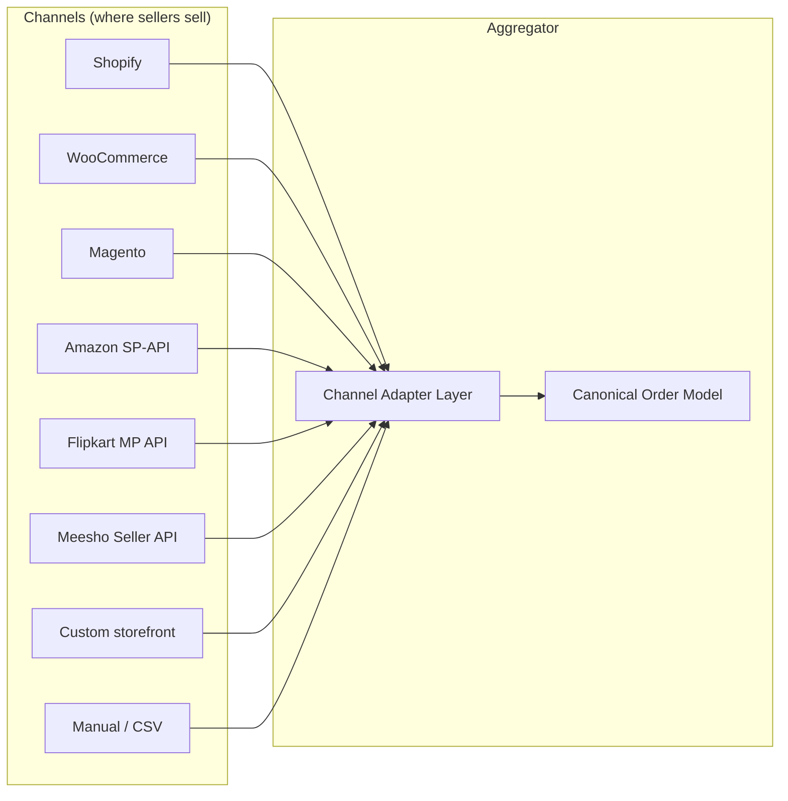

# Market & competitive landscape

## The Indian e-commerce shipping market

### Market sizing (qualitative — exact numbers maintained in `09-appendix/03-references.md`)

- **E-commerce GMV (India, 2024–25):** ~$120B and growing 22%+ YoY, driven by tier-2/3 D2C, social commerce (Meesho, WhatsApp), and quick-commerce.
- **Shipments per day:** ~25–30 million parcels move through Indian courier networks daily (organized + unorganized).
- **Aggregator-mediated share:** estimates vary from 8–15% of organized e-comm shipments are booked through aggregators (Shiprocket, Shipway, NimbusPost, iThink, ClickPost). The remainder go direct-to-courier (large enterprises) or unorganized.
- **Headroom:** every 1pp of aggregator share shift is ~75M+ shipments/year. The market is far from saturated.

### Structural characteristics

1. **High fragmentation on both sides.** ~200,000+ sellers ship online; 25–40 courier brands operate at scale; sellers ship via 2–4 of them simultaneously. The N×M problem is the aggregator's reason to exist.
2. **COD is still ~40–55% of shipment volume**, far higher than any developed market. COD changes everything: remittance cycles, fraud risk, NDR rates, working capital cycles.
3. **Pincode serviceability is non-uniform.** ~19,000 pincodes are "deliverable", but couriers vary widely in coverage of tier-3 / north-east / island pincodes. Every shipment requires a serviceability check.
4. **Margins are thin.** Couriers operate at 5–12% gross margin on the parcel. Aggregators operate at 6–10% on top of that. There is no "raise prices and win" play; the only way to win is volume + ops efficiency.
5. **Weight discrepancy is endemic.** Couriers reweigh and dispute weights post-shipment, often weeks later. Sellers without aggregator help routinely lose 3–8% of revenue here.

## Why aggregators win

A seller has three theoretical ways to ship:

1. **Direct to courier** — N portals, N agreements, N reconciliations. Only feasible at large scale (~1000+ shipments/day).
2. **Through their channel** — Shopify Shipping, Amazon FBA. Locks them into one channel; doesn't help the cross-channel seller (which is most sellers).
3. **Through an aggregator** — one integration, one wallet, one tracking system, multi-carrier comparison. Wins for sellers <1000 shipments/day, which is 99% of sellers by count.

Aggregators trade scale-buying power for take rate: they get cheaper rates from couriers (because they pool volume) and pass through some discount to the seller while keeping margin. For most SMB sellers, **aggregator rates are cheaper than what they could negotiate themselves**, even before considering ops savings.

## Competitive landscape

### Direct competitors (Indian shipping aggregators)

| Player | Founded | Positioning | Notable strengths | Notable weaknesses |
|---|---|---|---|---|
| **Shiprocket** | 2017 | Market leader, broadest seller base | Carrier breadth (25+), channel breadth, brand recall, capital | Tech debt; perceived support quality; weight dispute friction |
| **Shipway** | 2016 | Returns & post-purchase focus | Strong returns automation, branded tracking | Smaller carrier set; less full-stack |
| **NimbusPost** | 2018 | "Cheaper Shiprocket" wedge | Aggressive pricing, simple UX | Younger ops; smaller scale |
| **iThink Logistics** | 2017 | Mid-market D2C | Solid customer support reputation | Limited platform extensibility |
| **ClickPost** | 2015 | Post-purchase API platform (B2B2C) | Strong API/dev ergonomics; used by other aggregators and large enterprises | Not a direct seller-facing aggregator |
| **Pickrr** | 2015 | Was a direct competitor | — | Acquired by Shiprocket (2022). Out of market. |
| **Shyplite** | 2016 | SMB aggregator | — | Smaller share, less channel coverage |

### Adjacent / partial overlap

- **Delhivery One** — Delhivery's own multi-carrier dashboard (yes, the courier itself runs an aggregator). Limited because they bias to their own network.
- **Amazon Easy Ship / FBA, Flipkart Smart Fulfillment** — channel-locked aggregators. Only for sellers on those marketplaces.
- **GoKwik, Razorpay Magic, Shipyaari** — adjacent (COD conversion, checkout) but increasingly bundling shipping.
- **ULIPs** (Unified Logistics Interface Platform) — government-backed pan-logistics data exchange; in early stages, may eventually disrupt aggregator data moat.

### What this map tells us

- **Shiprocket is the gravity well.** Every other player is positioned relative to them. We must be too.
- **There is no defensible moat in features alone.** Every aggregator can copy any feature in ~6 months.
- **The moats that exist:** carrier rate cards (volume), channel breadth (BD), reliability (eng + ops), and operational quality (support, weight reconciliation, audit transparency).

## Where the incumbent is weak (our wedges)

Watching Shiprocket carefully (interviews with sellers; G2/Capterra reviews; Twitter/Reddit complaints; their own product release notes):

1. **Support quality at SMB tier.** Sellers below ~500 shipments/month report long resolution times, especially for weight disputes and COD reconciliation gaps.
2. **NDR resolution UX.** The action center exists but is reactive — sellers see NDRs after they happen rather than getting predictive flags. Buyer-side WhatsApp follow-up is templated and impersonal.
3. **Configuration rigidity.** Plans gate too many features behind tiers. Sellers who want one-off configurations typically need a sales call.
4. **Multi-channel order dedup.** When a seller sells the same SKU on Amazon + Shopify + Meesho and an order arrives on each (rare but possible), dedup is poor.
5. **Pricing contract self-service.** Sellers cannot model "if I switch from Plan X to Plan Y, what's my saving on last month's shipments?". The tooling is internal-only.
6. **COD fraud detection.** Reactive (seller eats the RTO cost), not predictive.
7. **Audit transparency.** Internal ops actions on a seller's account are not always surfaced to the seller.

We don't need to win on all 7. We need to win clearly on **#1 (support), #2 (NDR), #3 (configurability), #5 (transparent pricing tooling), and #7 (audit transparency)**, and be at parity on the rest.

## How orders actually flow into Indian aggregators today

> *Important context: there is no unified seller-side order interface in India. Aggregators integrate platform by platform.*

### The pattern

Every channel has its own:
- **Authentication mechanism** (OAuth for Shopify/Amazon; API key+secret for most marketplaces; HTTP basic for older WooCommerce; nothing standard).
- **Order schema** (Shopify uses GraphQL with a rich object; Amazon SP-API uses REST with marketplace-specific quirks; Meesho uses a flatter REST schema).
- **Status vocabulary** (one platform's "fulfilled" is another's "shipped" is another's "dispatched").
- **Webhook reliability** (Shopify is excellent; Amazon SP-API requires SQS subscriptions; some marketplaces have no webhooks and require polling every N minutes).

The aggregator's job is to write **N adapters** that each translate the platform's reality into a canonical order model. This adapter framework is detailed in [`07-integrations/01-channel-adapter-framework.md`](../07-integrations/01-channel-adapter-framework.md).

### Why is there no unified standard?

People have tried; none have stuck:

- **GS1 EPCIS** — international event-data standard for supply chain. Adopted by some enterprises; not by Indian SMB aggregator channels.
- **ONDC** (Open Network for Digital Commerce) — government-led open protocol, but it is *buyer-side* (catalog discovery, order placement) more than *seller-aggregator-side*. ONDC orders flow to sellers via ONDC seller apps; an aggregator can plug in as one ONDC participant, but ONDC does not solve the "pull orders from Shopify" problem.
- **OAuth + OpenAPI per platform** — what we actually have. Each platform publishes their spec; aggregators integrate.
- **IPaaS middleware** (Pipe17, Cymbio, Celigo, Zapier) — third-party "integration buses" that aggregators *could* use to avoid building all adapters themselves. Trade-offs:
  - **Pro:** faster to add channels.
  - **Con:** another vendor in the critical path; latency tax; cost; less control over webhook quality and rate-limit handling.
  - Most serious Indian aggregators build adapters in-house. We will too.
- **ULIPs** — government-led logistics data layer; relevant for tracking/regulatory data, not for seller order ingestion.

### What this means for the build

For order ingestion, our path is:
1. **Build a Channel Adapter framework** — common interface, plugin per platform.
2. **Prioritize platforms by seller share**: Shopify, WooCommerce, Amazon, Flipkart, Meesho cover ~80% of SMB sellers.
3. **Always offer manual + CSV** as universal fallbacks.
4. **Plan for ONDC** as a v3 channel (seller-app-side participation) — it is not strategic for v0/v1 but ignoring it long-term is unwise.

A full breakdown of channel options, complexity, and effort estimates is in [`04-features/03-channel-integrations.md`](../04-features/03-channel-integrations.md).

## How tracking & NDR data flows back

The mirror of the inbound problem. Each courier sends shipment events differently:

- **Webhooks** (preferred) — Delhivery, Bluedart, Ekart support webhooks. We must persist payloads, dedupe, and ack.
- **Polling** — many smaller couriers require us to poll their tracking API. Cadence varies.
- **Email-based** (legacy) — a few smaller couriers still send IMAP digests. Ugly but real.

Then we **normalize statuses** — every courier has its own status code dictionary; we maintain a mapping table to a canonical state machine. This is detailed in [`04-features/09-tracking.md`](../04-features/09-tracking.md).

> **Source-of-truth note:** the carrier is authoritative for tracking events. Pikshipp is the *unification layer* — we ingest, normalize, store, and present them. We never invent or patch tracking events except via explicit, audit-logged ops corrections.

## Strategic implications

The above analysis converges on these strategic choices, baked into the rest of this PRD:

1. **Win on operations + tech, not features.** Features are commodity.
2. **Start narrow on channels (5), broad on couriers (8+).** Sellers will tolerate fewer channel options if the courier side is comprehensive; the inverse is not true.
3. **Build adapters in-house.** No IPaaS in the critical path.
4. **Configurability as a first-class principle** — so adding a new behavior axis is a config change, not a feature.
5. **NDR & weight reconciliation are not "features" — they are products.** Treat them with the rigor of a P0 surface, not a P2 helper.
6. **First-party fulfillment is not a v1/v2 distraction.** The architecture supports it abstractly; the team does not build it now.
