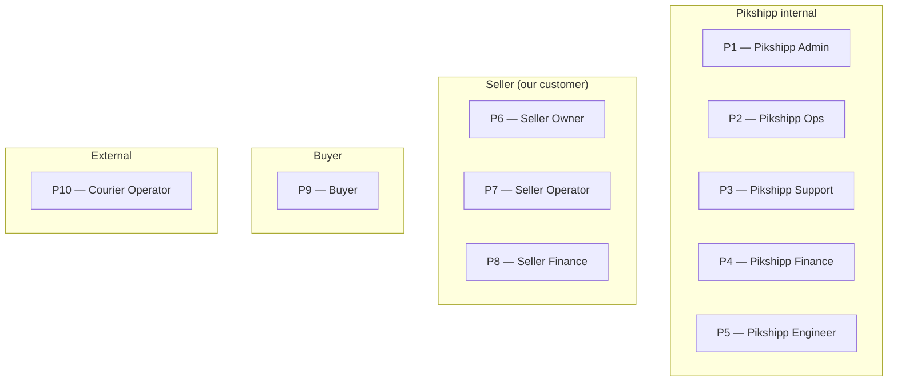

# Personas

> Pikshipp serves three classes of users. *Class* tells you what kind of organization the user belongs to; *role* tells you what job function they perform inside it. The matrix below is the canonical reference; the per-class detail follows.

## The matrix

```
                        │ Admin/  │         │          │         │           │
                        │ Owner   │ Ops     │ Support  │ Finance │ Operator  │
────────────────────────┼─────────┼─────────┼──────────┼─────────┼───────────┤
Pikshipp internal       │   P1    │   P2    │   P3     │   P4    │  (P5 Eng) │
Seller (our customer)   │   P6    │  (P6)   │   (P6)   │   P8    │    P7     │
Buyer (recipient)       │            single role; no login at all              │
```



## Pikshipp internal personas

### P1 — Pikshipp Admin
- **Role:** super-admin (effectively founders + platform eng).
- **Day-in-the-life:** rare in product surface; configures the platform, onboards carriers, manages seller-type defaults, sets policy locks.
- **Goals:** the platform is healthy, secure, and growing.
- **Tools:** Internal admin console (top-tier permissions), data warehouse, alerting.
- **Volume:** 5–20 humans at any time.

### P2 — Pikshipp Ops
- **Role:** runs day-to-day operations.
- **Day-in-the-life:** review KYC submissions; escalate weight disputes with couriers; handle seller-side suspensions; manage courier credential rotation; intervene in stuck shipments; review high-RTO patterns.
- **Goals:** zero stuck shipments; KYC SLA met; courier API issues triaged within minutes.
- **Tools:** Ops console, alerting, courier-partner portals.
- **Volume:** 5–50 humans depending on platform scale.

### P3 — Pikshipp Support
- **Role:** seller-facing support.
- **Day-in-the-life:** answer tickets via email/WhatsApp/in-app; reproduce seller issues; escalate to ops or eng.
- **Goals:** first-response SLA, low ticket-per-shipment ratio, high CSAT.
- **Tools:** Support console with read-only seller view + impersonation under explicit consent; ticketing system; comms templates.
- **Volume:** 10–200 humans at scale. Pooled — no dedicated CSM-per-seller model.

### P4 — Pikshipp Finance
- **Role:** treasury, COD remittance, GST, vendor reconciliation with couriers.
- **Day-in-the-life:** reconcile courier invoices vs our charges; process COD remittance to sellers; manage wallet float; file GST.
- **Goals:** zero reconciliation gaps; zero unremitted COD; audit-ready books.
- **Tools:** Finance console with ledger views, exports, and reconciliation workflows.
- **Volume:** 3–30 humans.

### P5 — Pikshipp Engineer
- **Role:** internal API consumer — eng, data, ops automation.
- **Goals:** good DX, observable system, deep data access *without* breaking seller data scoping.
- **Tools:** Internal admin APIs, BigQuery/Snowflake, observability stack.

## Seller personas (our customer)

> A seller is not a person — it's an organization. Inside it are the roles below.

### P6 — Seller Owner / Admin
- **Role:** founder / proprietor / authorized admin of the seller business.
- **Profile:** 25–45 years old, tier-1/2/3 city. GMV ranges from ₹5L/mo (small D2C) to ₹50Cr/mo (scaled D2C). At small end, often the same person who picks orders and packs them.
- **Day-in-the-life:** strategic — decides which couriers/channels to use, reviews monthly P&L, handles escalations.
- **Goals:** ship reliably, reconcile cleanly, grow without ops headcount scaling linearly.
- **Frustrations (today):** weight disputes, COD friction, NDR-driven RTO costs. Trust gap with current aggregator support.
- **Tools:** Seller dashboard (web). Mobile app is a strong v2 ask but not v1.
- **Volume:** ~equal to total active sellers — this is our biggest persona.

### P7 — Seller Operator
- **Role:** the staff member who does day-to-day shipping (picker / packer / manifest creator).
- **Profile:** 18–30, may not be the GST-registered person; uses the product 4–8 hours/day.
- **Day-in-the-life:** download labels, update orders, mark picked-up, handle pickup queries.
- **Goals:** print labels fast, never miss a pickup window, minimize keystrokes.
- **Frustrations:** keyboard-unfriendly workflows, slow PDFs, unclear status changes.
- **Tools:** Seller dashboard (web), label printer (Zebra/A4), occasionally a tablet on a packing table.
- **Volume:** 0.5× to 5× the seller owner population.

> **Note:** Operator is the highest-frequency human user of our seller-facing UI. Optimize the order list and bulk actions for them, not for the Owner.

### P8 — Seller Finance
- **Role:** the finance/accounts person, often part-time CA or bookkeeper.
- **Profile:** logs in once a week or once a month. Knows GST, knows ledgers, may not know logistics.
- **Day-in-the-life:** pull invoices, reconcile wallet, dispute weight charges, file GST.
- **Goals:** complete books match. Period.
- **Frustrations:** missing invoices; wallet ledger gaps; unclear discrepancy adjustments.
- **Tools:** Seller dashboard (Finance section), CSV/Excel exports, GST portal externally.
- **Volume:** ~0.5× sellers.

> **Roles within a seller** are also represented as RBAC roles in the system (Owner / Manager / Operator / Finance / Read-only / API-client). Multiple Owners or Operators per seller are supported.

## Buyer (end consumer)

### P9 — Buyer
- **Role:** the seller's customer; receives the shipment.
- **Profile:** entire Indian e-commerce buyer demographic. Tier-1 to tier-4, all ages, often lower digital literacy.
- **Day-in-the-life with us:** never sees "Pikshipp" — sees the seller's brand. Tracks shipments, confirms COD, reschedules deliveries.
- **Goals:** receive my parcel; if delayed, know when; if NDR, fix it.
- **Frustrations:** opaque tracking, missed delivery windows, unanswered courier calls.
- **Tools:** Branded tracking page (no login), WhatsApp messages, SMS, email. **Never** a Pikshipp-branded UI by default.
- **Volume:** ~10–50× the seller population by raw count.

> Buyer-facing surfaces inherit the **seller's brand** (logo, colors, optional custom domain — see Feature 17). This is per-seller buyer-experience customization, not white-label tenancy.

## External

### P10 — Courier Operator (driver / hub agent)
- **Role:** the human at the courier company who picks up, scans, delivers, calls the buyer.
- **We do not build for them directly** — they use the courier's own apps. But our product must produce labels, manifests, and pickup notifications that *work for them*.
- **Implication:** label format, barcode quality, manifest layout, pickup time-window communication all must be designed for courier operator usability, not just visual neatness.

## Persona × feature ownership matrix

The features that *primarily* serve each persona — used to prioritize design effort.

| Feature | P1 Admin | P2 Ops | P3 Support | P4 Finance | P5 Eng | P6 Owner | P7 Operator | P8 Seller Fin. | P9 Buyer | P10 Courier |
|---|---|---|---|---|---|---|---|---|---|---|
| Identity & onboarding | ⚙️ | ⚙️ |  |  |  | 🎯 | 🎯 |  |  |  |
| Seller org & config | 🎯 |  |  |  |  | 🎯 |  |  |  |  |
| Channel integrations |  | ⚙️ | ⚙️ |  |  | 🎯 | ⚙️ |  |  |  |
| Order management |  | ⚙️ | ⚙️ |  |  | ⚙️ | 🎯 |  |  |  |
| Catalog & warehouse |  |  |  |  |  | ⚙️ | 🎯 |  |  |  |
| Courier network | 🎯 | 🎯 |  |  |  |  |  |  |  | ⚙️ |
| Pricing / Allocation |  |  |  | ⚙️ |  | 🎯 | 🎯 |  |  |  |
| Booking & manifests |  | ⚙️ | ⚙️ |  |  |  | 🎯 |  |  | 🎯 |
| Tracking |  | ⚙️ | ⚙️ |  |  | ⚙️ | 🎯 |  | 🎯 |  |
| NDR | ⚙️ | 🎯 | 🎯 |  |  | ⚙️ | 🎯 |  | ⚙️ |  |
| Returns & RTO |  | ⚙️ |  | ⚙️ |  | 🎯 | ⚙️ |  | ⚙️ |  |
| COD management |  | ⚙️ |  | 🎯 |  | 🎯 |  | ⚙️ | ⚙️ |  |
| Wallet & billing |  |  |  | 🎯 |  | 🎯 |  | 🎯 |  |  |
| Weight reconciliation |  | 🎯 | ⚙️ | 🎯 |  | 🎯 |  | ⚙️ |  |  |
| Reports |  | ⚙️ |  | ⚙️ | ⚙️ | 🎯 |  | 🎯 |  |  |
| Notifications |  |  |  |  |  | ⚙️ | ⚙️ |  | 🎯 |  |
| Buyer experience | ⚙️ |  |  |  |  | 🎯 |  |  | 🎯 |  |
| Support & ticketing | ⚙️ | ⚙️ | 🎯 |  |  | 🎯 | ⚙️ | ⚙️ |  |  |
| Admin & ops console | 🎯 | 🎯 | 🎯 | 🎯 | 🎯 |  |  |  |  |  |
| Allocation engine (25) | ⚙️ | ⚙️ |  |  |  | ⚙️ | 🎯 |  |  |  |
| Risk & fraud (26) | ⚙️ | 🎯 | ⚙️ | ⚙️ | ⚙️ |  |  |  |  |  |
| Contracts & docs (27) | 🎯 |  |  | ⚙️ |  | ⚙️ |  | ⚙️ |  |  |
| Insurance (22) |  | ⚙️ | ⚙️ | ⚙️ |  | 🎯 |  | ⚙️ |  |  |

🎯 = primary user; ⚙️ = secondary/supporting user.
