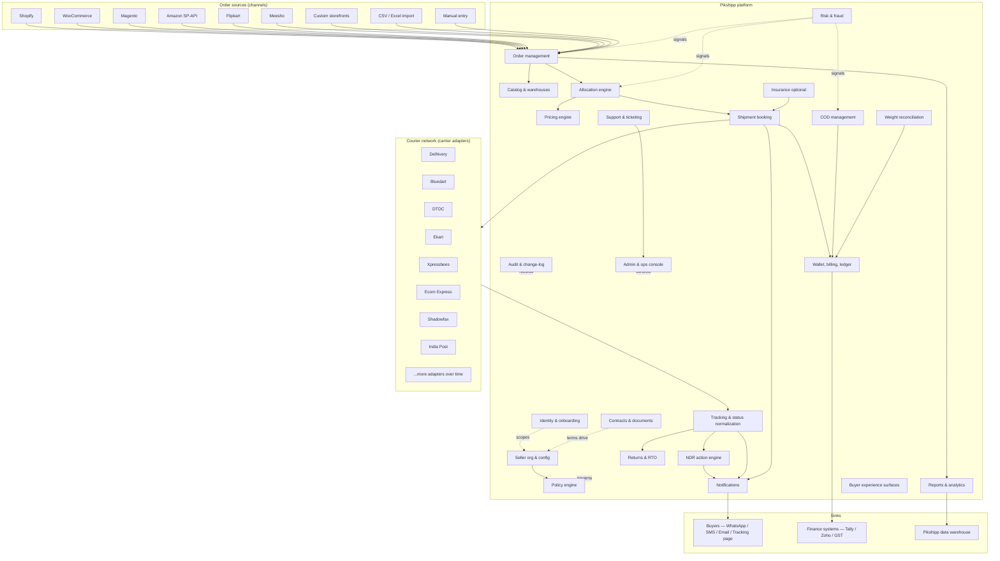
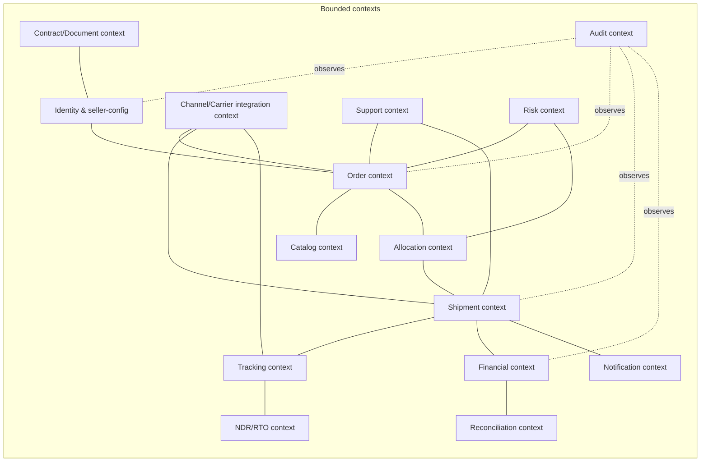
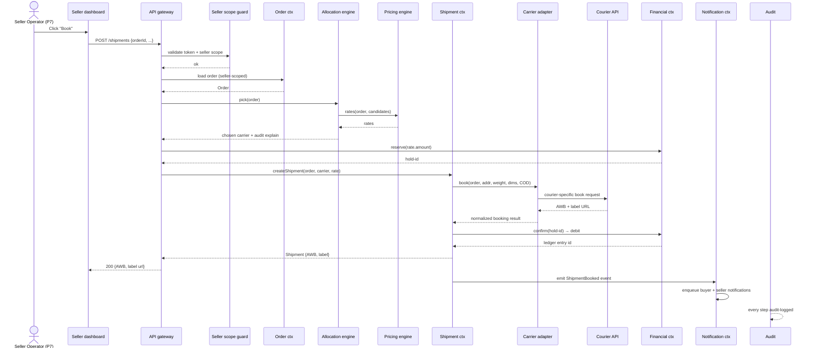
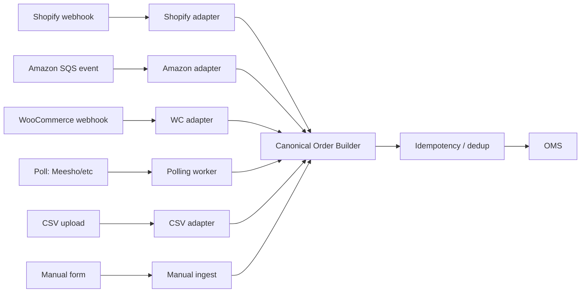
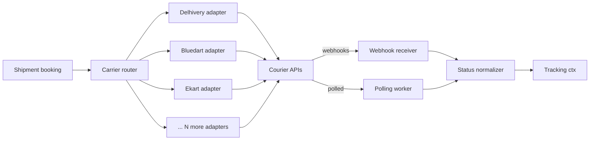
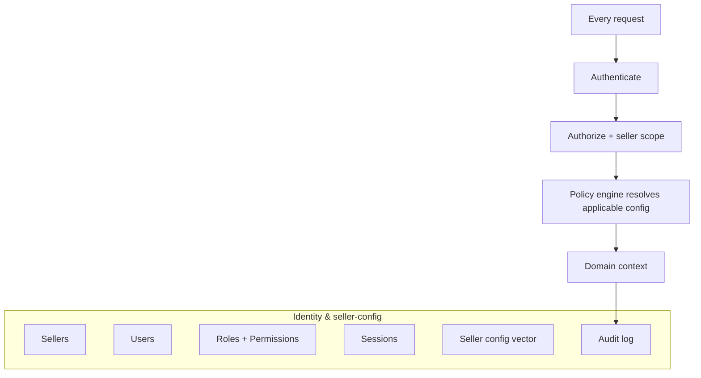

# System overview (logical architecture)

> This is a **product** architecture document, not a technical one. It defines the *logical* shape of the system — what the parts are, how they relate, and what each is responsible for. The technical realization (services, languages, data stores, queues, infra) lives in the HLD/HLA.

## What this document is for

- Anyone reading a feature spec downstream can refer here to understand *where* a feature plugs in.
- Anyone designing the technical architecture starts here for the boundaries.
- Anyone debating "should this be one product surface or two?" uses this as the source of truth on product seams.

## The big picture

> The diagram is also saved as [`../diagrams/01-system-overview.mmd`](../diagrams/01-system-overview.mmd) and rendered to [`01-system-overview.png`](../diagrams/01-system-overview.png).

## The five conceptual layers

Reading the diagram top-to-bottom, the platform has five conceptual layers:

1. **Source layer (channels)** — where orders originate. We do not own this layer; we adapt to it.
2. **Core platform** — what we build, own, and operate. The substance of this PRD.
3. **Carrier layer** — the courier partners. We do not own this layer either; we abstract it through adapters.
4. **Sink layer** — where data flows out: to buyers (notifications), finance systems (export), our own analytics warehouse.
5. **Cross-cutting layer** — identity (scopes everything), policy engine (parameterizes everything), audit (records everything), admin/ops (controls everything), risk (signals into many).

## Two engines worth their own pages

Two of the boxes in the core warrant special call-outs because they are central to how the platform *behaves*:

### The Policy engine
The runtime system that resolves "what's the rule for *this* seller × *this* setting?". Every feature in the platform reads from it — the policy engine is what makes Pikshipp configurable without forking. Detailed in [`05-policy-engine.md`](./05-policy-engine.md).

### The Allocation engine
The runtime system that picks which carrier/service to use for a given shipment, given filter constraints (seller's allowed carriers, pincode serviceability, weight limits) and weighted objectives (cost, speed, reliability, seller preference). Auditable: every decision stores why. Detailed in [`../04-features/25-allocation-engine.md`](../04-features/25-allocation-engine.md).

## Bounded contexts (the seams)

A **bounded context** is a region of the product where a single ubiquitous language applies — an Order in OMS context is unambiguous, but the same word in Tracking has slightly different shape. We define the contexts so cross-context contracts become explicit.

### Context responsibilities (one-liner each)

| Context | Owns | Doesn't own |
|---|---|---|
| **Identity & seller-config** | Sellers, users, roles, sessions, seller-level configuration vector | Anything domain-specific |
| **Order** | Canonical Order, addresses, line items, channel ref | Shipping decisions |
| **Catalog** | SKUs, weights, dims, HSN codes | Order state |
| **Allocation** | Carrier choice per shipment, with scoring + audit | Booking mechanics |
| **Shipment** | AWBs, manifests, labels, attempts | Buyer notifications, ledger |
| **Tracking** | Status events, normalized statuses, ETA | Action decisions |
| **NDR/RTO** | NDR actions, RTO state, attempt budgets | Ledger entries |
| **Financial** | Wallet balances, invoices, ledger, GST, reverse-leg charges | Decisions to charge |
| **Reconciliation** | Weight disputes, courier invoice match, COD remittance match | Originating charges |
| **Notification** | Templates, sends, deliverability | Triggering events |
| **Support** | Tickets, conversations, escalations | Resolution actions |
| **Integration** | Channel adapters, courier adapters, credentials | Domain semantics |
| **Risk** | Risk scores, behavioral signals, fraud queues | Enforcement actions (signals to others) |
| **Contract/Document** | Contracts, KYC docs, machine-readable terms | Policy resolution (those values feed Identity) |
| **Audit** | Append-only event log, tamper-evidence, exports | Anything else |

### Why these seams?

Each seam is chosen so that:
1. Either side can change implementation without affecting the other.
2. The cross-context contract is small enough to write down (we do — see each feature's "data model" section).
3. Per-seller scoping happens at every seam crossing.

## Anatomy of a request: "book a shipment"

A worked example of how a single user action traces through contexts.

Things to note:
- **Seller scope is enforced at one well-defined point** (the API gateway / scope guard). Downstream contexts trust the request is in scope.
- **The wallet is debited via two-phase commit**: reserve → confirm/release. Avoids charging a seller for a booking that fails at the courier API.
- **Allocation is its own step** before booking. The allocation result is stored with the shipment for audit.
- **Notifications are eventual**, fired off the booking event, not blocking the response.
- **The carrier adapter is the only place that knows about courier-specific shapes.** Everything upstream/downstream uses the canonical model.
- **Audit observes every step.**

## How channels integrate (orders in)

The mirror of carriers — channels also use an adapter pattern.

Detailed in [`07-integrations/01-channel-adapter-framework.md`](../07-integrations/01-channel-adapter-framework.md).

## How carriers integrate (booking + tracking out)

Detailed in [`07-integrations/02-courier-adapter-framework.md`](../07-integrations/02-courier-adapter-framework.md).

> **First-party note (v3+, if at all):** if Pikshipp ever builds its own first-party last-mile network, it plugs in here as just another adapter. There is no special path. The architecture treats it identically to a third-party carrier. We do not build a fleet for v1 or v2.

## Identity & seller-config as the spine

Every diagram in this PRD has identity and seller-scoping as an invisible cross-cutting layer. To make it visible:

The identity layer **MUST** intercept every request before any domain context sees it. There is no "internal" path that bypasses scope. The policy engine resolves applicable seller-level configuration once per request (or cached) and downstream contexts read from it. Detailed in [`02-multi-tenancy-model.md`](./02-multi-tenancy-model.md) (now "Seller config & data scoping") and [`05-policy-engine.md`](./05-policy-engine.md).

## What is *not* in this overview

- Storage choices (SQL vs NoSQL) — HLD.
- Service decomposition (monolith vs microservices) — HLD.
- Programming language / frameworks — HLD.
- Cloud provider, regions, availability — HLD.
- Cost model — HLD + finance.

The PRD is deliberately silent on these so we don't pre-commit before the engineering team weighs in.

## Open architectural questions

Logged in [`09-appendix/02-open-questions.md`](../09-appendix/02-open-questions.md). Notable ones:

- **Q-A1** — Are reconciliation (weight, COD, courier invoice) one bounded context or three?
- **Q-A2** — Is the catalog context required at v1?
- **Q-A3** — Does the allocation engine call the pricing engine, or vice versa? (Currently: allocation calls pricing.)
- **Q-A4** — How tightly coupled is the channel adapter to the order context's schema?
