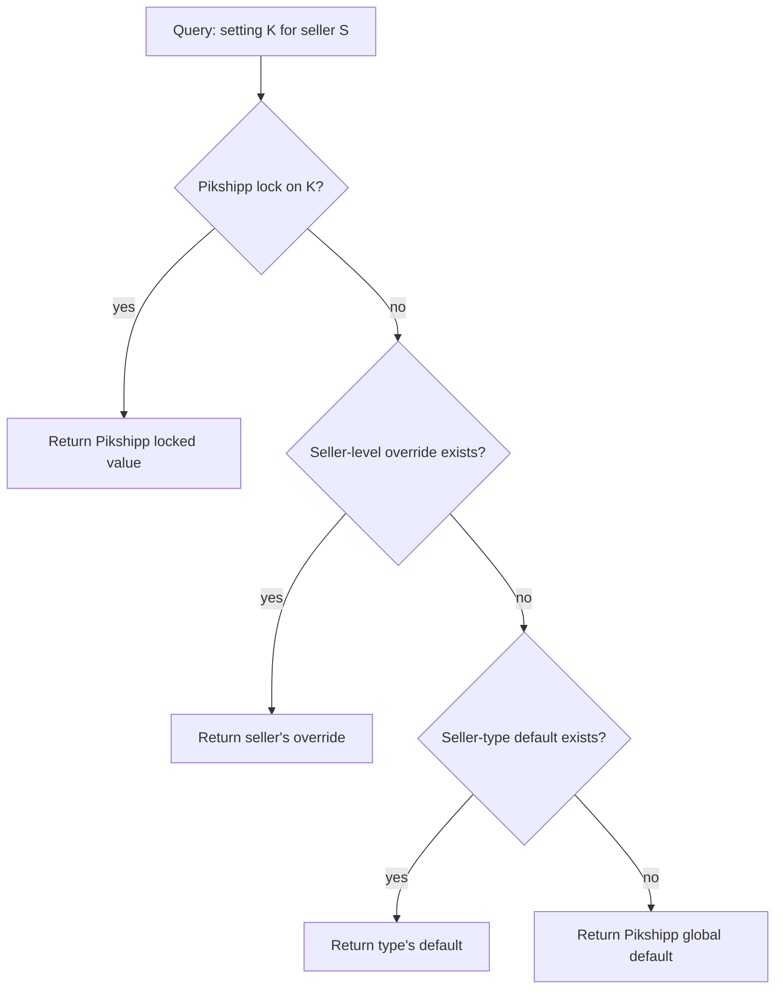

# Seller configuration & data scoping

> Pikshipp is a **single-aggregator** platform — there is no white-label, no reseller layer, no tenant-of-tenants tree. We are the only aggregator. Sellers are our customers. The "multi-tenancy" we need is the standard multi-customer SaaS pattern: every seller's data is isolated from every other seller's, and per-seller configuration drives per-seller behavior.

## The model in one sentence

> A seller is a **tenant** in the SaaS-data-isolation sense (their data is scoped via a `seller_id`), and a **vector of configuration values** in the behavioral sense (the policy engine resolves runtime behavior per seller).

There is no second level of tenancy. The diagram is flat:

```
Pikshipp (operator + brand)
   │
   ├── Seller A
   │     └── Sub-seller A.1 (optional; branch / subsidiary)
   ├── Seller B
   ├── Seller C
   └── ...
```

Sub-sellers are an internal hierarchy *inside* a seller (e.g., a brand with multiple branches), not a separate tenancy concept. They inherit most config from the parent seller; can be addressed by ID; have their own pickup locations. Sub-sellers are **optional**, only relevant for sellers who explicitly need them.

## Two distinct concerns this doc covers

1. **Data scoping** — how every persisted row is associated with a seller and how queries enforce that scope.
2. **Configuration scoping** — how per-seller config overrides defaults, and how the policy engine resolves the effective value at runtime.

The two are different. Data scoping is about **isolation**. Configuration scoping is about **behavior**. They share infrastructure but conceptually distinct.

## Data scoping rules (the hard rules)

1. **Every persistent object MUST carry a `seller_id`** (and, where applicable, `sub_seller_id`).
2. **Every API request is scoped** to a seller by the auth token (or, for ops, an explicit "view-as" with audit).
3. **Every database query MUST filter on `seller_id`.** This is enforced at the data-access layer (RLS / query interceptor / ORM scope), not application code.
4. **No background job operates "globally" without an explicit seller scope** in its parameters or output (e.g., a courier sync job operates per-seller; a courier-API health monitor is platform-wide and writes only to platform-level tables, not seller-scoped tables).
5. **No cross-seller joins** unless explicitly approved (e.g., the platform-wide courier health dashboard is built from a denormalized telemetry table, not from per-seller shipment tables).
6. **Cross-seller access by Pikshipp staff is audited and visible to the affected seller** in their audit log.

## Configuration scoping (the seller config vector)

Per [`05-policy-engine.md`](./05-policy-engine.md), every seller is a vector of configuration values. The vector lives in the seller record + config tables; the policy engine resolves effective values at runtime.

### What's in the vector (summary)

```yaml
seller {
  identity: { id, status }
  
  type/profile:
    seller_type     # bundle of defaults; e.g., small_smb | mid_market | enterprise
    industry        # affects KYC depth, restricted goods, risk class
    volume_band     # affects rate-card and credit eligibility
    risk_tier       # affects KYC and operational defaults
  
  wallet:
    posture         # prepaid_only | hybrid | credit_only
    credit_limit
    cod_remittance_cycle_days
    grace_negative_amount
  
  cod:
    enabled
    per_order_max
    pct_volume_cap
    verification_mode    # always | above_x | none
    pincode_blocklist    # or use platform default
  
  pricing:
    rate_card_ref
    overrides            # per zone / carrier / weight / time-window
    surcharges_passthrough
  
  carriers:
    allowed_set
    preferred_priority
    excluded_set
  
  delivery_semantics:
    max_attempts          # or "use carrier default"
    reattempt_window_hours
    auto_rto_on_max
    pickup_cutoff
  
  buyer_experience:
    brand_logo_url, brand_colors
    custom_domain
    notification_template_overrides
  
  features (flags layer):
    [insurance, weight_dispute_auto, custom_reports, ndr_chatbot, ...]
  
  sla:
    support_response_target
    resolution_target
  
  contract:
    type                # standard_tnc | negotiated_msa
    contract_doc_ref
    terms_machine_readable: { ... above fields ... }
}
```

The full taxonomy (~30 axes) lives in [`05-policy-engine.md`](./05-policy-engine.md).

## Resolution rules (how policy engine picks a value)

For any setting key K when serving seller S:



Locks are how Pikshipp prevents downstream override of a setting we cannot let a seller change (e.g., compliance floors).

## Seller lifecycle

```mermaid
stateDiagram-v2
    [*] --> Provisioning: Sign-up / contract
    Provisioning --> Active: KYC passed
    Provisioning --> Sandbox: KYC pending; sandbox-only
    Sandbox --> Active: KYC passed
    Active --> Suspended: SLA breach / non-payment / fraud signal
    Suspended --> Active: Reactivation
    Active --> Wound_Down: Seller exits / terminated
    Suspended --> Wound_Down: Final exit
    Wound_Down --> Archived: Data export complete + retention period
    Archived --> [*]
```

### State semantics

- **Provisioning** — seller exists in DB but cannot transact in production. Sandbox-mode bookings allowed.
- **Sandbox** — KYC pending; can use everything that doesn't touch real money/carriers.
- **Active** — fully operational.
- **Suspended** — reads allowed, no new bookings. Existing in-flight shipments continue to track. Wallet recharges blocked.
- **Wound_Down** — full stop. All flows blocked. Data export available for X days.
- **Archived** — data retained per legal retention; no access except by audited Pikshipp admin.

## Cross-seller operations (the legitimate ones)

A few flows legitimately need cross-seller access. They are listed explicitly so they are not implemented ad-hoc.

| Operation | Initiator | Audit | Notification |
|---|---|---|---|
| Pikshipp admin "view as" | Pikshipp Admin | ✅ tamper-evident | Seller sees the access in their audit log within 1h |
| Pikshipp support impersonation | Pikshipp Support (with reason) | ✅ | Seller sees audit entry; optional banner on UI |
| Cross-seller analytics (aggregates) | System | ✅ aggregate-only | None (no PII crosses) |
| Fraud network analysis (hashed signals) | System | ✅ | None |
| Courier-wide health monitoring | System | ✅ platform-level | None |
| Cross-seller buyer fraud signals | System (hashed phone allowlist) | ✅ | None |

Any other cross-seller operation MUST be added to this list with a documented rationale before implementation.

## Sub-sellers (when needed)

Some sellers have multi-branch operations (e.g., a fashion brand with 3 fulfillment hubs). Sub-sellers:

- Are **child organizations under one parent seller**.
- Inherit the parent's wallet by default (configurable).
- Inherit the parent's KYC, plan, and most config.
- May have their own pickup locations, channels, and (optionally) sub-seller-specific overrides on a few axes.
- Are **not** a tenancy concept — they share the parent's `seller_id` namespace, plus a `sub_seller_id`.

Most sellers will not use sub-sellers. v1 supports the data model and basic UX; advanced sub-seller-specific config is v2.

## Data model

```yaml
seller:
  id: slr_xxx
  legal_name
  display_name
  status: provisioning | sandbox | active | suspended | wound_down | archived
  status_reason
  status_changed_at
  type_profile:
    seller_type        # small_smb | mid_market | enterprise | custom
    industry
    volume_band
    risk_tier
  contact:
    primary_user_id
    billing_email
    support_email
  metadata:
    industry_subcategory
    annual_gmv_band
  created_at

sub_seller:
  id: ssl_xxx
  parent_seller_id
  name
  status
  pickup_locations: [ ... ]
  config_overrides: { ... }
  created_at

seller_setting:
  id
  seller_id (or sub_seller_id)
  key                 # e.g., "cod.enabled", "delivery.max_attempts"
  value (json)
  locked_by_pikshipp  # if true, blocks future seller-level changes
  updated_at, updated_by
  reason

seller_audit_event:
  id
  seller_id
  actor: { kind, ref }
  action              # seller.update | setting.update | impersonate.start | view_as ...
  target_ref
  payload (jsonb)
  occurred_at
  ip_address
  user_agent
```

## What we deliberately do NOT have

- **No reseller / aggregator-of-aggregators tier.** We are the only aggregator.
- **No tenant tree / hierarchy** beyond seller → sub-seller (which is just internal organization).
- **No per-tenant branding / domain mapping at the platform level.** Per-seller buyer-experience branding *is* supported (logo, colors, custom domain), but this is a feature of the buyer-experience surface (Feature 17), not platform-tenancy infrastructure.
- **No config-inheritance engine across reseller layers.** Just two layers: Pikshipp-default + seller-override.

## Open questions

- **Q-T1** — Sub-seller wallet: independent vs always-rolls-up-to-parent? Default v1: rolls up. Override available v2.
- **Q-T2** — Sub-seller KYC: separate or inherited? Default: inherited.
- **Q-T3** — Cross-seller buyer hash for RTO blocklist — privacy-aware, hashed, opt-in by seller? Default v2.
- **Q-T4** — Should some seller settings be locked-by-default (e.g., grace negative cap)? Worth a policy review.
