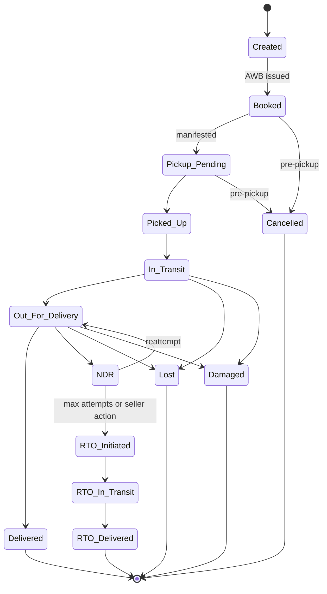

# Domain model

> The vocabulary of Pikshipp. Every term here has a single meaning across the codebase, the UI, the docs, and conversations. Whenever a feature doc refers to "Order", "Shipment", "AWB", "NDR" — it means *this*.

## The diagram

```mermaid
classDiagram
    class Seller {
        +id
        +legal_name, display_name
        +status
        +seller_type
        +industry, volume_band, risk_tier
    }
    class SubSeller {
        +id
        +parent_seller_id
        +name
        +status
    }
    class User {
        +id
        +seller_id
        +email/phone
        +roles
    }
    class Channel {
        +id
        +seller_id
        +platform: shopify|amazon|...
        +credentials_ref
        +status
    }
    class Buyer {
        +id (per seller)
        +seller_id
        +phone
        +addresses
    }
    class Address {
        +id
        +line1, line2
        +city, state, pincode
        +country: IN
        +contact_name
        +contact_phone
    }
    class PickupLocation {
        +id
        +seller_id
        +sub_seller_id
        +address_id
        +operating_hours
        +is_default
    }
    class Product {
        +id
        +seller_id
        +sku, name
        +weight_g
        +dims_lwh_mm
        +hsn_code
    }
    class Order {
        +id
        +seller_id
        +channel_id
        +channel_order_ref
        +buyer_id
        +pickup_location_id
        +ship_to_address_id
        +bill_to_address_id
        +line_items
        +declared_value
        +payment_mode: prepaid|cod
        +cod_amount
        +status
        +placed_at
    }
    class LineItem {
        +order_id
        +product_id
        +quantity
        +unit_price
        +tax
    }
    class Shipment {
        +id
        +order_id
        +carrier_id
        +awb
        +rate_quote_id
        +allocation_decision_id
        +chargeable_weight_g
        +declared_weight_g
        +status: canonical
        +pickup_scheduled_at
        +delivered_at
        +rto_at
    }
    class Carrier {
        +id
        +name
        +adapter_key
        +services: surface|air|express|hyperlocal
    }
    class RateCard {
        +id
        +scope: pikshipp|seller|seller_type
        +scope_ref
        +carrier_id
        +effective_from, effective_to
        +slabs (zone x weight x cod)
    }
    class RateQuote {
        +id
        +order_id
        +carrier_id
        +rate_card_id
        +amount_breakdown
        +quoted_at
    }
    class AllocationDecision {
        +id
        +order_id
        +chosen_carrier_id, chosen_service
        +candidates_considered (with scores)
        +objective_weights
        +filters_applied (with reasons)
        +decided_at
    }
    class Manifest {
        +id
        +seller_id
        +carrier_id
        +pickup_location_id
        +shipments: list
        +pickup_at
        +manifest_doc
    }
    class TrackingEvent {
        +id
        +shipment_id
        +carrier_event_code
        +canonical_status
        +location
        +timestamp
        +source: webhook|poll
    }
    class NDREvent {
        +id
        +shipment_id
        +reason
        +attempt_no
        +action
        +action_at
        +deadline_at
    }
    class WalletAccount {
        +id
        +seller_id
        +balance, available_balance
        +credit_limit
        +grace_negative_amount
    }
    class LedgerEntry {
        +id
        +wallet_account_id
        +amount
        +direction: credit|debit
        +ref_type
        +ref_id
        +created_at
    }
    class Invoice {
        +id
        +seller_id
        +period
        +line_items
        +total
        +tax
    }
    class WeightDispute {
        +id
        +shipment_id
        +declared_weight_g
        +carrier_weight_g
        +evidence_refs
        +status
    }
    class CODRemittance {
        +id
        +shipment_id
        +amount
        +remitted_at
        +remittance_ref
    }
    class Notification {
        +id
        +seller_id
        +recipient_kind: buyer|seller|...
        +channel: whatsapp|sms|email|push
        +template_id
        +status
    }
    class Ticket {
        +id
        +seller_id
        +created_by
        +subject
        +status
        +linked_shipment_id
    }
    class RiskScore {
        +id
        +scope: order|seller|buyer_phone
        +scope_ref
        +score
        +bucket
        +factors
        +computed_at
    }
    class Contract {
        +id
        +seller_id
        +type
        +doc_ref
        +effective_from, effective_to
        +status
        +machine_readable_terms
    }
    class AuditEvent {
        +id
        +seller_id
        +actor
        +action
        +target_ref
        +occurred_at
        +tamper_chain_hash
    }

    Seller "1" --> "many" SubSeller
    Seller "1" --> "many" User
    Seller "1" --> "many" Channel
    Seller "1" --> "many" PickupLocation
    Seller "1" --> "many" Product
    Seller "1" --> "many" Buyer
    Seller "1" --> "many" Order
    Seller "1" --> "1" WalletAccount
    Seller "1" --> "many" Contract
    Order "1" --> "many" LineItem
    Order "1" --> "many" RateQuote
    Order "1" --> "1" AllocationDecision
    Order "1" --> "1..n" Shipment
    Shipment "many" --> "1" Carrier
    Shipment "1" --> "many" TrackingEvent
    Shipment "0..1" --> "many" NDREvent
    Shipment "1" --> "0..1" WeightDispute
    Shipment "1" --> "0..1" CODRemittance
    Shipment "many" --> "1" Manifest
    RateQuote "many" --> "1" RateCard
    WalletAccount "1" --> "many" LedgerEntry
    LedgerEntry "many" --> "0..1" Shipment : ref_type=shipment
    Seller "1" --> "many" Invoice
    Seller "1" --> "many" Notification
    Seller "1" --> "many" Ticket
    Seller "1" --> "many" RiskScore : risk on seller
    Order "1" --> "0..1" RiskScore : risk on order
    Seller "1" --> "many" AuditEvent
```



> Saved as [`../diagrams/03-domain-model.mmd`](../diagrams/03-domain-model.mmd) → PNG.

## Glossary in plain English

(Authoritative glossary lives in [`09-appendix/01-glossary.md`](../09-appendix/01-glossary.md). This is the conceptual subset.)

### Seller
Our customer — a business that ships goods. Has multiple users in defined roles (Owner / Operator / Finance / etc.). Has a configuration vector (see [`05-policy-engine.md`](./05-policy-engine.md)) and a wallet.

### Sub-seller
An optional child organization of a seller (branch / subsidiary). Inherits parent's wallet and most config; has its own pickup locations and (optionally) channels.

### User
A human (or service account) acting on behalf of one seller. Users have roles within their seller.

### Channel
A connection between a seller and a sales platform (Shopify, Amazon, Meesho, etc.). One seller can have N channels.

### Buyer
The seller's customer — the recipient of a shipment. Buyers belong to a seller; buyer identity is per-seller (no cross-seller buyer profile in v1, though hashed cross-seller fraud signals are an architectural option for v2/v3).

### Pickup Location
A physical address from which a seller ships. Many sellers have multiple. Validated against carrier serviceability.

### Product
A SKU master record: name, weight, dimensions, HSN. Optional — orders can carry inline weight/dims if no SKU master is set up.

### Order
A canonical purchase event from a single channel. Carries buyer, ship-to, payment mode (prepaid/COD), line items, declared value, COD amount.

> An Order is **immutable** once it has a Shipment booked for the same line items. Edits before booking are allowed; after booking, the seller may add a "supplementary shipment" but cannot retroactively edit shipped lines.

### Line Item
A single SKU + quantity + price within an order.

### Shipment
A single physical parcel handed to a courier, identified by an AWB. One Order can have multiple Shipments. Carries the carrier, the AWB, the chargeable weight, the canonical status, and the allocation decision that picked this carrier.

### Carrier
A courier partner integrated via a Carrier Adapter. Offers Services (surface/air/express/hyperlocal/B2B).

### Rate Card
The per-carrier pricing structure, defined globally (Pikshipp master), per seller-type (defaults), or per seller (negotiated overrides). Has a validity window. Multi-dimensional: zone × weight × COD/prepaid × service.

### Rate Quote
An on-the-fly calculation of "what would shipping this Order via this Carrier cost right now". Quotes are short-lived (minutes) and are referenced from the Shipment.

### Allocation Decision
A first-class record of *why* a particular carrier was chosen for a shipment. Stores candidates considered, filters applied (with reasons for exclusion), objective weights, and the chosen one. Auditable: a seller asking "why this carrier?" gets a real answer.

### Manifest
A document handed to the courier at pickup, listing AWBs to be picked up.

### Tracking Event
A single status change reported by the courier — "picked up", "in transit", "out for delivery", "delivered", "RTO initiated", etc. Carriers send their own status codes; we map to a canonical status set.

### Canonical Status (the normalized set)

```
Created → Booked → Pickup_Pending → Picked_Up → In_Transit → Out_For_Delivery → Delivered
                                                                     ↘ NDR_1 → ...NDR_n → RTO_Initiated → RTO_In_Transit → RTO_Delivered
                                                       ↘ Cancelled
                                                       ↘ Lost
                                                       ↘ Damaged
```

### NDR Event
"Non-Delivery Report" — a delivery attempt failed. Each NDR carries a reason (buyer unavailable, address wrong, premises locked, COD not ready, refused). NDR events trigger an Action loop with a deadline.

### Wallet Account
Seller's prepaid (and optionally credit-limited) balance with Pikshipp. Every charge or refund is a Ledger Entry. The wallet supports a configurable `grace_negative_amount` so RTO charges can debit even if the wallet has just-zero balance — to a configured limit, after which suspension semantics kick in.

### Ledger Entry
An immutable record of a wallet movement: amount, direction (credit/debit), reference type (shipment/refund/recharge/adjustment/rto/weight_dispute/cod_remit/insurance), reference id, timestamp, actor.

### Invoice
A monthly tax invoice from Pikshipp to the seller, summarizing shipping charges, COD handling fees, weight disputes, etc., with GST.

### Weight Dispute
A dispute raised between Pikshipp/seller and the courier when courier-reweighed weight differs from declared weight. Carries evidence (seller photo, courier reweigh data) and resolution.

### COD Remittance
A record of cash-on-delivery money moving from courier → Pikshipp → seller's wallet, traceable to the originating shipment(s).

### Notification
A single outbound message to a recipient (buyer/seller/internal). Carries the channel (WhatsApp/SMS/email/push), template id, and delivery status.

### Ticket
A support conversation. Belongs to a seller; may be linked to a specific shipment.

### RiskScore
A score on an order, seller, or buyer phone (hashed for cross-seller use). Computed by the risk feature; consumed by COD verification, allocation, and ops.

### Contract
A signed agreement between Pikshipp and a seller. Contains both the document (PDF, e-sig metadata) and machine-readable terms that feed into the policy engine as seller-level overrides.

### AuditEvent
An append-only event recording who did what, when, and to which seller. Tamper-evident via hash-chains for high-value events.

## Lifecycle of an Order, in one diagram

```mermaid
stateDiagram-v2
    [*] --> Pending: Channel adapter ingest / manual create
    Pending --> Ready_To_Ship: validation passes
    Pending --> On_Hold: KYC/wallet/policy block
    Ready_To_Ship --> Booked: shipment(s) booked
    Ready_To_Ship --> Cancelled: seller cancels
    On_Hold --> Ready_To_Ship: hold cleared
    On_Hold --> Cancelled: hold abandoned
    Booked --> Partially_Fulfilled: some shipments delivered
    Booked --> Fulfilled: all shipments delivered
    Booked --> Cancelled_Post_Booking: rare; carrier/seller initiated
    Partially_Fulfilled --> Fulfilled: rest delivered
    Fulfilled --> [*]
    Cancelled --> [*]
    Cancelled_Post_Booking --> [*]
```



## Lifecycle of a Shipment, in one diagram



## Identity rules

- **Order ID** — Pikshipp-issued, globally unique, per-seller prefixed (e.g., `PSO-<seller_short>-<id>`).
- **Channel order ref** — the platform's order number; unique per (channel, seller).
- **AWB** — courier-issued, unique per courier; we treat (carrier_id + awb) as the unique key.
- **Internal Shipment ID** — Pikshipp-issued; never exposed externally.
- **Buyer phone** — primary identity for buyer matching within a seller.

## Constraints worth pre-committing

- **An Order MUST belong to exactly one Seller.**
- **A Shipment MUST belong to exactly one Order.**
- **A Shipment MUST have exactly one Carrier and exactly one AWB.** (Splits become new Shipments.)
- **A Wallet Account MUST belong to exactly one Seller.**
- **A Rate Card MUST have exactly one scope** (pikshipp / seller_type / seller).
- **An Address is value-typed.**
- **A Product is per-seller.**
- **An AllocationDecision exists for every Shipment** (so we always have an answer to "why this carrier?").

## What's intentionally NOT modeled here

- **Inventory** — the channel owns it.
- **Cross-seller buyer linkage** — explicitly absent in v1; hashed phone allowlist for fraud signals is a v2 architectural option.
- **Couriers' internal hubs / routes / agents.**
- **Buyer accounts** — buyers are recipients, not account holders.
- **Subscription billing for our own SaaS plans** — handled in financial context (Feature 13) but not a separate domain entity here.

## Where each entity is detailed

| Entity | Feature doc |
|---|---|
| Seller, SubSeller, User | [`02-tenant-and-organization`](../04-features/02-tenant-and-organization.md), [`01-identity-and-onboarding`](../04-features/01-identity-and-onboarding.md) |
| Channel | [`03-channel-integrations`](../04-features/03-channel-integrations.md) |
| Buyer, Address | [`04-order-management`](../04-features/04-order-management.md), [`17-buyer-experience`](../04-features/17-buyer-experience.md) |
| Pickup Location, Product | [`05-catalog-and-warehouse`](../04-features/05-catalog-and-warehouse.md) |
| Order, LineItem | [`04-order-management`](../04-features/04-order-management.md) |
| Shipment, Manifest | [`08-shipment-booking`](../04-features/08-shipment-booking.md) |
| Carrier | [`06-courier-network`](../04-features/06-courier-network.md) |
| RateCard, RateQuote | [`07-rate-engine`](../04-features/07-rate-engine.md) |
| AllocationDecision | [`25-allocation-engine`](../04-features/25-allocation-engine.md) |
| TrackingEvent | [`09-tracking`](../04-features/09-tracking.md) |
| NDREvent | [`10-ndr-management`](../04-features/10-ndr-management.md) |
| WalletAccount, LedgerEntry, Invoice | [`13-wallet-and-billing`](../04-features/13-wallet-and-billing.md) |
| WeightDispute | [`14-weight-reconciliation`](../04-features/14-weight-reconciliation.md) |
| CODRemittance | [`12-cod-management`](../04-features/12-cod-management.md) |
| Notification | [`16-notifications`](../04-features/16-notifications.md) |
| Ticket | [`18-support-and-tickets`](../04-features/18-support-and-tickets.md) |
| RiskScore | [`26-risk-and-fraud`](../04-features/26-risk-and-fraud.md) |
| Contract | [`27-contracts-and-documents`](../04-features/27-contracts-and-documents.md) |
| AuditEvent | [`05-cross-cutting/06-audit-and-change-log`](../05-cross-cutting/06-audit-and-change-log.md) |
