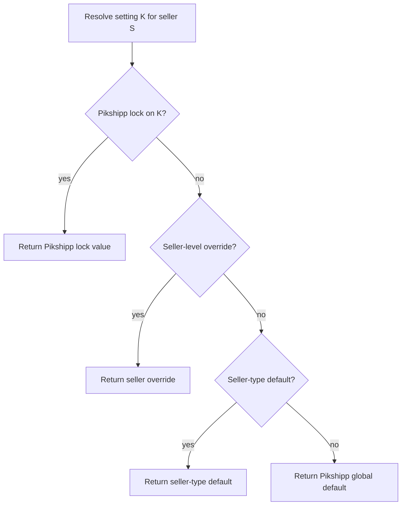

# Policy engine

> The configurability framework. The runtime system that resolves *"what's the rule for this seller × this setting?"* — and the canonical home of the seller configuration vector.

## Why this is its own document

Configurability is a first-class principle. Every behavior in the platform — wallet posture, COD eligibility, max delivery attempts, allowed carriers, pricing, KYC depth — varies per seller. If 24 features each implement their own "if seller is on plan X then..." logic, the platform is uncontrollable in a year. Instead, **one engine** resolves config; every feature consumes it.

## What the policy engine does

- Stores the seller's configuration vector (per-seller settings).
- Stores Pikshipp-default configuration (platform defaults).
- Stores seller-type defaults (bundles of values shared by sellers of that type).
- Stores Pikshipp locks (settings sellers cannot override).
- Resolves an effective value for any (seller, key) pair at runtime.
- Audit-logs every change, every read of a sensitive setting (optional), every override.

## What it does NOT do

- It does not run business logic. It returns values; features act on them.
- It does not own contracts (machine-readable contract terms feed *into* settings, but contract storage is Feature 27).
- It does not own RBAC (which user can do what is the auth layer's concern; the policy engine is about *what the platform does* for a seller, not what a user is allowed to do).

## The taxonomy of seller configuration

A seller's behavior is determined by ~30 independent axes. Grouped:

### Identity & profile
| Axis | Example values |
|---|---|
| `seller.type` | `small_smb` / `mid_market` / `enterprise` / `custom` |
| `seller.industry` | `general` / `jewelry` / `electronics` / `pharma` / `apparel` / ... |
| `seller.volume_band` | `<100/mo` / `100-1000` / `1k-10k` / `10k+` |
| `seller.risk_tier` | `low` / `medium` / `high` |

### Wallet & billing
| Axis | Example values |
|---|---|
| `wallet.posture` | `prepaid_only` / `hybrid` / `credit_only` |
| `wallet.credit_limit_inr` | numeric |
| `wallet.grace_negative_amount_inr` | numeric (default ₹500) |
| `wallet.auto_recharge.enabled` | bool |
| `wallet.auto_recharge.amount_inr` | numeric |
| `billing.invoice_cycle_days` | enum: monthly / weekly / on-demand |
| `billing.credit_period_days` | numeric (15 / 30 / 45 / 60) |

### COD
| Axis | Example values |
|---|---|
| `cod.enabled` | bool |
| `cod.per_order_max_inr` | numeric |
| `cod.pct_volume_cap` | 0..1 |
| `cod.verification_mode` | `always` / `above_x` / `none` |
| `cod.verification_threshold_inr` | numeric |
| `cod.remittance_cycle_days` | numeric (D+2 premium, D+5 default, D+8 default for high-risk) |
| `cod.pincode_blocklist_ref` | ref or `platform_default` |
| `cod.handling_fee_visibility` | `bundled` / `lineitem` |
| `cod.prepay_nudge` | `aggressive` / `silent` |

### Carriers
| Axis | Example values |
|---|---|
| `carriers.allowed_set` | list |
| `carriers.preferred_priority` | ordered list |
| `carriers.excluded_set` | list |

### Delivery semantics
| Axis | Example values |
|---|---|
| `delivery.max_attempts` | numeric or `carrier_default` |
| `delivery.reattempt_window_hours` | numeric |
| `delivery.auto_rto_on_max` | bool |
| `delivery.pickup_cutoff` | time-of-day or `carrier_default` |

### Pricing
| Axis | Example values |
|---|---|
| `pricing.rate_card_ref` | ref |
| `pricing.overrides` | list of axis-level overrides |
| `pricing.surcharges_passthrough` | bool |

### Buyer experience
| Axis | Example values |
|---|---|
| `buyer_experience.brand.logo_url` | url |
| `buyer_experience.brand.colors` | { primary, secondary } |
| `buyer_experience.brand.custom_domain` | optional domain |
| `buyer_experience.notification_template_overrides` | map |
| `buyer_experience.locales_enabled` | list |

### KYC & risk
| Axis | Example values |
|---|---|
| `kyc.required_docs` | list |
| `kyc.depth_tier` | `basic` / `enhanced` / `video_kyc` |
| `kyc.recheck_frequency_days` | numeric |

### Restricted goods
| Axis | Example values |
|---|---|
| `goods.restricted_categories` | list (overridable upward only — Pikshipp can lock minimum) |

### Operational
| Axis | Example values |
|---|---|
| `pickup.capacity_per_day` | numeric or `unlimited` |
| `support.tier` | `best_effort` / `4h` / `1h` |
| `support.dedicated_csm` | bool (always false at v1) |

### Feature flags (separate boolean layer)
| Axis | Example values |
|---|---|
| `features.insurance_attach` | bool |
| `features.weight_dispute_auto` | bool |
| `features.custom_reports` | bool |
| `features.ndr_chatbot` | bool |
| `features.public_api` | bool (always false at v1) |
| `features.bulk_operations_high_limit` | bool |
| `features.api_rate_limit_high` | bool |
| `features.subseller_enabled` | bool |

## The four layers of resolution



Concretely:

1. **Pikshipp lock** — settings Pikshipp pins for compliance/risk reasons. E.g., grace-negative-cap can be locked at `₹500`; `goods.restricted_categories` can have a *minimum* (you cannot un-restrict alcohol).
2. **Seller override** — explicit per-seller value from negotiated contracts or seller-self-service settings.
3. **Seller-type default** — the bundle of defaults attached to a seller's type (the "plan").
4. **Pikshipp global default** — fallback for settings the seller-type doesn't address.

## Data shape

```yaml
policy_setting_definition:
  key: "cod.remittance_cycle_days"
  type: numeric | string | bool | enum | list | map | ref
  range: { min: 0, max: 30 }
  enum_values: [...]
  default_global: 5
  defaults_by_seller_type:
    small_smb: 5
    mid_market: 3
    enterprise: 2
  lock_capable: true
  override_allowed_at: [seller_level, sub_seller_level]
  description: "Days between delivery and seller wallet credit"
  changed_in_version: 7

policy_seller_override:
  seller_id
  key
  value
  reason
  set_by_user_id
  set_at
  expires_at?

policy_lock:
  key
  scope: global | seller_type:{name}
  value
  reason
  set_by_user_id
  set_at

policy_seller_type:
  name: small_smb | mid_market | enterprise | ...
  description
  default_settings: [{ key, value }]
```

## Read path: how features consume policy

Every feature reads via:

```pseudo
value = policy.resolve(seller_id, "cod.enabled")
```

The resolver:
1. Looks up the setting definition.
2. Walks the four layers.
3. Caches the result (per-request memoize; per-seller cache with invalidation on change).
4. Optionally audit-logs the read for sensitive keys.

Returns a typed value or raises if the key is unknown.

## Write path: how settings change

| Source of change | Path | Audit |
|---|---|---|
| Seller self-service (e.g., toggling a feature flag they own) | UI → API → policy.set_override | ✅ + tenant-visible audit |
| Pikshipp Ops setting an override | Ops console → policy.set_override | ✅ + reason required |
| Pikshipp Admin locking a setting | Admin → policy.set_lock | ✅ + reason required + may notify |
| Plan/type change (bulk default change) | Admin → policy.set_seller_type_defaults | ✅ + impact analysis report |
| Contract update (ingest signed contract → machine-readable terms) | Contract feature → policy.set_overrides_from_contract | ✅ + linked to contract_id |

## Cross-feature example

When a seller books a shipment, the system reads from policy:

```
- carriers.allowed_set        → filters allocation candidates
- carriers.preferred_priority → orders allocation ranking
- pricing.rate_card_ref       → which rate card applies
- pricing.overrides           → per-zone modifications
- delivery.max_attempts       → carrier passes this in booking payload (where supported)
- features.insurance_attach   → triggers insurance prompt
- cod.handling_fee_visibility → controls UI line-item display
- buyer_experience.brand.*    → applied to buyer notifications and tracking page
- support.tier                → determines SLA badge in dashboard
```

All from one resolver. No "if seller.plan == 'enterprise'" code anywhere.

## Versioning settings

Setting definitions are versioned. Adding a new key is additive (new readers handle it; old readers ignore). Changing a key's type is breaking (requires a migration plan). Removing a key is deprecation + removal cycle (≥6 months).

Setting *values* (overrides, locks) are not versioned — they're current-state. The audit log captures historical values for reference.

## Audit & change-log integration

Every write to the policy engine emits an event to [`05-cross-cutting/06-audit-and-change-log.md`](../05-cross-cutting/06-audit-and-change-log.md). For sensitive reads (e.g., reading a credit limit), optionally emit a read-audit event.

## What about contracts and the policy engine

Contracts have **machine-readable terms** that map to policy settings. Workflow:

1. Sales/Ops negotiates a contract with seller.
2. Contract is signed and stored (Feature 27).
3. Machine-readable terms are extracted/encoded.
4. The contract feature pushes those terms as policy overrides for the seller, with `contract_id` reference.
5. If the contract is amended or terminated, the overrides are updated/removed, audit-logged.

This is how Pikshipp's contractual variability lands as runtime behavior without ad-hoc code.

## Observability

Policy engine exposes:
- **Per-seller config snapshot** (effective values) for support troubleshooting.
- **Setting-level usage telemetry** (which keys read often; which never).
- **Override volume** (how many sellers have non-default values per key — informs whether to promote to a tier default).
- **Lock violations** (attempts to override locked settings; should be zero).

## What this enables downstream

Because the policy engine is in place:
- **Adding a new behavior axis** (a new seller-level config knob) is a definition + UI — it's not 24 feature changes.
- **A new plan** is a `seller_type` row with default values.
- **A negotiated enterprise contract** is a set of seller-level overrides with `contract_id` provenance.
- **Compliance changes** (e.g., regulator requires X for sellers with Y) is a Pikshipp lock — applied platform-wide instantly.
- **Per-seller debugging** is a one-screen view: "show me the effective config vector for seller S".

This is the leverage of having a configurability framework. Without it, the platform calcifies. With it, we add new behaviors without re-architecting.

## Open questions

- **Q-PE1** — Audit reads on sensitive keys: which keys count as sensitive? Default: financial (credit limits, rates) and risk (KYC depth) read-audit. Behavioral keys (max_attempts) not audited on read.
- **Q-PE2** — Cache invalidation strategy: TTL vs event-driven vs hybrid? Default: event-driven invalidation; TTL fallback at 5 min.
- **Q-PE3** — Contract-driven settings: are they hard overrides (cannot be undone outside contract) or soft (any ops can change)? Default: contract-linked overrides require contract amendment to change; ops can bypass with two-person approval.
- **Q-PE4** — Sub-seller policy: do sub-sellers have their own override layer (5th layer)? Default v1: no — sub-sellers inherit parent. v2 may add.
