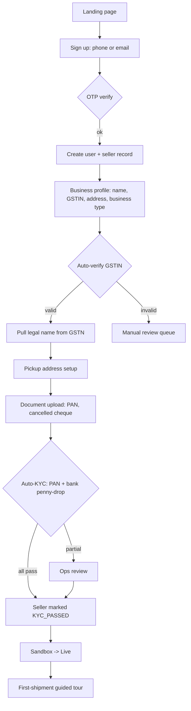

# Feature 01 — Identity & onboarding

## Problem

A seller needs to sign up, verify their business identity (KYC), and start shipping — fast. KYC is a **risk-management** tool: we need to know who is shipping what so we minimize fraud, weight under-declaration, restricted-goods movement, and identity abuse. We do *not* perform KYC theatre; depth scales with risk and volume, not with bureaucratic checkboxes (with the caveats that some compliance is legitimately required — RBI-PPI for wallet, sanctions screening, etc.).

The wrong onboarding flow either (a) lets fraudulent sellers in (real money loss) or (b) friction-burns legitimate sellers (CAC waste).

## Goals

- **Time-to-first-shipment** < 30 minutes median, < 24 hours P95.
- **KYC SLA** P95 < 24h.
- **Risk-tiered KYC**: depth scales with seller-type, volume, and risk signals.
- **Frictionless re-onboarding** for sellers migrating from Shiprocket/Shipway/etc. — accept their existing GSTIN/PAN, prefill where possible.
- **Sandbox mode** during KYC review so sellers can explore product without booking real shipments.

## Non-goals

- KYC of *buyers* — out of scope; we serve only the seller side.
- Replacing risk monitoring once seller is live (Feature 26).
- Compliance-first KYC (we do enough for compliance + enough for risk; not more).

## Industry patterns

How others handle seller onboarding + KYC in Indian e-commerce platforms:

| Approach | Used by | Pros | Cons |
|---|---|---|---|
| **Manual document upload + ops review** | Shiprocket (legacy), most aggregators | Cheap to build; flexible | Slow (24–72h SLA); ops headcount scales linearly |
| **Automated KYC via Karza / IDfy / Hyperverge / Signzy / Bureau** | Razorpay, Cashfree, NimbusPost | Sub-5-min approval; OCR-driven | API cost (₹5–25 per verification); failure on edge cases |
| **DigiLocker integration** | Some banks | Authoritative source; user-pulled | UX friction; poor seller adoption |
| **GSTIN public API (GSTN)** | Razorpay, Zoho, most fintech | Free, real-time | Returns business name + status only; needs proof doc |
| **PAN verification via NSDL / IT API** | All KYC vendors | Cheap; reliable | Requires KYC vendor as middleman |
| **Bank account verification (penny drop)** | All payment platforms | Verifies actual bank ownership | ₹1–3 cost per check |
| **Tiered KYC based on volume** | Modern fintech | Low friction at low risk; rigorous at high | Complex to design; needs volume-based triggers |
| **Video KYC** | Banks, mutual funds | Highest assurance | UX heavy; not needed for our risk profile |

**Our pick (v1):** Hybrid — **automated GSTIN + PAN + bank** via Karza/Hyperverge, **manual ops review for edge cases**. Tiered KYC: configurable per `seller.type` and `seller.risk_tier`. v1 is simple; deeper KYC capabilities phased in v2/v3.

## Functional requirements

### Authentication

- **Login methods (v1):**
  - Mobile + OTP (primary, India default).
  - Email + password (secondary).
- **Login methods (v2+):**
  - Google SSO.
  - Apple ID (mobile app only, when launched).
  - SAML / OIDC for enterprise sellers.
- **Sessions:**
  - Short-lived access tokens (15 min) + long-lived refresh (30 days).
  - Device-aware sessions; "log out all devices" available.
  - Inactive timeout: 24h for web.
- **MFA:**
  - Optional via TOTP at v1; required for Owner and Finance roles by v2.
  - Mandatory for any user with wallet-recharge permission > ₹50k.
- **Password policy:** 10+ chars, mixed case + number; rotation NOT enforced (per modern guidance); breach-checked against HIBP-style lists.

### Signup flow



### Sandbox mode

During KYC pending or KYC failed:

- Can explore the dashboard, connect channels, view pulled orders.
- Can create rate quotes (read-only — no booking).
- Can configure pickup addresses, products.
- **Cannot** book real shipments.
- **Can** book *test* shipments via a sandbox carrier adapter that returns mock AWBs and mock tracking events.
- Wallet shows ₹0; recharge disabled until KYC pass.

### Risk-tiered KYC depth

KYC requirements resolved per seller via policy engine (`kyc.required_docs`, `kyc.depth_tier`).

| Tier | Required for | Documents |
|---|---|---|
| **Basic** | `small_smb` low-risk | PAN + GSTIN (if applicable) + bank penny-drop |
| **Standard** | `mid_market` / medium volume | + entity docs (LLP/MOA/partnership deed); ops review |
| **Enhanced** | `enterprise` / high-risk industry | + sanctions/PEP screening + address verification + entity director KYC |
| **Video KYC** | v3 — for very high-risk | Live video session |

Auto-promotion: when a seller crosses volume thresholds (e.g., ₹50L cumulative GMV or 5,000 shipments), system flags for tier-upgrade KYC.

### KYC document set (Basic tier minimum)

| Document | Required for | Verification path |
|---|---|---|
| **PAN (proprietorship/individual)** | All sellers | Auto via NSDL/IT API + photo OCR |
| **PAN (entity — company/LLP/partnership)** | Entity sellers | As above + entity name match |
| **GSTIN** | Sellers above ₹40L/yr turnover (or voluntary) | Auto via GSTN; status must be `Active` |
| **Bank cancelled cheque or statement** | All sellers (for COD remittance) | Penny-drop; account holder name match |

### Standard / Enhanced tier additional

| Document | Tier | Notes |
|---|---|---|
| Aadhaar (proprietor, masked) | Standard+ | Optional v1; depth controlled by config |
| Partnership deed / MOA / LLP agreement | Standard+ entity | Auto-OCR + manual review |
| MSME / Udyam certificate | Optional | Auto via MSME API; unlocks tier-rate benefits |
| Address proof for pickup location | If pickup ≠ business | Manual ops v1 |
| Director KYC | Enterprise (PVT LTD) | Per-director PAN + Aadhaar |
| Sanctions / PEP screening | Enhanced | Karza/Bureau API |

### KYC rejection reasons + recovery

| Reason | Recovery path |
|---|---|
| GSTIN inactive/cancelled | Show GSTN status; prompt for new GSTIN or composition scheme |
| PAN-name mismatch | Allow re-upload with proof of name change (gazette/marriage cert) |
| Bank verification fails | Re-enter account; ops can override with screenshot |
| Address proof unclear | Re-upload with prompt; ops can override |
| Sanctions match | Manual ops review; legal escalation |
| GSTIN voluntary not provided | Cap monthly volume; offer GSTIN add later |

### Roles & permissions (within a seller)

| Role | Capabilities |
|---|---|
| **Owner** | All capabilities; tenant config; wallet recharge unlimited |
| **Manager** | All operational; cannot edit billing or roles |
| **Operator** | Create/edit orders, book shipments, download labels, NDR actions |
| **Finance** | Wallet, invoices, ledger, weight disputes, COD reports |
| **Read-only** | View everything; create nothing |
| **API client** (when API launches v2) | Token-only; configurable scopes |

Full RBAC matrix in [`05-cross-cutting/01-security-and-compliance.md`](../05-cross-cutting/01-security-and-compliance.md).

### Multi-user invites

- Owner can invite users by email/phone with a role.
- Invitee receives a magic link valid 72h.
- Invitee completes profile (name, password, MFA) and is bound to that seller.
- A user can belong to one seller in v1 (multi-tenant user is v2+ for CA persona).

## User stories

- *As a new seller*, I want to sign up with my mobile number and start exploring the platform within 5 minutes.
- *As a seller in KYC*, I want to know exactly what stage my application is at and an ETA.
- *As an owner*, I want to invite my packing operator with order-only permissions, so they can't drain the wallet.
- *As Pikshipp Ops*, I want a queue of KYC manual-review cases sorted by SLA breach proximity.

## Flows

### Flow: First-time signup → first shipment

(See diagram above.) Step durations:

| Step | Median | P95 | Owner |
|---|---|---|---|
| Phone OTP | 30s | 90s | Auth service |
| Business profile | 90s | 5m | UI / Seller |
| GSTIN auto-verify | 5s | 30s | KYC service |
| Document upload | 2m | 10m | Seller |
| Auto-KYC | 30s | 5m | KYC service |
| Manual review (when needed) | 4h | 24h | Ops |
| First wallet recharge | 60s | 5m | Payments |
| First booking | 90s | 5m | Booking |

### Flow: Sandbox → live transition

Triggered by: KYC pass.

1. Seller status changes from `sandbox` → `active`.
2. Sandbox carrier adapters disabled; real adapters enabled.
3. Wallet recharge unlocked.
4. Welcome email + WhatsApp with first-shipment guided tour link.
5. Seller's existing test bookings remain visible in a "test history" tab; not counted in metrics.

### Flow: Tier upgrade

System detects threshold crossed (volume or risk) → flags seller for KYC upgrade → seller prompted in-app to upload additional docs → ops review per upgrade tier → effective tier updated in policy engine.

### Flow: Forgotten password / locked out

Standard. Magic link via email + OTP via phone. If both inaccessible, ops can verify identity manually (rare).

## Configuration axes (consumed via policy engine)

```yaml
kyc:
  required_docs: [pan, gstin, bank]   # depends on tier
  depth_tier: basic | standard | enhanced | video
  recheck_frequency_days: 365         # annual GSTIN re-check
  auto_promote_thresholds:
    cumulative_gmv_inr: 5000000
    cumulative_shipments: 5000
  vendor_routing:
    primary: karza
    fallback: hyperverge
```

## Multi-seller-scoping considerations

- All KYC docs and decisions are seller-scoped.
- Cross-seller signal use (e.g., flagging multi-account fraud across sellers) goes via Risk feature (26) with hashed identifiers.
- Audit emits on every KYC decision.

## Data model

```yaml
user:
  id: u_xxx
  seller_id
  email
  phone
  name
  hashed_password
  mfa_enrollment
  roles: [Owner | Manager | Operator | Finance | ReadOnly]
  status: invited | active | suspended | locked
  last_login_at
  created_at

kyc_application:
  id: kyc_xxx
  seller_id
  tier_target: basic | standard | enhanced
  documents: [{type, ref, upload_at}]
  auto_results: { gstin: {...}, pan: {...}, bank: {...}, sanctions: {...} }
  manual_review:
    assigned_to: u_ops_xxx
    notes
  status: pending | auto_approved | manual_approved | rejected
  approved_at
  rejection_reason
  attempt_no: 1
```

## Edge cases

- **Seller signs up, abandons KYC, returns 6 months later** → resume in place; previous documents retained per retention policy; if purged, full re-upload.
- **Seller's GSTIN is cancelled mid-life** → status moves to `kyc_lapsed`; new bookings blocked; existing in-flight shipments continue.
- **Same phone number signs up twice** → blocked at signup; existing seller's owner gets an alert.
- **Owner leaves the company** → ownership transfer flow. Requires KYC of new owner if they were not previously a user with sufficient role.
- **Seller wants to change tenant type** (sole prop → Pvt Ltd) → new KYC application; legal-entity-change handled by ops.

## Open questions

- **Q-O1** — Tiered KYC volume cap: cumulative GMV vs shipment count? *Suggested:* both, lower of the two. Owner: Risk PM.
- **Q-O2** — Aadhaar storage: hashed-only vs masked image? Owner: Legal.
- **Q-O3** — KYC document retention period: 90 days post-rejection, indefinite post-approval? Or DPDP-aligned 7-year? Owner: Legal.
- **Q-O4** — When auto-tier-upgrade triggers, does shipping pause until upgrade completes? Default: no — soft-flag with grace.

## Dependencies

- KYC vendor selected & contracted ([`07-integrations/05`](../07-integrations/05-kyc-and-verification.md)).
- Communication providers (SMS for OTP, email, WhatsApp) ([`07-integrations/04`](../07-integrations/04-communication-providers.md)).
- Policy engine for tier-aware behaviors.
- Wallet provisioning ([`13-wallet-and-billing`](./13-wallet-and-billing.md)).
- Audit (`05-cross-cutting/06`).
- Risk (Feature 26) for behavioral monitoring after KYC.

## Risks

| Risk | Mitigation |
|---|---|
| KYC vendor outage blocks all signups | Multi-vendor (Karza primary, Hyperverge secondary); manual fallback |
| OTP SMS deliverability poor in tier-3 | Multi-route SMS provider; voice OTP fallback; WhatsApp OTP path (v2) |
| Fraudulent sellers slip through auto-KYC | Volume cap; first-pickup verification; risk model post-launch |
| Long KYC SLA in early days when ops is small | Auto-approve + sandbox mode masks ops slowness |
| Sellers abandon at document upload step | UX: explain why each doc is needed; allow partial save & resume |
