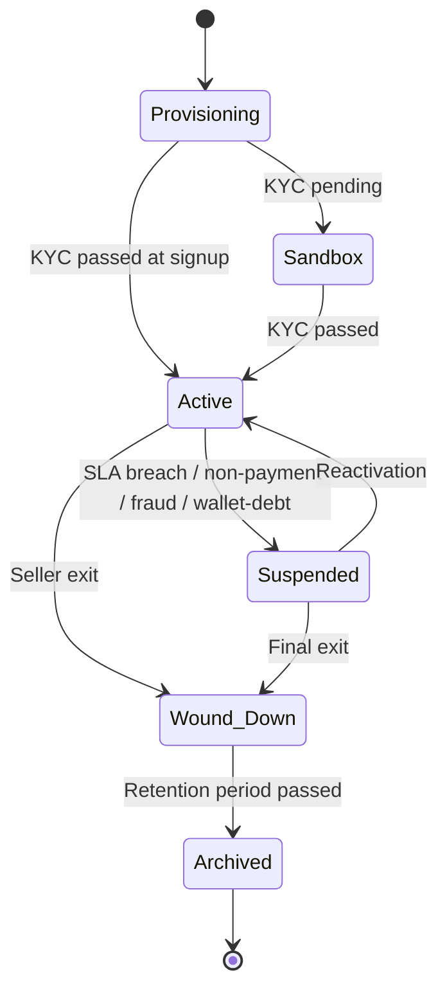

# Feature 02 — Seller organization & configuration

> The seller record itself: identity, lifecycle, sub-sellers, multi-user RBAC, and the per-seller configuration vector that the policy engine consumes.

## Problem

A seller is not a flat record — it's a structured organization with users, lifecycle states, sub-sellers (where applicable), and an extensive configuration vector that drives every other feature's behavior. Get this wrong and either the platform is too rigid (every variation needs code) or too chaotic (settings are scattered).

## Goals

- One canonical place for seller identity, lifecycle, sub-organizations, and config.
- Per-seller configuration that flows through the **policy engine** to every feature.
- Multi-user RBAC inside each seller.
- Optional sub-seller hierarchy for branches / subsidiaries.
- Lifecycle observability and reversibility where appropriate.

## Non-goals

- The policy engine itself ([`03-product-architecture/05-policy-engine.md`](../03-product-architecture/05-policy-engine.md) — this feature *consumes* it).
- Authentication ([`01-identity-and-onboarding`](./01-identity-and-onboarding.md)).
- Contract storage ([`27-contracts-and-documents`](./27-contracts-and-documents.md)).

## Industry patterns

Multi-customer SaaS handles seller orgs via:
- **Single record + RBAC** — Stripe, Razorpay (called "merchants" / "accounts"). Standard.
- **Hierarchical orgs** — Salesforce, Atlassian (orgs + sub-orgs). For enterprise users.
- **Workspaces / projects** — Notion, Slack. Doesn't fit shipping.

**Our pick:** Standard "Seller record + RBAC + optional sub-seller hierarchy". Configuration externalized to the policy engine.

## Functional requirements

### Seller entity

```yaml
seller:
  id: slr_xxx
  legal_name: "Lotus Beauty Private Limited"
  display_name: "Lotus Beauty"
  short_code: "lotus"           # used in IDs, URLs
  status: provisioning | sandbox | active | suspended | wound_down | archived
  status_reason
  status_changed_at
  
  type_profile:
    seller_type: small_smb | mid_market | enterprise | custom
    industry
    volume_band
    risk_tier
  
  contact:
    primary_user_id
    billing_email
    support_email
  
  metadata:
    industry_subcategory
    annual_gmv_band
  
  created_at
```

### Sub-seller entity

```yaml
sub_seller:
  id: ssl_xxx
  parent_seller_id: slr_xxx
  name: "Lotus Beauty - Mumbai branch"
  status
  pickup_locations: []
  channels: []                  # optional sub-seller channels
  config_overrides: { ... }     # limited overrides v1
  created_at
```

### Lifecycle



### Lifecycle operations

| Operation | Allowed by | Audit | Notify |
|---|---|---|---|
| Create seller | Self-serve / ops | ✅ | Welcome flow |
| Update profile | Owner / ops | ✅ | — |
| Suspend | Pikshipp Ops / system | ✅ | Yes |
| Reactivate | Pikshipp Ops | ✅ | Yes |
| Wind down (initiate) | Owner / ops | ✅ | Yes |
| Wind down (confirm — final) | Pikshipp Admin | ✅ | Yes |
| Archive | System (after retention) | ✅ | — |
| Restore (rare) | Pikshipp Admin | ✅ | Yes |

### Suspension semantics

When a seller is suspended:
- Reads allowed (dashboard view, history).
- New bookings blocked.
- Existing in-flight shipments continue tracking.
- Wallet recharges blocked.
- Notifications continue (so buyers and seller see status).

Triggers (configurable):
- Manual ops decision.
- Wallet negative beyond grace cap.
- Fraud signal (Risk feature).
- Non-payment (credit-line customers).
- KYC lapsed.

### Wind-down / data export

- 90-day window for seller to export their data.
- All orders, shipments, tracking events, ledger as CSV+JSON.
- Settings, addresses, products.
- Beyond 90 days: cold-storage archive; access only by audited admin request.
- Per legal retention (typically 7 years for financial records).

### Multi-user RBAC

Roles within a seller:

| Role | Description |
|---|---|
| **Owner** | Full control |
| **Manager** | All operational; not billing/RBAC |
| **Operator** | Order creation, booking, NDR; no finance |
| **Finance** | Wallet, invoices, ledger, weight disputes |
| **Read-only** | View only |
| **API client** | Token-only (when API launches v2+) |

Multi-Owner per seller supported. RBAC matrix detailed in `05-cross-cutting/01-security-and-compliance.md`.

### Sub-seller hierarchy (optional)

For sellers with branches / subsidiaries:
- Parent seller's wallet covers sub-sellers by default (configurable).
- Sub-sellers have their own pickup locations.
- Sub-sellers' shipments roll up to parent for billing/reporting.
- Limited config overrides at sub-seller level v1; expanded v2.

Most sellers will not use sub-sellers. Feature flag `features.subseller_enabled`.

### Seller configuration

The seller record has many configuration values that drive runtime behavior. These are stored in the policy engine, not on the seller record itself. See [`03-product-architecture/05-policy-engine.md`](../03-product-architecture/05-policy-engine.md) for the full taxonomy.

The seller record stores **identity and lifecycle**; the policy engine stores **behavior**.

### Plan changes

A plan change is just a `seller_type` change in the policy engine, which cascades through default values. Existing seller-level overrides survive (unless explicitly removed). Audit logged.

### Cross-seller analytics

- Aggregate platform metrics: read from data warehouse, no per-seller PII.
- Cohort comparisons: ditto.
- Per-seller drill-downs: require admin elevation, audited.

## User stories

- *As an Owner*, I want to invite my finance person with finance-only access.
- *As Pikshipp Admin*, I want to provision a new enterprise seller with their negotiated config in <1 hour from contract signing.
- *As an Owner*, I want my Mumbai branch as a sub-seller with its own pickup address but my wallet.
- *As Pikshipp Ops*, I want to suspend a non-paying seller and have audit captured automatically.

## Flows

### Flow: Provisioning a new enterprise seller

```mermaid
sequenceDiagram
    actor BD as Pikshipp BD
    actor SO as Seller Owner
    participant ADM as Admin Console
    participant SLR as Seller service
    participant CON as Contracts
    participant POL as Policy engine
    participant N as Notify
    
    BD->>ADM: create seller record
    ADM->>SLR: createSeller(type=enterprise)
    SLR-->>ADM: slr_xxx (status=provisioning)
    BD->>CON: upload signed MSA + SoS
    CON->>POL: push machine-readable terms as overrides
    BD->>ADM: invite Owner user
    ADM->>N: send invite email
    SO->>ADM: accept; complete profile + MFA
    SO->>ADM: complete KYC (already pre-discussed)
    ADM->>SLR: status=active
    SLR->>N: welcome notification
```

### Flow: Adding a sub-seller

1. Owner clicks "Add branch" in seller settings.
2. Provides: name, primary user, pickup address.
3. System creates sub-seller; inherits parent settings.
4. Sub-seller's primary user gets invite (or existing user gets context-switch capability).
5. Sub-seller is immediately active (no separate KYC; rolls up to parent).

### Flow: Suspension via wallet debt

1. Wallet goes negative beyond `wallet.grace_negative_amount`.
2. System triggers `seller.status = suspended` with reason.
3. Notifications to seller (email + WhatsApp + SMS).
4. UI banner shows resolution path (recharge to clear).
5. On recharge that clears debt: auto-reactivate.

## Configuration axes (consumed via policy engine)

The seller record itself doesn't have policy-engine values; it has identity and lifecycle. The policy engine holds:
- All behavioral knobs (~30 axes — see policy engine doc).

## Data model

(See `03-product-architecture/03-domain-model.md` for canonical entities.)

```yaml
seller_audit_event:
  id
  seller_id
  actor: { kind, ref }
  action               # seller.create | seller.update | seller.suspend | ...
  target_ref
  payload (jsonb)
  occurred_at
  ip_address
  user_agent
```

## Edge cases

- **Seller-type change mid-cycle** — new defaults apply; existing overrides preserved; audit logged with `change_type=plan_change`.
- **Multi-Owner conflict** (two Owners issue conflicting actions simultaneously) — last-write-wins on settings; audit captures both.
- **Sub-seller wallet override** in v2: independent vs parent. Default rolls up.
- **Seller wound-down with active sub-sellers** — sub-sellers wound down too; cascades.
- **Migrating from `mid_market` to `enterprise`** — typically involves a contract; trigger via Contract feature.

## Open questions

- **Q-T1** — Sub-seller wallet posture: parent-shared vs independent? Default v1: parent-shared. v2 may add per sub-seller.
- **Q-T2** — Cross-seller user (one user belongs to multiple sellers, e.g., a CA): not supported v1. v2+.
- **Q-T3** — Bulk plan upgrade tooling for ops (apply new defaults across N sellers): nice-to-have v2.

## Dependencies

- Identity (Feature 01).
- Policy engine (architecture).
- Audit (cross-cutting).
- Wallet (Feature 13) for wallet provisioning.
- Contracts (Feature 27) for term-driven config.

## Risks

| Risk | Mitigation |
|---|---|
| Cross-seller data leak through bug | Data scoping at data layer (RLS / interceptor); mandatory CI checks |
| Lifecycle race (suspend during active booking) | Lifecycle changes acquire write-lock; in-flight requests complete cleanly |
| Settings drift between seller record and policy engine | Single resolver; never read settings off seller record directly |
| Sub-seller misuse (one branch dominating wallet) | Per-sub-seller spend caps configurable (v2) |
