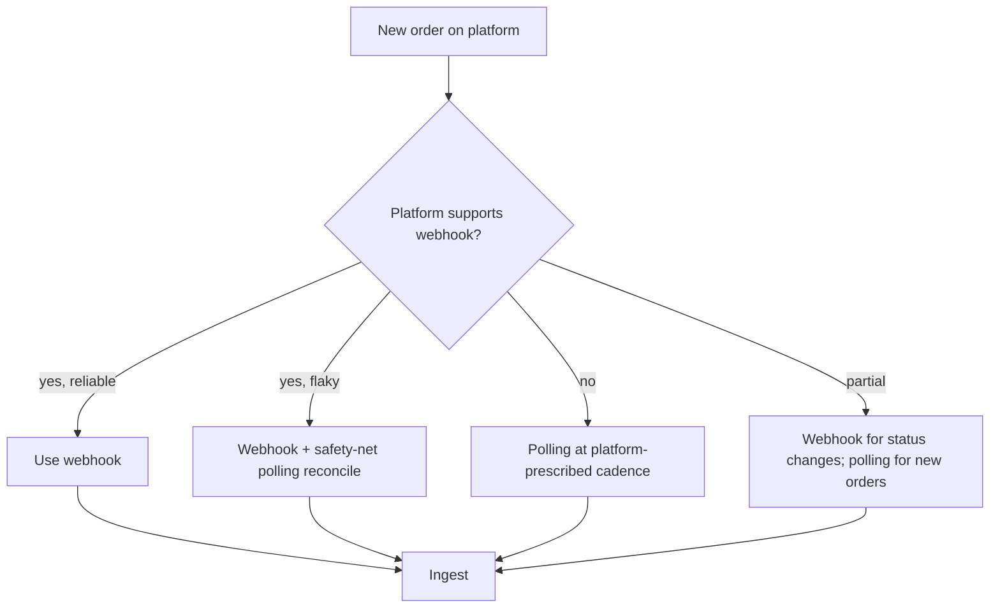
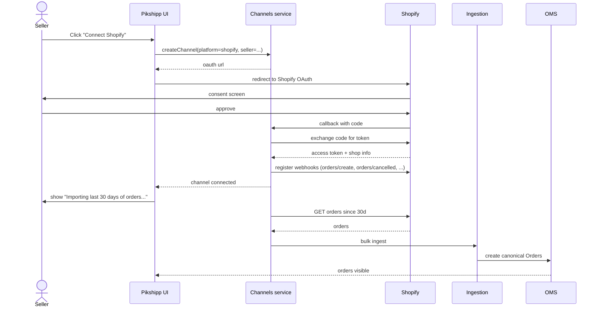
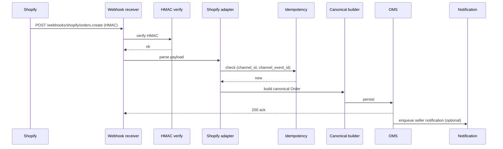

# Feature 03 — Channel integrations

> *This is one of the load-bearing features of the platform. The user explicitly asked: "is there a unified interface for orders that everyone follows in India?" — short answer: no, and this doc explains how we deal with that.*

## Problem

Sellers sell on many places: their own Shopify/WooCommerce/Magento store, marketplaces like Amazon/Flipkart/Meesho, social commerce on Instagram/WhatsApp, sometimes just a CSV from a custom backend. Each of those places has its own way of representing an order, its own way of authenticating, its own way of telling us about a new order, and its own way of accepting fulfillment status updates back from us.

Pikshipp needs to: **(1) ingest orders from all of these into a single canonical model**, **(2) keep the channel and the canonical state in sync** (both ways), **(3) handle channel-specific edge cases without polluting downstream features**, and **(4) let sellers add a new channel in a few minutes, not a few weeks**.

## Goals

- v1: support **5 channels** out of the box covering ~80% of Indian SMB sellers — Manual, CSV, Shopify, WooCommerce, Amazon SP-API.
- v2: add Flipkart, Meesho, Magento, BigCommerce, OpenCart.
- v3: add Myntra, Ajio, Snapdeal, Instamojo, Dukaan, Bikayi, Shoplinks, ONDC seller-app.
- All channel integrations follow a single **Channel Adapter framework** (no per-channel feature surface in the rest of the product).
- Channel onboarding (seller connects channel) MUST take < 5 minutes for OAuth-based channels and < 10 minutes for API-key-based channels.
- Order ingestion latency: **P95 < 60 seconds from platform event → visible in Pikshipp dashboard**.

## Non-goals

- We do not build the storefront. Sellers' sites are their own.
- We do not aggregate buyer data across channels (no cross-channel buyer identity).
- We do not push *catalog* (products) back to channels — at most we sync inventory/fulfillment status.

## Industry patterns — *how do orders flow into Indian aggregators today?*

This is the question that motivated this PRD. Detailed answer.

### Is there a unified order interface in India?

**No.** Each platform has its own seller API. There is no widely-adopted seller-side standard. Attempts and adjacent things:

| Standard | What it is | Our take |
|---|---|---|
| **GS1 EPCIS** | International event-data standard for supply chain, mostly for tracking events | Partially relevant for tracking, irrelevant for order ingestion |
| **ONDC** (Open Network for Digital Commerce) | India's open protocol for e-commerce, primarily buyer-side discovery + transaction | Important to follow but it solves "buyer finds a seller", not "aggregator pulls Shopify orders". We will integrate as an ONDC seller-app participant in v3 |
| **OpenAPI / per-platform docs** | Each platform publishes an OpenAPI spec or its own docs | The de facto reality |
| **IPaaS** (Pipe17, Cymbio, Celigo) | Third-party integration buses that maintain channel adapters for you | Considered; rejected as critical-path. Adds latency, vendor lock-in, and webhooks-of-webhooks reliability tax. Standard verdict among Indian aggregators |
| **OAuth 2.0** | Auth standard for several platforms (Shopify, Amazon SP-API, ...) | Used for auth where available; doesn't standardize the *order* itself |
| **Webhook callbacks** | Most modern platforms support these; many older or marketplace platforms don't | Preferred when available; we fall back to polling otherwise |

So the architecture conclusion: **build one Channel Adapter per platform**, all conforming to a common interface, layered under a Canonical Order Builder. The framework is detailed in [`07-integrations/01-channel-adapter-framework.md`](../07-integrations/01-channel-adapter-framework.md). This file is the *product* spec; the linked file is the *integration framework* spec.

### How each major channel actually works

| Channel | Auth | Order push | Status push back | Webhook quality | Notable quirks |
|---|---|---|---|---|---|
| **Shopify** | OAuth 2.0 (per shop) | Webhook on `orders/create` (real-time) | Fulfillment API (`fulfillments` resource) | Excellent; HMAC-signed | Plan tier affects API rate limit; Plus stores have higher limits |
| **WooCommerce** | API key+secret per site | Webhook (newer) or REST polling (older) | REST POST to `/orders/{id}/notes` and order status update | Variable — depends on host; some unreachable behind login walls | Self-hosted reality: many sites slow, occasional incompatibilities with security plugins |
| **Magento (Adobe Commerce)** | OAuth 1.0a (legacy) or OAuth 2.0 (newer) | REST polling primarily; webhooks via Magento `webhook` extension | REST `/V1/orders/{orderId}/ship` | Mixed; depends on Magento version | Magento 1 (legacy) still has long-tail in India |
| **Amazon SP-API** | OAuth + IAM (LWA + AWS) | EventBridge / SQS subscription; or polling `Orders` resource | `Feeds` API for fulfillment notifications | Good but architecturally heavy (SQS, AWS roles) | Marketplace IDs (IN, AE, SG) per region; PII restrictions on buyer data; rate limit per operation |
| **Flipkart Marketplace API** | OAuth | Polling primarily (no robust webhooks) | Status updates via REST | Polling cadence is the real product question | Specific dispatch SLAs; Flipkart-managed-shipping vs self-shipping flag |
| **Meesho** | API key | Polling; some events via webhook (newer) | REST status update | Younger API; evolving | High share for tier-2/3 sellers; Meesho-specific COD economics |
| **Myntra (PPMP)** | API key + IP whitelisting | Mixed | REST | Enterprise-ish onboarding; not self-serve at the seller level | Aggregator typically handshakes with Myntra centrally |
| **Custom storefront** | API key from us | Webhook to us OR our REST `POST /orders` | Webhook back from us | Whatever the seller builds | Most flexible; least standardized |
| **Manual / CSV / Excel** | n/a (in-app) | UI form / file upload | n/a | n/a | Universal fallback; needed forever |

### The per-channel "pull or push" decision



Cadence guidance (where polling):
- Shopify polling fallback: every 5 min.
- WooCommerce polling: every 5–15 min depending on plan.
- Amazon polling: every 1–5 min for active sellers.
- Flipkart polling: every 2–3 min.
- Meesho polling: every 5 min.
- Magento polling: every 10 min.

These are operational defaults; sellers on paid plans can request faster cadence.

## Functional requirements

### Channel connection (for the seller)

- Self-serve connection wizard for each supported channel.
- OAuth-based: redirect to platform → consent → callback with token → channel marked Connected.
- API-key-based: form field for credentials → test call → channel marked Connected.
- Display of channel sync status: last successful sync, lag, errors.
- Per-channel settings the seller can configure:
  - Auto-import: on/off (vs. show-as-pending).
  - Auto-mark-fulfilled in source channel when shipment booked: on/off.
  - Default pickup location.
  - Default carrier rule (or "use rate engine").
  - Inclusion filters (e.g., "ignore unpaid orders", "ignore COD over ₹X").

### Order ingestion

- For every connected channel, the system ingests orders by webhook (preferred) or polling (fallback).
- Each ingested order is converted to canonical Order.
- Ingestion is idempotent: webhook + polling overlap MUST NOT produce duplicate orders.
- Ingestion preserves the channel's order ID as `channel_order_ref` and back-link URL.
- Buyer PII: handled per channel rules (e.g., Amazon redacts emails — we accept null and degrade gracefully).

### Order updates back to channel

- When a shipment is booked → mark the order fulfilled on the channel (with AWB and carrier name).
- When a shipment delivers → optional "delivery confirmed" update on the channel (some channels close orders only on delivery).
- When an order is cancelled in Pikshipp → cancel on channel (where allowed).
- When an order is cancelled on the channel → fast-detect (webhook or short-cycle polling) and cancel on Pikshipp side; if shipment already booked, attempt cancellation with carrier (not always possible).

### Conflict resolution

The channel and Pikshipp can disagree (e.g., seller marks shipped on channel after booking on Pikshipp). Rules:

- **Channel is source of truth for order content** (line items, prices, addresses). If channel updates after Pikshipp ingestion: surfaces in seller UI as "channel updated this order" with diff; seller decides.
- **Pikshipp is source of truth for shipment state** (what was actually booked, AWB, status). Channel-side fulfillment updates that contradict Pikshipp's view are flagged.
- Seller can resolve manually.

### Multi-store same channel

A seller may have multiple Shopify stores. We support N channels of the same `platform` per seller (`shopify-storeA`, `shopify-storeB`).

### Channel health

Per-channel health card in seller dashboard:
- Last successful sync.
- Order ingestion lag (P50, P95).
- Error count last 24h.
- Outstanding errors needing seller action (e.g., "your Shopify token expired, reconnect").
- Sync paused indicator and reason.

### Channel error handling

| Error | Effect | Recovery |
|---|---|---|
| Auth token expired | Channel marked `auth_expired`; seller prompted | Re-OAuth |
| Rate limited | Backoff + retry | Auto |
| Channel API outage | Backoff + alert; orders queued | Resume on recovery |
| Schema change in channel API | Adapter version mismatch alert | Eng triages |
| Malformed order (missing pincode etc.) | Order ingested in `pending_validation`; seller sees flag | Seller fixes or skips |
| Buyer PII redacted (Amazon) | Ingest with available fields; flag as redacted; tracking comms via channel-mediated routes | Document the limitation; we cannot WhatsApp the buyer if we have no phone |

## User stories

- *As a seller*, I want to connect my Shopify store with one click and see existing orders within minutes.
- *As a seller with two Shopify stores*, I want both connected separately, each with its own pickup address default.
- *As a seller on Amazon*, I want to ship Amazon orders through our negotiated couriers (not Amazon's), so I save on shipping cost.
- *As a Pikshipp Ops*, I want to see channel-wide health (e.g., Flipkart polling errors are trending up) so I can engage Flipkart support.

## Flows

### Flow: Connect Shopify



### Flow: A new Shopify order arrives



### Flow: Channel auth lapsing (token expired)

1. Channel adapter on next call gets 401.
2. Channel marked `auth_expired`; ingestion paused.
3. Seller dashboard shows red status with "Reconnect Shopify" CTA.
4. Email + WhatsApp to seller.
5. Seller reconnects; ingestion resumes; backfill runs to catch missed orders.

## Channel-specific quirks (worth pre-committing)

| Channel | Quirk | Our handling |
|---|---|---|
| Shopify | Order edits after creation are surfaced via separate webhooks | Subscribe to `orders/updated`; reconcile diffs |
| Amazon SP-API | Buyer email/phone can be redacted | Operate on Amazon-mediated comms for those orders |
| Amazon SP-API | "Premium shipping" SLAs | Tag order; rate engine biases toward fast carriers |
| Flipkart | "Smart Fulfillment" orders (Flipkart-shipped) | Filter out — never our orders |
| Meesho | Orders sometimes have address quality issues (Meesho's reseller-driven model) | Address normalizer + flag |
| WooCommerce | Many sites use plugins that mutate the order schema | Adapter parses defensively; logs unknown fields |
| Magento 1 | Legacy auth | Allow but mark deprecated; encourage upgrade |
| Manual | Seller may type address with pincode in city field | Address parser tolerates common errors |
| CSV | Encoding & locale issues (Excel CSV) | Auto-detect; UTF-8 BOM stripped; column mapping wizard |

## Multi-seller considerations

- Channels belong to a seller; data is seller-scoped.
- Pikshipp may centrally negotiate enterprise integrations with marketplaces (e.g., Myntra MPHP); these are exposed to qualified sellers via policy engine flags.
- Per-seller channel credentials are isolated per seller.

## Data model

```yaml
channel:
  id: ch_xxx
  seller_id
  platform: shopify | woocommerce | magento | amazon | flipkart | meesho | myntra | ajio | bigcommerce | opencart | dukaan | bikayi | manual | csv | api | ondc
  display_name: "MyShop Main Store"
  credentials_ref: secret_xxx
  scope: seller_owned | platform_owned       # platform_owned = central marketplace integration
  config:
    auto_import: true
    auto_mark_fulfilled: true
    default_pickup_location_id
    inclusion_filters: { exclude_unpaid: true, max_cod_inr: null }
  status: connected | auth_expired | paused | disconnected | error
  last_sync_at
  last_sync_lag_ms
  health: { error_count_24h, ... }
  metadata:
    shopify_shop_domain
    amazon_seller_id
    ...
  installed_at
  uninstalled_at

channel_event:
  id: ce_xxx
  channel_id
  event_type: order_create | order_update | order_cancel | refund_create | ...
  channel_event_id (idempotency key)
  payload_ref
  received_at
  processed_at
  status: pending | processed | failed
  attempts
  error
```

## Edge cases

- **Same order arrives via webhook AND polling** — idempotency on `(channel_id, channel_order_ref)`.
- **Channel sends webhook BEFORE the order is fully written** (rare, observed on some hosted WC) — adapter retries fetching the order from the platform if fields are missing.
- **Order with multiple shipping addresses** — split into multiple Pikshipp orders; cross-reference field tracks the parent channel order.
- **Test mode orders** (Shopify test mode) — ingested under sandbox or filtered out (configurable).
- **Channel disconnects/uninstalls** — ingestion stops; existing orders retained; seller informed.
- **Duplicate channel connects** (seller connects same Shopify store twice) — block based on platform shop ID.

## Open questions

- **Q-C1** — When Amazon redacts buyer phone, do we accept the order anyway? (Default: yes, with seller-visible flag and limited tracking comms.)
- **Q-C2** — Should we offer a "channel migration" tool (e.g., "move my orders from manual to Shopify retroactively")? Default: no — too error-prone.
- **Q-C3** — Should we attempt to reconcile inventory back to channels? Default: no in v1; explore in v2.
- **Q-C4** — How aggressive should backfill be on first connect? (30 days default, configurable up to 180 days.)

## Dependencies

- Channel adapter framework ([`07-integrations/01`](../07-integrations/01-channel-adapter-framework.md)).
- OMS for canonical order shape (Feature 04).
- Notifications (Feature 16).

## Risks

| Risk | Mitigation |
|---|---|
| Platform changes their API breaking our adapter | Versioned adapters; canary; alert on schema drift |
| Webhook deliverability (channel sends → never arrives) | Polling reconcile; lag-based alerts |
| Rate limits during backfill | Tiered backfill; cooperative rate limiting |
| Auth tokens leaking | Secrets in vault, never logged; rotation supported |
| Buyer PII handling differs by channel (Amazon, ONDC) | Adapter declares the PII profile; downstream features check |
| Channel-mediated tracking comms (Amazon) — we can't WhatsApp the buyer | Document; surface to seller; not a defect, a constraint |
