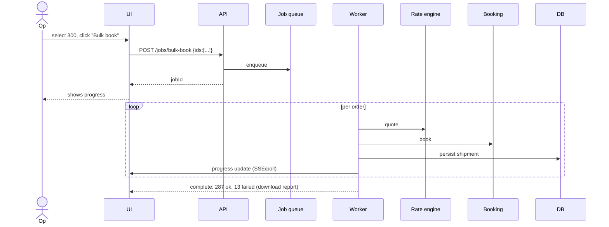
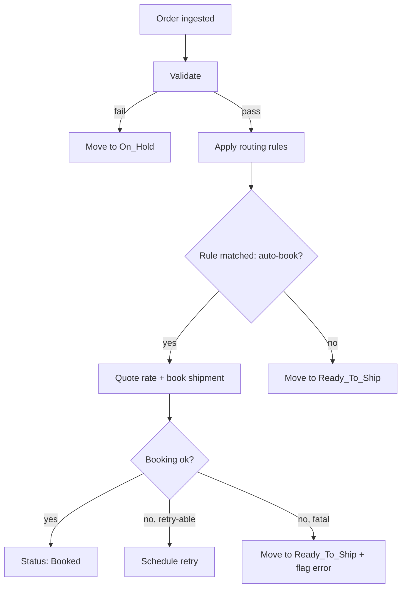

# Feature 04 — Order management

## Problem

The Order is the canonical "thing to ship". Every other downstream feature (rate, booking, tracking, billing) consumes Orders. The order management feature is the seller's primary operational surface — the list, filters, bulk actions, edit, validation, and routing happen here.

## Goals

- Provide a high-throughput **order list** that scales to sellers with 10,000+ daily orders.
- Provide **bulk operations** that an operator (P9) can execute on hundreds of orders in seconds.
- Validate orders proactively (pincode serviceability, address quality, weight limits, COD restrictions).
- Support **routing rules** so orders auto-assign to the right pickup location and carrier without operator intervention.
- Make order edits safe (only allowed before booking; audit trail post-booking).

## Non-goals

- Channel-specific quirks (covered in Feature 03).
- Carrier selection logic (covered in Feature 07).
- Inventory management (out of scope).

## Industry patterns

How aggregators present the order list:

| Pattern | Pros | Cons |
|---|---|---|
| **Single flat list** (Shiprocket old UI) | Simple | Slow at high volume; no segmentation |
| **Tabs by status** (most modern aggregators) | Fast filtering for common views | Can hide rare states |
| **Saved views / smart filters** | Power-user friendly | Complexity |
| **Kanban by status** | Visual | Doesn't scale to 1000s |
| **Spreadsheet-style with virtualization** | Massively scalable | UX learning curve |

**Our pick:** Tabs (Pending / Ready / Booked / In transit / NDR / RTO / Delivered / Cancelled), each list virtualized for performance. Power users get saved filters.

Bulk operation patterns:
- **Select all in current page** (default): safe and predictable.
- **Select all matching filter** (with count + confirmation): for power use.
- **Server-side bulk operation** (long-running, observable): for >100 items.

## Functional requirements

### Order creation modes

1. **From channel** (Feature 03) — auto.
2. **Manual entry** — full form with address, items, weight, dims, COD.
3. **CSV / Excel import** — column mapping wizard, validation report, partial commit.
4. **Public API** — `POST /orders` with idempotency key.
5. **Quick re-order** — duplicate a delivered order.

### Order list

- Paginated, virtualized.
- Default sort: `placed_at desc`.
- Filter by:
  - Status (canonical states + sub-states).
  - Date range (placed, ingested, last-updated).
  - Channel (or "manual").
  - Pickup location.
  - Payment mode (prepaid/COD).
  - Carrier (post-booking).
  - Pincode / pincode zone.
  - Buyer phone / name search.
  - Tags / custom fields.
  - SLA / NDR-pending / weight-disputed flags.
- Search by: order ID, channel order ref, AWB, buyer phone (last 4 digits OK), product SKU.
- Saved views (per user).
- Column customization (which fields to show).

### Order detail page

- Header: status, payment mode, total value, channel link.
- Tabs:
  - **Items** — products, qty, prices, HSN.
  - **Buyer & address** — contact, ship-to, bill-to, address validation status.
  - **Shipment(s)** — list of all shipments under this order, statuses, AWBs.
  - **Tracking** — combined timeline if shipped.
  - **Activity** — every event (ingestion, edits, bookings, NDRs, comms, ledger entries).
  - **Comms** — notifications sent to buyer for this order.
  - **Documents** — invoice, label, manifest, POD, e-way bill.

### Bulk actions

| Action | Min items | Sync vs. async | Notes |
|---|---|---|---|
| Bulk validate | 1 | Sync up to 50; async above | Re-runs serviceability + address checks |
| Bulk book | 1 | Async | Most important high-volume action |
| Bulk download labels | 1 | Async (zip) | Per orientation (4×6 / A4) |
| Bulk download manifest | 1 | Sync | Per carrier + pickup location |
| Bulk cancel | 1 | Sync up to 50; async above | Pre-pickup only |
| Bulk export CSV | 1 | Async | Customizable columns |
| Bulk tag | 1 | Sync | Adds/removes tags |
| Bulk re-route | 1 | Sync | Change carrier (pre-booking only) |
| Bulk reattempt (NDR) | 1 | Async | Sends reattempt request to carrier |

Async bulk ops are observable in a "Tasks" tab — progress %, success/fail counts, downloadable error reports.

### Order validation rules (run at ingest and pre-booking)

- **Pincode serviceability** — at least one carrier must serve the destination pincode.
- **Address completeness** — line1, city, state, pincode, country, contact name, contact phone all required.
- **Pincode-state consistency** — pincode prefix matches state (mismatch flagged but not blocking).
- **Weight present** — `declared_weight_g > 0` else block.
- **Weight bounds** — within a carrier's min/max for the chosen service; if max exceeded across all carriers, block.
- **Dimensions present** — if not, default to "envelope" (used only for volumetric).
- **COD bounds** — COD amount must equal order total minus prepaid amount; for some pincodes COD prohibited (zone-specific).
- **HSN code presence** — required if e-way bill applicable (intra-state ≥ ₹50k or interstate ≥ ₹50k).
- **Phone valid** — E.164; Indian numbers normalized.
- **Restricted goods** — flagged categories (alcohol, batteries, perishables) require carrier service-class match or explicit seller acceptance.

Validation result categorization:
- **Blocks booking** — must fix.
- **Warning** — booking allowed; flagged for awareness.
- **Auto-fixed** — system normalized; logged.

### Order edits

- Pre-booking: any field editable. Audit logged.
- Post-booking: only non-shipping fields (tags, internal notes). Shipping fields require cancellation + re-book.
- Channel-side edits arriving post-Pikshipp ingest: surfaces as "channel updated this order"; seller chooses which version wins.

### Routing rules (auto-assignment)

Sellers can define rules that auto-assign:
- **Pickup location** based on conditions (e.g., "if ship_to.state = MH → pickup at Mumbai warehouse").
- **Default carrier** (e.g., "if weight < 1kg → Delhivery; else → Bluedart").
- **Auto-book** (e.g., "auto-book all prepaid orders <₹2000 every hour").
- **Hold** (e.g., "hold all COD orders > ₹5000 for manual review").

Rule structure:

```yaml
rule:
  name: "MH small parcels via Delhivery"
  enabled: true
  priority: 100
  scope: { seller_id, sub_seller_id, channel_id }
  conditions:
    - { field: "ship_to.state", op: "=", value: "MH" }
    - { field: "package.declared_weight_g", op: "<=", value: 1000 }
    - { field: "payment.mode", op: "=", value: "prepaid" }
  action:
    type: assign_carrier
    carrier_id: crr_delhivery
    service_type: surface
  audit_each_match: true
```

Rules engine:
- Evaluated at ingestion + pre-booking.
- Multiple matching rules → highest priority wins.
- Visible "why was this routed this way?" explanation on each order.

### Bulk import (CSV/Excel)

- Drag & drop file.
- Column mapping wizard with auto-detection (heuristic based on column header).
- Validation pass — inline errors per row.
- "Import valid only" vs "Import all (invalid go to Pending)".
- Imports tracked as a Job; full history in Tasks tab.
- Sample template downloadable.

## User stories

- *As an operator handling 500 orders/morning*, I want to bulk-book by status filter "Ready to Ship" with one click, so my morning takes 10 minutes not 2 hours.
- *As an owner*, I want to set a routing rule that hold-flags any COD order >₹3000 to a small pincode list, so I can vet RTO risk.
- *As a finance person*, I want to filter orders by date range and export with COD column visible, so I can reconcile my COD float.
- *As a seller*, I want to see why an order is in "Pending" — the validation reason should be surfaced clearly, not buried.

## Flows

### Flow: Bulk book 300 orders



### Flow: Auto-book based on rule



## Multi-seller considerations

- Order belongs to seller (and sub-seller if applicable).
- Pikshipp can ship platform-default routing rules (e.g., per seller-type); sellers may override unless locked by Pikshipp.
- Order edit history is auditable; Pikshipp staff access is logged in the seller's audit log.

## Data model

(See `03-product-architecture/04-canonical-data-model.md` for canonical Order.)

Key per-feature additions:
```yaml
order_validation_result:
  order_id
  validated_at
  blocks: [{ rule_id, field, message }]
  warnings: [{ rule_id, field, message }]
  auto_fixes: [{ rule_id, field, before, after }]

routing_rule:                 # see above

bulk_job:
  id
  seller_id
  kind: bulk_book | bulk_label | bulk_validate | ...
  selection: { ids } | { filter }
  status: queued | running | completed | failed | partial
  progress: { total, done, ok, failed }
  result_ref
  started_at, completed_at
```

## Edge cases

- **Address mid-edit**: seller edits address while booking is in progress → booking proceeds with snapshot at start; edit applies to subsequent operations only.
- **Order without phone** (rare; some channels): cannot book on carriers requiring phone; surfaces validation block.
- **Order with multiple shipments**: most sellers fulfill in one box; we support N shipments. Splitting decided pre-booking.
- **Manual order with same channel_order_ref as a real channel order**: blocked by uniqueness on `(channel, channel_order_ref)`; manual orders use a synthetic prefix.
- **Buyer attempts to cancel after pickup**: order can't be cancelled; surfaces option to "convert to RTO".

## Open questions

- **Q-OM1** — Should we support custom states beyond canonical? (E.g., a seller's "QC done" intermediate.) Trade-off: flexibility vs. uniformity for downstream features. Default: tags only.
- **Q-OM2** — Should manifests be auto-generated when N orders for a courier reach a threshold, or only on-demand? Default: on-demand v1; auto v2.
- **Q-OM3** — Should we allow rule-based auto-cancellation? (E.g., "auto-cancel COD over ₹X to high-RTO pincode".) Default: no — risky.

## Dependencies

- Channels (Feature 03), Catalog/warehouse (Feature 05), Rate engine (Feature 07), Booking (Feature 08), Tracking (Feature 09).

## Risks

| Risk | Mitigation |
|---|---|
| Order list slow at scale | Virtualized list + indexed filters + warehouse for analytical queries |
| Bulk-book partial failures cause confusion | Clear per-order error report; rerun-failed action |
| Rule engine misroutes | Dry-run + simulator; rule audit logs per match |
| Edit-during-booking races | Snapshot semantics + idempotency on booking |
