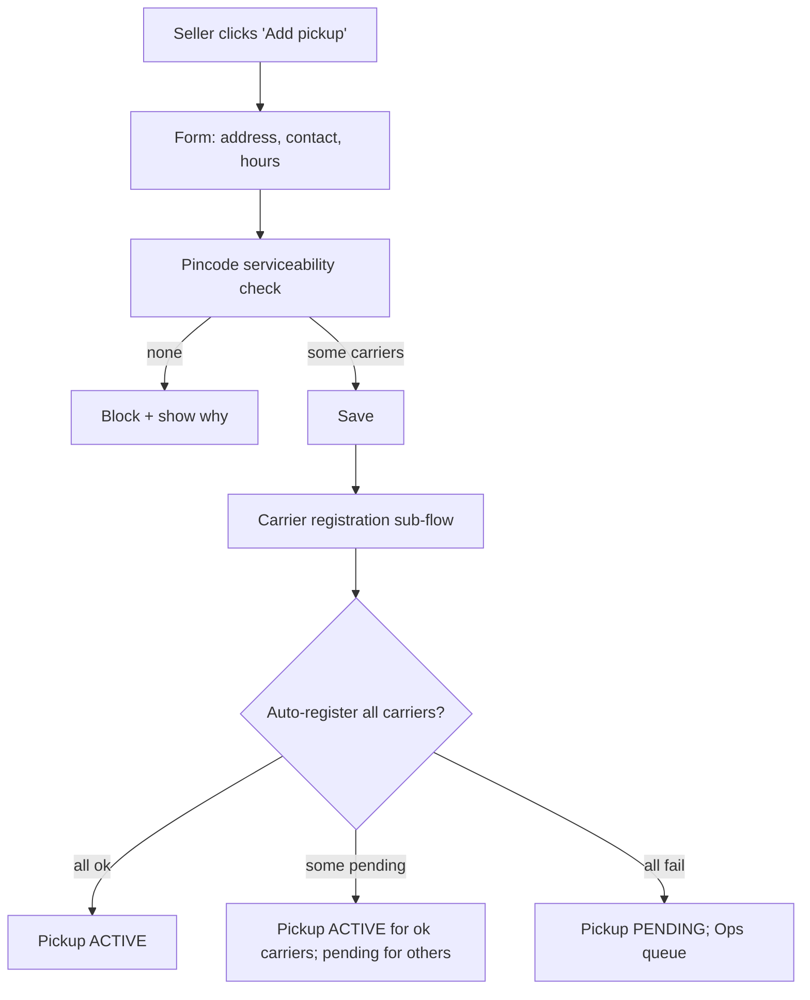
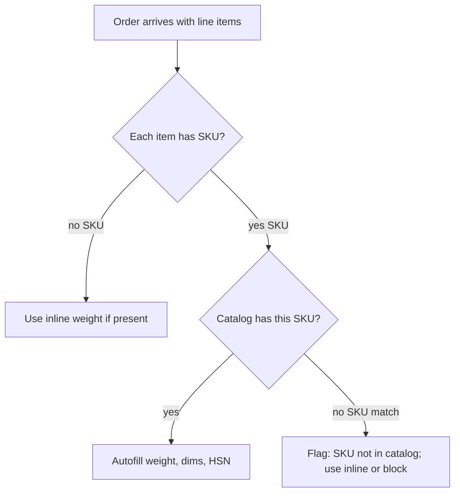

# Feature 05 — Catalog & warehouse (pickup locations)

## Problem

Two related concepts share this doc because they often confuse new users:

1. **Catalog** (products / SKUs) — optional master data so the seller doesn't re-enter weight/dims for every order.
2. **Warehouse / pickup locations** — the physical addresses from which the seller ships. This is *not* optional; every shipment needs a pickup address.

We bundle these because they share lifecycle (settings-grade, not transactional) and because operators interact with both during setup.

## Goals

- Make pickup location setup **the first thing** in the seller onboarding (else they can't ship).
- Allow multiple pickup locations per seller; allow per-channel/per-rule defaults.
- Catalog is optional but valuable for sellers with repeat SKUs; weight/dims should auto-fill on order creation.
- Support **multi-warehouse** for sellers with regional fulfillment.

## Non-goals

- Inventory management (stock levels, reservations, stock-outs). Channels own this.
- Warehouse management (bin locations, picking slips). Out of scope; this is not a WMS.
- Product catalog as a marketing surface. We don't render product pages.

## Industry patterns

| Approach | Used by | Notes |
|---|---|---|
| **Mandatory catalog** (every line item must be a SKU) | Some enterprise WMS | Heavy onboarding; not for SMB |
| **Optional catalog with inline override** | Shiprocket, Shipway | Right balance; our default |
| **No catalog** (always inline weight/dims) | Smaller aggregators | Easy but punishes high-volume sellers |
| **Channel-synced catalog** | Cymbio, Pipe17 | Pulls SKUs from channels; useful but couples us to channel schemas |

**Our pick:** Optional catalog with channel-sync as a v2 enhancement.

For pickup locations:
| Approach | Notes |
|---|---|
| Single pickup address (forced) | Wrong for multi-warehouse sellers |
| Multiple pickup addresses with rule-based defaults | Standard |
| Geo-fenced pickup (auto-pick nearest based on ship-to) | Powerful; complexity v2 |

**Our pick:** Multiple pickup addresses with rule-based defaults v1; geo-fence v2.

## Functional requirements

### Pickup location

- Fields: name, line1/2/landmark, city, state, pincode, country=IN, contact name, contact phone, alternate phone, operating hours per day, whether pickups are open weekends/holidays.
- Validation: pincode serviceable for at least one carrier; phone E.164; address geocoded if possible.
- Multi-warehouse: any seller can add ≥ 1.
- Default pickup: one designated as default; rules can override.
- Carrier-specific approval: some carriers (Bluedart, Ekart) require a per-pickup-address registration; we automate this where APIs allow, otherwise surface a "carrier registration pending" state with ops handling.
- KYC tie-in: pickup address ≠ business address requires address proof (see Feature 01).

### Catalog (Product master)

- Fields: SKU (seller-unique), name, description, weight_g, dims_lwh_mm, HSN code, GST rate, declared value default, fragile flag, dangerous goods flag, image url(s).
- Optional: bar code (EAN/UPC), category, custom fields.
- Bulk import via CSV.
- Channel sync (v2): periodic pull of SKUs from each connected channel; conflicts surfaced.
- SKU resolution at order time: if the line item SKU matches catalog → autofill weight/dims/HSN; else fallback to inline values.
- Variant support: simple (e.g., product "T-shirt", variants "Red-S", "Red-M") with each variant a separate SKU under v1.

### Pickup capacity & scheduling

- Per pickup location, the seller indicates daily/weekly capacity (parcels). Used to throttle auto-booking and to flag when capacity is over-subscribed.
- Pickup window (time-of-day) communicated to courier on booking.
- Pickup-day cutoff (e.g., orders booked before 4 PM picked up same day; later → next day).

### Holiday & exceptions calendar

- Per pickup location, a calendar of closed days. Bookings that would result in same-day pickup are deferred or warned.
- National & regional holidays prepopulated; sellers can override.

### Multi-warehouse routing

If multiple pickups + a routing rule says "pick nearest" or "pick by state":
- We pre-compute zone-of-pickup × zone-of-delivery → carrier rate.
- The order's pickup location is locked at booking time.

## User stories

- *As a new seller*, I want to add my pickup address as Step 2 of onboarding so I can ship as soon as KYC clears.
- *As a multi-warehouse D2C*, I want orders auto-routed to my Mumbai warehouse if buyer is in MH/Goa/Karnataka, and Delhi otherwise.
- *As an operator*, I want a SKU master so when I add line items by SKU, weights and HSN codes are auto-filled.
- *As Pikshipp Ops*, I want to know if a seller's pickup address is failing carrier registration so I can intervene.

## Flows

### Flow: Add pickup location



### Flow: Catalog import

1. Seller downloads CSV template.
2. Fills SKU/name/weight/dims/HSN/...
3. Uploads.
4. Validation pass: row-level errors.
5. Commit valid rows; show error report for invalid.

### Flow: Order ingestion uses catalog



## Multi-seller considerations

- Catalog & pickups are per-seller (sub-sellers can have their own or inherit).
- Pikshipp seeds a default HSN/GST reference table.
- Pickup location addresses are sensitive (can include home addresses) — restricted visibility.

## Data model

```yaml
pickup_location:
  id
  seller_id
  name
  address: { ... }
  contact: { name, phone, alt_phone }
  operating_hours:
    mon: { open: "09:00", close: "18:00", off: false }
    ... (per day)
  capacity:
    daily_max_parcels: null  # null = unlimited
  carrier_registrations:
    - carrier_id, status: registered | pending | failed, ref
  is_default: bool
  status: active | inactive
  geo: { lat, lng } | null

product:
  id
  seller_id
  sku
  name
  description
  weight_g
  dims_mm: { l, w, h }
  hsn_code
  gst_rate_pct
  declared_value_default
  is_fragile, is_dangerous
  variants: [...]            # if applicable
  channel_refs:                # for v2 channel sync
    - { channel_id, channel_product_id }
  status: active | discontinued

holiday_calendar_entry:
  id
  pickup_location_id
  date
  reason
```

## Edge cases

- **Same SKU on multiple sellers' catalogs** — independent records, no global SKU.
- **Bulk import with duplicates** — last write wins; show conflict report.
- **Pickup location inactive but has in-flight shipments** — they continue to track; new bookings against this pickup blocked.
- **Pickup address change** — affects only future bookings; in-flight unchanged.
- **Carrier-specific pickup address restrictions** (e.g., a carrier doesn't service that pincode anymore) — pickup status reflects this per-carrier.

## Open questions

- **Q-CW1** — Geo-fenced pickup routing (auto-pick nearest pickup based on ship-to): v1 or v2? Default v2 — needs more data.
- **Q-CW2** — Pooled / fulfillment-as-a-service pickup addresses (where Pikshipp operates a shared warehouse on behalf of multiple sellers): out of scope v1; possibly v3+.
- **Q-CW3** — How aggressive is channel catalog sync? On-demand vs periodic? Default: on-demand pull v2.

## Dependencies

- Carrier network (Feature 06) for serviceability.
- Channels (Feature 03) for sync (v2).

## Risks

| Risk | Mitigation |
|---|---|
| Wrong weight/dims in catalog → systematic underweighing | Periodic weight reconciliation feedback; surface "your declared weights deviate from carrier-reweighed" |
| Pickup carrier registration delays block sellers | Track P95 of registration time per carrier; preemptively start at pickup creation |
| Multiple "default" pickups due to UI race | Server enforces single-default invariant |
