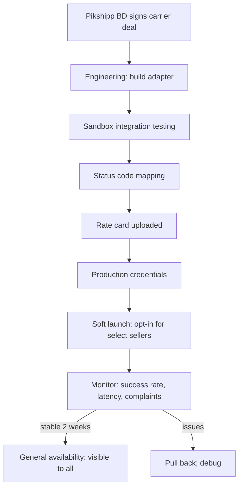

# Feature 06 — Courier network

## Problem

We are a multi-carrier aggregator. The number of carriers we offer, their service-type breadth, their reliability, and our internal toolchain to onboard / monitor / disable them — these collectively are the **carrier network feature**. From the seller's perspective, "more couriers" looks like a feature; in reality it is an operations + integrations machine.

## Goals

- Carry **8 carriers at v1 launch**, **15+ by end of year 1**, **25+ by end of year 2**.
- Provide a uniform internal contract (Carrier Adapter) so adding carrier #N is a 2-week project, not a 3-month one (after framework matures).
- Provide **Pikshipp Ops** with first-class carrier monitoring, configuration, performance reporting.
- Plug **Pikshipp Express** (our future first-party network) in as just another adapter — same interface.
- Allow **per-seller courier subset** (sellers can disable carriers they don't want to use, within Pikshipp-allowed set).

## Non-goals

- The actual delivery operation (we don't own trucks).
- Courier-side dispute management beyond what the courier API supports.
- International couriers (FedEx, DHL, Aramex) in v1/v2.

## Industry patterns

How aggregators manage carriers:

| Approach | Pros | Cons |
|---|---|---|
| **Per-courier custom code** (early Shiprocket) | Fast for first 3 carriers | Becomes unmaintainable past 10 |
| **Carrier adapter framework** (Shiprocket today, ClickPost) | Maintainable; consistent | Upfront framework investment |
| **Open-source standardization (e.g., AfterShip-like fields)** | Reuse existing taxonomies for tracking | Doesn't solve booking/manifest variance |
| **Plug-in marketplace** (rare) | Third-party adapters | Not realistic in Indian market |

**Our pick:** Carrier adapter framework from day 1. Detailed in [`07-integrations/02-courier-adapter-framework.md`](../07-integrations/02-courier-adapter-framework.md).

## v1 carrier set

| Carrier | Strengths | Why include |
|---|---|---|
| Delhivery | Largest network; reliable API | Default carrier for most pincodes |
| Bluedart | Premium air; B2B-grade reliability | Higher value parcels, faster delivery |
| DTDC | Surface network; price-competitive | SMB-friendly rates |
| Ekart | Flipkart's logistics; broad surface | Tier-2/3 reach |
| Xpressbees | E-commerce focused; modern API | Strong ops tech |
| Ecom Express | E-commerce focused; tier-2/3 strength | Coverage breadth |
| Shadowfax | Hyperlocal + last-mile; strong cities | Same/next-day capability |
| India Post | Universal pincode coverage | Last-resort serviceability for remote pincodes |

Full carrier roster (target by year 2): + Rivigo, Safexpress (B2B), Trackon, Professional Courier, Gati, Spoton, FirstFlight, ATS, V-Xpress, etc.

## Functional requirements

### Carrier configuration (Pikshipp admin)

For each carrier:
- **Identity:** name, logo, brand color (for UI).
- **Adapter key:** technical identifier matching the adapter implementation.
- **Credentials per environment:** sandbox + production; rotation supported.
- **Services offered:** surface, air, express, hyperlocal, B2B-LTL, B2B-FTL.
- **Service-level capabilities:** COD support, dimensional reweighing, partial AWB cancel, manifest format, e-way bill support, dangerous goods, fragile.
- **Weight bounds per service:** min/max in grams.
- **Pincode coverage:** uploaded as a serviceability matrix (carrier-supplied) or fetched via carrier serviceability API.
- **Pricing:** base rate cards (managed centrally; per-tenant overrides in Feature 07).
- **Operational windows:** per-carrier holidays/closures; carrier-specific cutoff times.
- **API endpoints:** rate, book, cancel, label, manifest, track, NDR action, COD remittance.
- **Webhook config:** URL whitelisting, secret, event types.
- **Polling config:** if no webhooks, polling cadence.
- **Status code mapping:** see canonical data model.

### Carrier health dashboard (Pikshipp ops)

A real-time view per carrier:
- API success rate (booking, rate, tracking) — 1h, 24h, 7d.
- API P95 latency.
- Webhook delivery rate (and lag).
- Booking failure reasons (top 5).
- NDR rate (carrier's NDR / total bookings).
- RTO rate.
- Average pickup delay.
- Average transit time per zone.
- Weight discrepancy rate (carrier reweigh > declared).
- Cancellation rate.
- Customer (seller) complaints linked to carrier.
- Open ops tickets with carrier.

Alerts when any metric crosses a threshold (per-carrier configurable).

### Carrier switching (per-shipment failover)

If a booking fails on the requested carrier:
- Configurable retry policy (1–3 retries with backoff).
- Optional fallback: the rate engine can automatically suggest next-best carrier and re-attempt (only if seller has opted in to "auto-fallback").
- Otherwise, return booking failure to seller with reason and alternatives.

### Carrier disable/enable

- Globally (Pikshipp admin) — emergency switch for a carrier outage.
- Per seller-type (default carrier set per plan).
- Per seller (within Pikshipp-allowed set) — exclude a carrier from their preferences via policy engine.
- Affects: rate quotes (excluded carriers don't appear), booking (blocked), but not in-flight shipments.

### First-party Pikshipp Express integration (architecturally)

- Same Carrier Adapter interface; the implementation just calls our internal first-party API.
- Same rate card format (managed by us as the carrier *and* the platform — we wear two hats but the architecture doesn't care).
- Same status/webhook contract.
- The adapter lives in the same code surface as third-party carriers.
- A flag `is_first_party = true` marks it for analytics and pricing logic but not for adapter logic.

This is the architectural validation that the abstraction holds. If Pikshipp Express needs special treatment in 5 places, the abstraction is broken; we treat that as a bug.

### Carrier serviceability API

Public endpoint (sellers can pre-check, channels can pre-check):
- `GET /serviceability?from=<pincode>&to=<pincode>&weight_g=<>&service=<>&payment=<>`
- Returns carriers that serve, their estimated rates, ETAs.
- Cached aggressively; invalidated on carrier coverage updates.

### Pickup registration

Some carriers (Bluedart, Ekart, others) require pre-registration of pickup addresses with the carrier. Our adapter automates this on pickup creation; status reflected on the pickup location.

### Manifest generation

Per-carrier manifest format:
- Some carriers generate manifests in their portal; we just record the manifest ID.
- Others require us to generate the manifest document.
- Our manifest builder produces a canonical PDF + carrier-required format.

## User stories

- *As Pikshipp Admin*, I want to see Delhivery's API success rate dropped below 95% in the last hour so I can route traffic to alternates.
- *As a seller*, I want to exclude a carrier I've had bad experiences with from my allowed set, so the allocation engine never picks them.
- *As a seller in v3*, I want my dashboard to show "shipped via Pikshipp Express" without any visual difference from third-party carriers — uniform UX.

## Flows

### Flow: Onboarding a new carrier



### Flow: Carrier outage detected

1. Health monitor flags Delhivery API success rate < threshold.
2. Pages on-call eng + ops.
3. Diagnostic: courier-side issue or our adapter?
4. If carrier-side: notify courier partner; toggle "degraded" badge in seller UI; rate engine biases away from this carrier; failed bookings route to alternates if seller opted in.
5. Sustained outage > 30 min: SLA breach; consider full disable.
6. Post-mortem after recovery.

## Multi-seller considerations

- Carrier configuration (credentials, base rates) is platform-global, owned by Pikshipp.
- Carrier *availability* (which carriers a tenant sees) is tenant-scoped.
- Carrier *rates* per tenant managed in Feature 07.
- Pikshipp Express, when introduced, is treated identically to third-party carriers from the tenant's perspective.

## Data model

```yaml
carrier:
  id: crr_xxx
  name: "Delhivery"
  display_name: "Delhivery Surface"
  adapter_key: "delhivery_v2"
  brand: { logo_url, color }
  is_first_party: false
  services:
    - { type: surface, weight_g_min: 50, weight_g_max: 30000, cod_supported: true, ... }
    - { type: air, ... }
  capabilities:
    supports_cod: true
    supports_partial_cancel: false
    supports_eway_bill: true
    requires_pickup_registration: true
    manifest_format: pdf | xml | none
    label_format: pdf-a4 | pdf-4x6 | zpl | epl
    webhook_signature: hmac_sha256
  config:
    api_base_url
    rate_endpoint, book_endpoint, ...
    polling_cadence_min: 5
  health:
    booking_success_rate_24h
    api_p95_ms
    webhook_lag_p95_s
  status: active | degraded | disabled
  status_reason
  enabled_for_seller_types: []   # restrict to certain plans

carrier_serviceability:
  carrier_id
  pincode
  service_type
  cod_allowed: bool
  estimated_days
  zone_classification
  last_updated_at
  source: api | uploaded_csv

carrier_credential:
  id
  carrier_id
  env: sandbox | production
  secret_ref
  rotated_at
```

## Edge cases

- **Carrier credentials rotated mid-stream** — adapter caches; on auth failure, refetches credentials from secrets manager.
- **Carrier serviceability stale** — cache TTL; periodic full refresh; per-pincode check on booking.
- **Carrier returns 200 but no AWB** (seen in some legacy APIs) — adapter classifies as failure; retries.
- **Carrier returns multiple AWBs for one shipment** — split into multiple shipments under same Order.
- **Carrier deprecates an endpoint** — adapter version bump; canary; full cutover.
- **Pikshipp Express stub during development** — sandbox adapter; doesn't appear in seller-facing UI until enabled per tenant.

## Open questions

- **Q-CN1** — Should serviceability data be replicated locally (heavy) or fetched on demand (slow)? Default: replicated for top carriers, on-demand for tail.
- **Q-CN2** — Carrier ranking signal in rate engine: success rate weight vs. rate weight? See Feature 07.
- **Q-CN3** — What's our SLA to the seller when a carrier is down? Default: rate engine biases away; seller-visible "carrier degraded" badge; no refund for delays caused by carrier outage (passthrough).

## Dependencies

- Carrier adapter framework (`07-integrations/02-courier-adapter-framework`).
- Rate engine (Feature 07) — consumes carrier config + per-tenant rates.
- Tracking (Feature 09) — consumes carrier event stream.
- Observability (`05-cross-cutting/05-observability`) for health monitoring.

## Risks

| Risk | Mitigation |
|---|---|
| Carrier API instability cascades to sellers | Adapter circuit breakers; rate engine bias; auto-fallback opt-in |
| Carrier deprecation during launch window | Maintain adapter versioning; carrier roadmap visibility; redundant carriers per pincode |
| Pikshipp Express tightly coupled when finally built | Strict abstraction; treat as third-party in code |
| Operational visibility gap (we don't see carrier internals) | Aggressive instrumentation of adapter calls; cross-reference seller complaint volume |
