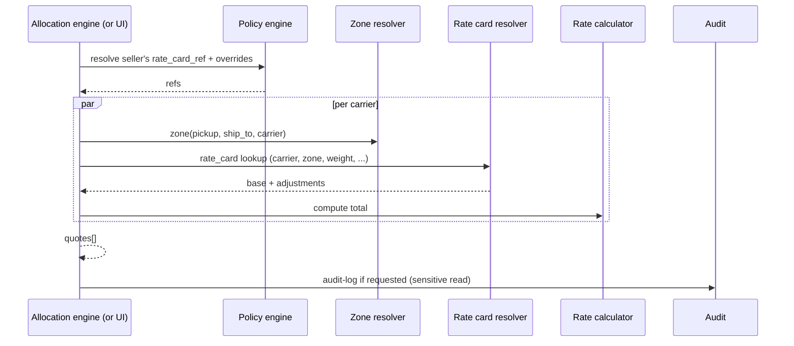
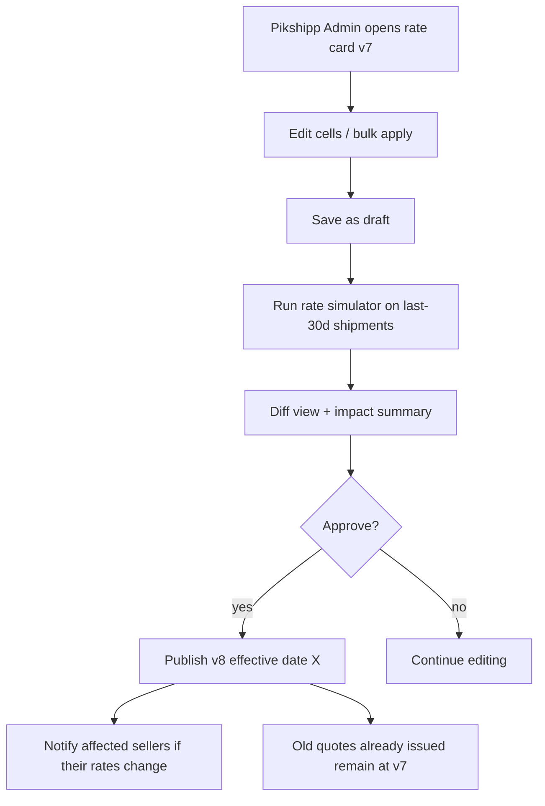

# Feature 07 — Pricing engine

> *Subsystem of the Allocation engine (Feature 25). Computes the price for a (carrier × service × order × seller) combination. Highly configurable, versioned, and auditable.*

## Problem

Given an order and a candidate carrier/service, **how much does it cost?** This is the input to allocation, the input to wallet reservation, and the input to invoicing. Wrong answers either lose us margin (we charge less than the carrier costs us) or break seller trust (sellers see surprises in their invoice).

The pricing engine must support real-world contract complexity: zone matrices, weight slabs, volumetric divisors, fuel surcharges, COD handling, ODA surcharges, peak-season uplifts, per-seller overrides, time-bounded validity, plan-tier defaults — without hand-coded if-else logic.

## Goals

- **Highly configurable** — add a new pricing axis without code changes.
- **Versioned & immutable** — published rate cards are never overwritten; new versions supersede.
- **Per-seller layered overrides** — full custom card / per-zone / discount %.
- **Sub-50ms** rate quote per (order × carrier).
- **Explainable** — every quote shows the breakdown, every rupee accounted.
- **Simulator** — "what would last month have cost on this card?".

## Non-goals

- Picking the carrier (Allocation engine, Feature 25).
- Booking (Feature 08).
- Setting business margins (commercial decision; reflected in rate card).

## Industry patterns

| Approach | Pros | Cons |
|---|---|---|
| **Live API call to each carrier** | Most accurate | Slow; carrier API rate limits; unreliable on outage |
| **Local rate-card lookup** | Fast (<10ms) | Drifts when carriers change rates; manual sync |
| **Hybrid: local for surface, live for special** | Best of both | Complexity |
| **Cached live rates with TTL** | Reasonable balance | Cache invalidation hard |

**Our pick:** **Local rate card lookup** as primary. Rate cards versioned with effective dates. Periodic carrier rate review (quarterly). Live API as fallback for special cases.

## Functional requirements

### Rate card structure

Multi-dimensional table:

```
zone × weight_slab × service_type × payment_mode → base price
+ adjustments: fuel surcharge %, COD handling, GST, delivery area surcharge
+ rules: first slab vs additional weight, volumetric divisor
```

Dimensions:
- **Zone** — pickup pincode zone × delivery pincode zone. Carriers typically define 4–6 zones (Metro-Metro, Metro-Regional, Within-Region, Across-Region, Rest-of-India, Special-NE). Each carrier has its own zone matrix; we normalize internally.
- **Weight slab** — typically 0.5kg first slab, 0.5kg increments thereafter. Some carriers use 250g or 1kg.
- **Service type** — surface, air, express, hyperlocal, B2B.
- **Payment mode** — prepaid vs COD (COD adds handling).
- **Volumetric divisor** — typically 5000 (cm³ / 5000 = volumetric kg). Some carriers use 4000 (express).

### Volumetric weight

```
volumetric_kg = (L_cm × W_cm × H_cm) / divisor
chargeable_kg = max(declared_kg, volumetric_kg)
```

Different divisors per carrier and per service. Stored in carrier config.

### Pricing layers

Layered overrides resolve in order:

```
Pikshipp's master rate card (negotiated with carrier)
  →  Seller-type defaults (per-tier discount/markup)
  →  Per-seller overrides (negotiated)
  →  Plan-tier discount
  =  Final rate
```

Plus runtime adjustments:
- Fuel surcharge (% of base; updated monthly).
- COD handling (% of COD value or flat, whichever per card).
- ODA surcharge (per pincode list).
- Peak-season uplift (date-bounded; configured by Pikshipp).
- Promotional credits (per seller, per period).
- GST (18% on logistics; place-of-supply rules).

### Rate computation

```
INPUT: order (pickup, ship_to, weight_g, dims, payment_mode, declared_value)
       seller context (seller_id, allowed carriers, overrides)

FOR each candidate carrier C:
  zone = lookup_zone(C, pickup_pincode, ship_to_pincode)
  service_types = applicable_services(C, weight_g, dims)
  FOR each service S in service_types:
    chargeable_kg = max(weight_g/1000, volumetric_kg(dims, C.divisor[S]))
    base_price = rate_card.lookup(C, S, zone, chargeable_kg, payment_mode, seller_id)
    cod_handling = payment_mode==cod ? rate_card.cod_handling(C, declared_value, seller_id) : 0
    fuel_surcharge = base_price * rate_card.fuel_pct(C)
    delivery_area_surcharge = special_pincode_surcharge(C, ship_to_pincode)
    peak_uplift = rate_card.peak_uplift(C, today)
    promo_credit = seller_promotions.applicable(seller_id)
    subtotal = base_price + cod_handling + fuel_surcharge + delivery_area_surcharge + peak_uplift - promo_credit
    gst = subtotal * 0.18
    total = subtotal + gst
    estimated_days = transit_time_estimate(C, S, zone)
    APPEND quote(C, S, total, breakdown, estimated_days)
RETURN quotes
```

### Bulk rate quoting

For batch operations (bulk book, CSV import preview):
- Vectorized rate computation (batched lookups).
- Cache by (zone, weight_slab, service, payment_mode) within request.

Throughput target: 1000 quotes/sec for a seller.

### Rate quote object

```yaml
rate_quote:
  id
  for_order_id
  carrier_id, service_type
  rate_card_id, rate_card_version
  computed_at
  expires_at   # short — minutes
  inputs:
    chargeable_weight_g
    zone
    payment_mode
    declared_value
  breakdown:
    base_first_slab
    additional_weight
    cod_handling
    fuel_surcharge
    delivery_area_surcharge
    peak_uplift
    promo_credit
    subtotal
    gst
    total
  estimated_delivery_days
```

The Shipment, when booked, carries `rate_quote_id` so we can prove what was quoted vs charged.

### Rate card management UI

- Visual editor with zone × weight grid.
- Versioning: draft → publish; published rates are immutable; new versions supersede.
- Effective date range.
- Bulk update operators ("apply +5% across all surface rates effective May 1").
- **Rate simulator**: "what would last month's shipments have cost on this new card?".
- Rate diff viewer: "show me what changed between v6 and v7".

### Per-seller negotiated rates

- Pikshipp BD or Ops can attach a per-seller rate card override.
- Override may be:
  - **Discount %** (across-the-board reduction).
  - **Per-zone override** (specific cells).
  - **Custom card** (full replacement).
- Applies only to that seller; references via `pricing.rate_card_ref` setting.

### Plan-tier defaults

- `seller_type=small_smb`: Pikshipp rack rates.
- `seller_type=mid_market`: -10% off rack.
- `seller_type=enterprise`: custom (per contract).

Resellable via the policy engine — no hard-coded "if plan == X" logic.

### Public rate API (v2)

- `POST /rates` with order shape; returns quotes.
- For seller integrations that pre-quote in their own checkout.
- Idempotency-Key supported.
- Deferred to v2 (when public API launches).

## User stories

- *As a seller*, I want to see rates from all 6 of my carriers within 1 second when I open an order.
- *As an operator*, I want to know *why* a particular price was quoted (a one-liner explanation).
- *As an owner on Free*, I want a simulator showing how much I'd save on Grow next month given my current shipping mix.
- *As Pikshipp Ops*, I want to publish a rate card update and see the impact across all sellers before activating.

## Flows

### Flow: Quote rates for an order



### Flow: Update a rate card



## Configuration axes (consumed via policy engine)

```yaml
pricing:
  rate_card_ref: rc_xxx        # which card applies to this seller
  overrides: [...]             # per-zone / per-carrier / per-weight overrides
  surcharges_passthrough: true
  promo_credits: [...]
  cod_handling_visibility: bundled | lineitem  # UI choice; see Feature 12
```

## Data model

```yaml
rate_card:
  id
  scope: pikshipp | seller_type | seller
  scope_ref
  carrier_id
  service_type
  version
  effective_from, effective_to
  status: draft | published | archived
  zones: [{ name, code, pincodes_pattern }]
  slabs:
    - { weight_min_g, weight_max_g, base_first_slab, additional_per_slab }
  cod_rules:
    - { value_band, charge_flat, charge_pct }
  fuel_surcharge_pct
  delivery_area_surcharges:
    - { pincode_pattern, surcharge }
  peak_uplifts:
    - { date_range, pct_or_flat }
  gst_pct: 18
  metadata: { source, notes }

rate_quote:    # see canonical model
```

## Edge cases

- **Pincode just became serviceable for a carrier we hadn't loaded yet** — daily refresh + on-demand fallback.
- **Volumetric ties exactly at slab boundary** — round half up (configurable).
- **Order missing dims** — assume "envelope" (small) volumetric; may underestimate; seller warned.
- **Rate computation failure for one carrier** — exclude that carrier from results; not a global failure.
- **Multi-package shipment** — rate per package + sum; some carriers offer multi-pkg discounts (modeled in card).
- **Same pincode in two zones for the same carrier** (carrier ambiguity) — first-match wins; flagged.

## Open questions

- **Q-RT1** — Should reliability scoring affect *price* or only *recommendation*? Default: only recommendation (price is price). Owned by Allocation engine.
- **Q-RT2** — Should we expose per-shipment "savings vs Shiprocket" to drive conversion? (Marketing wants this; product wants caution.)
- **Q-RT3** — How do we handle pricing during a known carrier outage — keep showing rates (with degraded badge) or hide? Default: show with badge.
- **Q-RT4** — Is the rate quote ID required by carriers in booking? (Some carriers regenerate on book and may differ; reconciliation policy needed.)

## Dependencies

- Carriers (Feature 06) — zone matrices, capabilities.
- Policy engine — per-seller rate card refs and overrides.
- Allocation engine (Feature 25) — primary consumer.
- Wallet (Feature 13) — consumes quote total for reserve/confirm.

## Risks

| Risk | Mitigation |
|---|---|
| Rate card drift (carrier changes rates, we don't update) | Periodic carrier rate review (quarterly); auto-alert on dispute spikes |
| Seller-visible rate ≠ actual courier charge (we eat the diff) | Quote → invoice ledger reconciliation; alerting on systematic gap |
| Slow at scale | Local lookup; bulk vectorization; cache |
| Misconfigured override (typo turns +5% into +50%) | Two-person approval on rate card publish; simulator review pre-launch |
