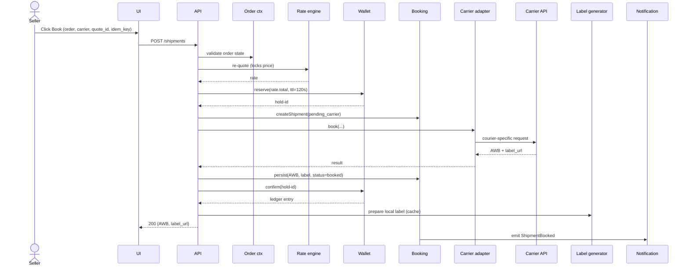
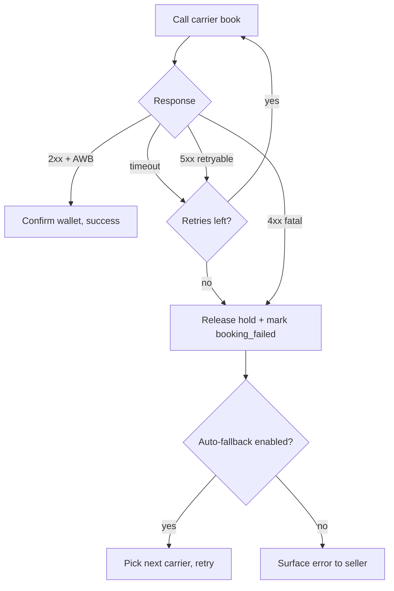
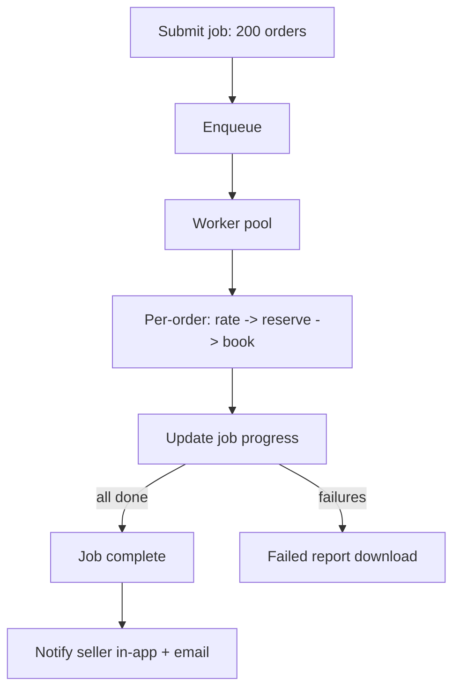

# Feature 08 — Shipment booking & manifests

## Problem

Once a seller picks a carrier, we need to actually create the shipment with the carrier (get an AWB), produce a label and manifest, schedule a pickup, and reflect all of this in our internal state — atomically with respect to the seller's wallet (we charge them; if booking fails, we refund).

This is the most operationally critical write path in the system. Failures here are visible, expensive, and erode seller trust.

## Goals

- **Booking P95 latency < 2s** (carrier APIs permitting).
- **Label generation < 1s** for single, < 30s for bulk-100.
- **Manifest generation** — both system-generated (printable) and carrier-generated where required.
- **Atomic wallet ↔ booking** — never charge for a failed booking; never book without a charge.
- **Idempotent on retry** — repeat clicks / retries don't double-book.
- **Cancellation pre-pickup** is fast and refunds wallet.

## Non-goals

- Choosing the carrier (Feature 07).
- Tracking after pickup (Feature 09).
- NDR handling (Feature 10).
- Reverse / RTO logistics (Feature 11).

## Industry patterns

How aggregators handle the booking transaction:

| Approach | Pros | Cons |
|---|---|---|
| **Direct API call, charge after success** | Simple | Race conditions; double-charge risk on retries |
| **Two-phase: reserve wallet → book → confirm** | Safe; matches our stated principle | More complex; needs a TTL on holds |
| **Optimistic charge, refund on failure** | Easy to model | Customer-visible refunds; UX noise |
| **Pre-paid commitments (block balance per booking)** | Wallet integrity | Same as two-phase |

**Our pick:** Two-phase reserve-then-confirm with TTL on the hold. The Financial context exposes `reserve(amount, ttl)` returning a hold-id; `confirm(hold_id)` to debit; `release(hold_id)` to free. Detailed in [`13-wallet-and-billing.md`](./13-wallet-and-billing.md).

Label format patterns:
| Pattern | Used by |
|---|---|
| **PDF A4** | Default for low-volume sellers (regular printer) |
| **PDF 4×6** | Standard for thermal printers |
| **ZPL / EPL** | Native thermal printer language; Zebra/TSC etc. |
| **PNG fallback** | For embedded views |

We support all four. The seller picks default; bulk operations honor the default.

## Functional requirements

### Single-shipment booking

Inputs:
- `order_id` (tenant-scoped).
- `carrier_id`, `service_type` (chosen by seller or auto-routed).
- `rate_quote_id` (the quote the seller saw — locked-in price).
- `idempotency_key` (caller-supplied or UI-generated; required).

Steps (server-side):
1. **Authorize** — tenancy, role.
2. **Validate** — order is in `ready_to_ship`; pickup location active; pincode serviceable on chosen carrier; weight within bounds.
3. **Re-quote** — re-compute rate; if differs from `rate_quote_id` by > tolerance, reject (the quote expired or rate card changed).
4. **Reserve wallet** — `reserve(rate.total, ttl=2 minutes)`.
5. **Create shipment record** with status `pending_carrier`.
6. **Call carrier adapter** `book()` with normalized payload.
7. **Persist** AWB, label refs.
8. **Confirm wallet** — `confirm(hold_id)` → ledger entry.
9. **Update Order** — status to `booked` (or `partially_fulfilled` if multi-shipment).
10. **Emit events** — `ShipmentBooked` for downstream (notifications, channels, analytics).

If step 6 fails:
- Classify error: retryable vs fatal.
- Retryable (timeout, transient 5xx): retry with idempotency, up to 2 retries.
- Fatal (4xx, validation): release wallet hold; mark shipment `booking_failed`; surface error to seller.
- Auto-fallback (if seller opted in): go back to Feature 07, pick next-best carrier, restart from step 4.

### Idempotency

- `idempotency_key` is required for public API; UI auto-generates per-click.
- Server stores `(seller_id, idempotency_key) → shipment_id` for 24h.
- Replay returns existing shipment.

### Bulk booking

- Submit list of `(order_id, carrier_id?, rate_quote_id?)` (carrier optional → use rule/recommendation).
- Server enqueues a job; per-order processing with parallelism limited by:
  - Carrier API rate limits (per-carrier semaphore).
  - Wallet balance (continuously checked).
- Per-order result: ok / failed (with reason).
- Partial completion: job marks `partial`; seller can rerun failed.

### Label generation

- Triggered immediately on booking success.
- Stored in object storage; URL returned in shipment.
- Re-generation supported (e.g., reprint after damage).
- Bulk download as ZIP, with optional filtering (by carrier, pickup, date).
- Print queue concept (v2): integrate with seller's thermal printer via local agent or web USB.

Label content:
- Carrier branding + barcode (AWB).
- Order ID, AWB, ship-from, ship-to, contact phones.
- Weight (declared), dims (if printed).
- Payment mode + COD amount (if COD).
- Service type indicator.
- Pikshipp / seller branding (small; configurable per seller).
- QR code (optional) linking to internal shipment for ops.

### Manifest generation

- Generated per (carrier, pickup_location, date).
- Lists all shipments to be picked up.
- Either system-generated PDF or carrier-required format (some carriers reject our PDF; we adapt).
- Manifest barcode / ID for courier scanning at pickup.
- Manifest digitally signed by seller (e-sign optional v2).
- Manifests downloadable / printable.

### Pickup scheduling

- On booking, default pickup date = next business day per pickup location's rules.
- Aggregated pickup request per (carrier, pickup, date) — we don't bother carriers per-shipment.
- Pickup time-window communicated to carrier where supported.
- Pickup confirmation event from carrier marks shipments `picked_up`.

### Cancellation

- Pre-pickup: full refund to wallet on cancel.
- Pickup-pending or post-manifest: best-effort cancellation; some carriers don't allow once manifested. If denied: shipment continues; seller informed.
- Post-pickup: cannot cancel; treated as RTO if needed.

### Reprint / reissue

- Label reprint: any time before delivered.
- AWB reissue: only allowed if carrier supports it; otherwise cancel + rebook.

## User stories

- *As an operator*, I want to bulk-book 200 orders and get a list of which 5 failed and why, so I can fix and rerun.
- *As a seller*, I want to know my wallet was not charged when a booking fails — and to see it in my ledger that there was no charge.
- *As a power user*, I want to print thermal labels in ZPL so my Zebra printer doesn't downscale a PDF.
- *As Pikshipp Ops*, I want to see all `booking_failed` shipments in the last hour with carrier breakdown, so I can detect carrier issues.

## Flows

### Flow: Single-shipment booking



### Flow: Booking fails on carrier



### Flow: Bulk booking



## Multi-seller considerations

- Booking is seller-scoped; carrier credentials are platform-level (Pikshipp's accounts with carriers).
- Pikshipp can impose booking restrictions per policy (e.g., hold high-value high-risk COD orders).
- Seller's wallet is debited at booking; charge type and idempotency per Feature 13.

## Data model

(Canonical Shipment in `03-product-architecture/04-canonical-data-model.md`.) Key per-feature fields:

```yaml
booking_attempt:
  id
  shipment_id
  attempt_no
  carrier_id
  request_payload_ref
  response_payload_ref
  result: success | fail
  error_code, error_message
  duration_ms
  occurred_at

manifest:
  id
  seller_id
  carrier_id
  pickup_location_id
  pickup_date
  shipments: [shipment_id]
  doc_ref (PDF / CSV / carrier format)
  status: draft | finalized | picked_up | partial_pickup
  finalized_at
  pickup_confirmed_at
```

## Edge cases

- **Carrier returns AWB but no label** — generate label from our template using AWB; flag.
- **Carrier returns success but ack of webhook never arrives** — periodic reconciliation job per carrier checks "shipments without first tracking event after T hours".
- **Wallet hold expires during a slow carrier call** — adapter detects on confirm; if shipment was actually created with carrier, we re-reserve and confirm; if not, we cancel with carrier and release.
- **Seller cancels in UI while booking is in flight** — UI disables cancel until booking returns; backend rejects cancel-on-pending.
- **Two operators click "Book" simultaneously** — second click ignored (idempotency on a UI-generated key per order).
- **Bulk book exceeds wallet balance mid-batch** — remaining orders fail with `insufficient_balance`; not a fatal job error.
- **Carrier requires pre-manifested booking** (some legacy) — adapter handles by managing manifest internally before book call.

## Open questions

- **Q-BK1** — Should we offer "schedule booking" (book at 9 AM tomorrow)? Use case: seller closes night-shift, wants morning bookings auto-fired. Default: v2.
- **Q-BK2** — Should bulk-book be transactional (all-or-nothing) ever, or always best-effort? Default: best-effort always.
- **Q-BK3** — Label rendering: server-side (consistent) or client-side from a JSON template (configurable for per-seller branding)? Default: server-side v1; v2 explores client-side templates for sellers wanting customization.

## Dependencies

- Carrier network (Feature 06), Rate engine (Feature 07), Wallet (Feature 13).

## Risks

| Risk | Mitigation |
|---|---|
| Wallet ↔ booking inconsistency (charged but not booked, or vice versa) | Two-phase commit; periodic reconciliation; alerting on diff |
| Carrier-side AWB issued but no response back | Reconciliation job; check carrier API for in-flight requests on retry |
| Label barcode unreadable (DPI/ZPL issue) | Validation rendering on save; barcode quality test |
| Manifest mismatch with truck driver count | Pickup confirmation captures actual count; discrepancy raised |
