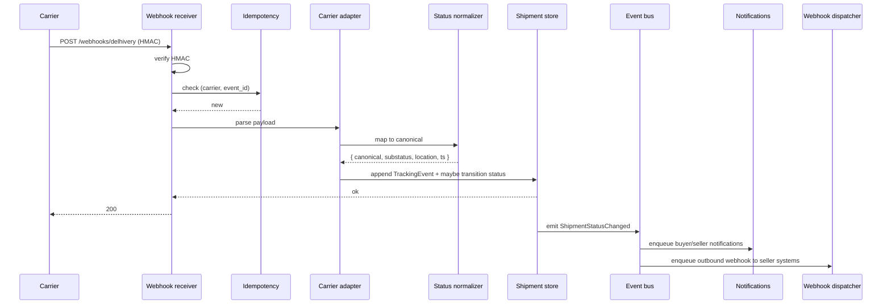
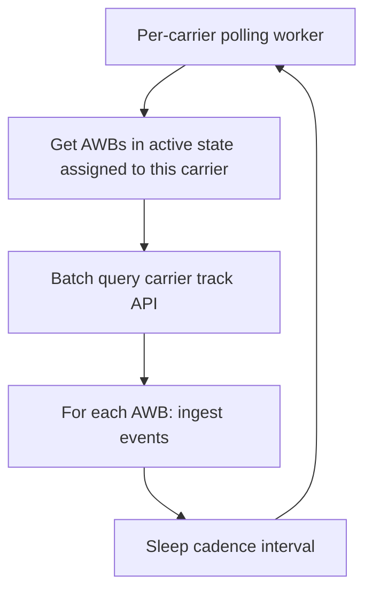
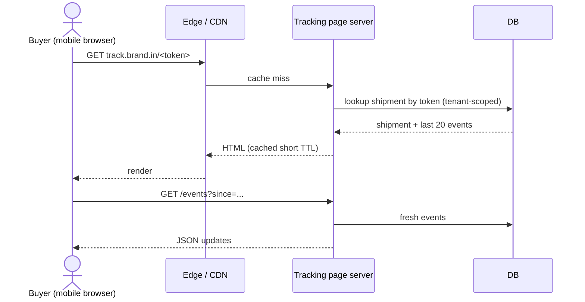

# Feature 09 — Tracking & status normalization

## Problem

Every carrier emits tracking events in their own vocabulary, on their own cadence, with their own reliability characteristics. Sellers want one normalized view; buyers want a friendly tracking page; downstream features (NDR, RTO, COD remittance) want canonical statuses.

This feature is the unification machine.

## Goals

- **Tracking event lag < 5 min P95** (carrier event → visible to seller/buyer).
- **Status normalization** across all carriers to the canonical state set.
- **Buyer-facing tracking page** (zero-login, branded per seller, mobile-first).
- **Search by AWB or order ID**.
- **Webhook outbound** to seller for material status changes.

## Non-goals

- Acting on tracking events (NDR action, RTO trigger) — Features 10–11.
- Notifications — triggered from this feature, defined in Feature 16.
- Carrier-side ops — Feature 06.

## Industry patterns

| Approach | Pros | Cons |
|---|---|---|
| **Pure pass-through** (show carrier statuses raw) | Cheap | Sellers see "OK" / "AT-DC" / "OFD" inconsistencies |
| **Status normalization to canonical set** | Consistent UX; downstream-ready | Requires mapping tables maintained per carrier |
| **AfterShip-style overlay** | Reuse existing service | Vendor cost; another point of failure |
| **Dual-source (carrier + own)** | Resilient | Duplication; conflict resolution required |

**Our pick:** Internal status normalization, no third-party overlay. Mapping tables are first-class config in the carrier adapter.

## Functional requirements

### Event ingestion

Two modes per carrier:
- **Webhook** — carrier POSTs events to our endpoint; HMAC verified; idempotent on `(carrier, carrier_event_id)`.
- **Polling** — workers pull `/track?awb=...` per carrier cadence; only for carriers without webhooks.

Ingestion path:
1. Receive payload.
2. Verify (HMAC / signature where applicable).
3. Idempotency check.
4. Lookup shipment by `(carrier_id, awb)`.
5. Parse to canonical TrackingEvent.
6. Persist.
7. If status transition crosses a canonical boundary, emit `ShipmentStatusChanged` event.

### Status normalization

Maintained per carrier as a structured mapping:

```yaml
delhivery:
  UD: { canonical: booked }
  PU: { canonical: picked_up }
  PUD: { canonical: picked_up }
  TR: { canonical: in_transit }
  IT: { canonical: in_transit }
  OFD: { canonical: out_for_delivery }
  DL: { canonical: delivered, delivered_substatus: by_buyer }
  CR: { canonical: ndr, reason: refused }
  ND: { canonical: ndr, reason: buyer_unavailable }
  RT: { canonical: rto_initiated }
  RTD: { canonical: rto_delivered }
  LO: { canonical: lost }
  DM: { canonical: damaged }
```

Unknown codes:
- Logged.
- Surface as `canonical: unknown`.
- Auto-alert: ops investigates and adds to map.
- Status of shipment uses last-known canonical; unknown does not regress.

### Status state machine (server-side enforcement)

We enforce a partial order on canonical statuses. Disallow regression except for:
- `ndr → out_for_delivery` (reattempt is fine).
- Anything → `lost` / `damaged` / `cancelled` (terminal-ish).

If a carrier sends an event that would regress the state, we:
- Persist the event for audit.
- Do not regress the displayed status.
- Flag for ops if the regression is severe (e.g., delivered → in_transit).

### Tracking timeline UI (seller-facing)

- Visual stepper: Booked → Picked up → In transit → OFD → Delivered.
- NDR / RTO branches displayed inline.
- Per-event details (location, timestamp, carrier raw label).
- Estimated delivery date (computed from carrier zone + service).
- Carrier raw events accessible (collapsed) for power users.

### Tracking page (buyer-facing)

- Public URL: `track.<branded-domain>/<token>` where token is opaque (cannot be guessed).
- No login.
- Mobile-first, < 100 KB load on 3G.
- Branded with the seller's logo and colors (per Feature 17); fallback to neutral default.
- Shows: stepper, ETA, latest event, NDR feedback CTA (if NDR active).
- Localized (Hindi, English; v2 add regional languages).
- Optional add-ons (per seller config):
  - Buyer can rate the experience post-delivery.
  - Buyer can request reschedule (if NDR).
  - Buyer can confirm/cancel COD pre-pickup (Feature 12).

### Outbound webhooks (to seller systems)

For sellers consuming our public API:
- Subscribe to events: `shipment.booked`, `shipment.picked_up`, `shipment.in_transit`, `shipment.out_for_delivery`, `shipment.delivered`, `shipment.ndr`, `shipment.rto`, `shipment.lost`, `shipment.damaged`.
- Delivery: HMAC-signed POST.
- Retry policy: exponential backoff up to 24h.
- Dead-letter queue for permanently failing endpoints.
- Per-seller delivery dashboard.

### Seller notifications (in-product)

- Material status changes surface as in-app notifications and (per seller config) email/WhatsApp digests.
- Operators can subscribe to specific carriers / pickup locations / SLAs.

### Buyer notifications (across channels)

- WhatsApp (preferred; opt-in via phone consent).
- SMS (fallback).
- Email (if available).
- Per seller branding.

Per channel, configurable templates per status. Defaults provided.

### ETA and SLA tracking

- ETA computed from carrier service zone + booking time.
- "On-time" if delivered within ETA + tolerance.
- "Delayed" badge if past ETA without delivery.
- SLA misses tracked per carrier in Feature 06 health.

### Tracking search

- AWB (any carrier).
- Pikshipp Order ID, Pikshipp Shipment ID.
- Channel order ref.
- Buyer phone (last 4 OK).

Power tools (ops):
- "Show me all shipments stuck in `picked_up` for >3 days" — surfaced as a saved filter.
- "Shipments without any event in the last 24h" — staleness watch.

### Reconciliation

For carriers that don't reliably webhook, periodic reconciliation:
- For active shipments not in terminal status, re-poll on cadence.
- For terminal-statused shipments, freeze events except for after-the-fact corrections.
- Detect "missing pickup confirmation" — alert ops if booked but no pickup event after Y hours.

## User stories

- *As a seller*, I want one tracking timeline regardless of carrier, so my support team trains once.
- *As a buyer*, I want a tracking page that loads in 1 second on 3G with my expected delivery date.
- *As an operator*, I want to know when a shipment goes silent (no events for >48h).
- *As a Pikshipp Ops*, I want to see what % of shipments per carrier are stuck without movement so I can detect carrier-side issues.

## Flows

### Flow: Webhook event arrives



### Flow: Polling worker



### Flow: Buyer opens tracking page



## Multi-seller considerations

- Tracking page domain is per-seller (custom domain optional, see Feature 17).
- Branding from seller config (Feature 17 / policy engine).
- Webhook outbound endpoints (when API launches v2) are seller-owned.
- Events are seller-scoped; cross-seller queries forbidden.

## Data model

```yaml
tracking_event:                 # see canonical model
shipment_status_history:
  shipment_id
  canonical_status
  changed_at
  source_event_id

webhook_subscription:
  id
  seller_id
  url
  secret
  event_types: [...]
  active

webhook_delivery:
  id
  subscription_id
  event_id
  attempt_no
  result
  status_code
  next_attempt_at
```

## Edge cases

- **Out-of-order events** (carrier sends `delivered` before `out_for_delivery`) — normalize to canonical; emit "delivered"; backfill `OFD` event for audit but state machine forwards.
- **Duplicate events** — idempotency on `(carrier, carrier_event_id)`; if no carrier event id, hash payload + timestamp.
- **Carrier sends correction** (delivered → wrong; revert) — manual ops process; not auto-handled.
- **Carrier event timestamp in future** (clock skew) — clamp to now.
- **AWB in our system but no booking record** (carrier sends event for unknown AWB) — log + ignore + alert; usually means stale AWB or wrong carrier.
- **Tracking token guessable** — tokens are 64-bit-equivalent random; rate-limited per IP.

## Open questions

- **Q-TR1** — Should buyer tracking page show every micro-event or summarize? Default: stepper + last 5 events; "show all" for power.
- **Q-TR2** — How long do we keep tracking event raw payloads? Default: 90 days for active, 1 year cold archive.
- **Q-TR3** — Outbound webhook delivery — guarantee at-least-once or exactly-once? Default: at-least-once with idempotency keys for sellers to dedup.
- **Q-TR4** — Should we attempt buyer-side delivery feedback (rate the experience) ourselves or pass to seller? Default: ours, with consent; aggregated to seller.

## Dependencies

- Carrier adapters with normalization tables.
- Notifications (Feature 16).
- Buyer experience surfaces (Feature 17).

## Risks

| Risk | Mitigation |
|---|---|
| Webhook flood overwhelms ingestion | Backpressure; queue; rate limiting per source |
| Lossy events from a carrier | Polling reconcile; staleness alerts |
| Tracking page abuse (brute-force tokens) | High-entropy tokens + IP rate limit |
| Branding leak across tenants | Render path strictly scoped by domain → tenant |
| Outbound webhook to seller becomes flaky | Retry + DLQ + dashboard for seller |
