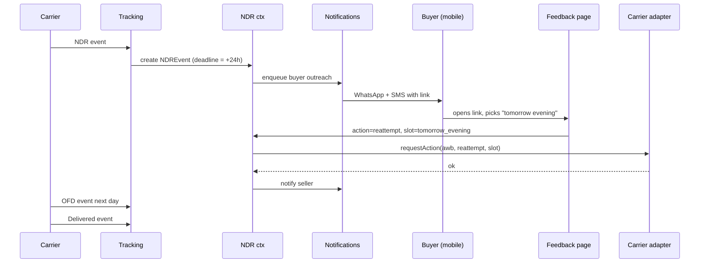
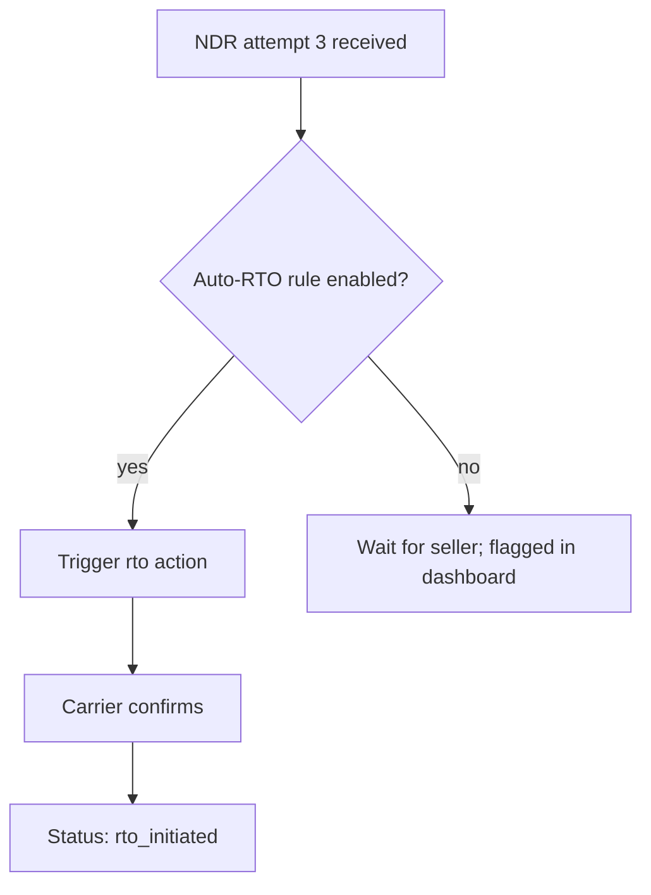

# Feature 10 — NDR (Non-Delivery Report) management

## Problem

Indian e-commerce sees NDRs on **25–40% of COD orders** and ~10% of prepaid. Without action, an NDR becomes an RTO. RTO costs the seller the original shipping + a return shipping leg + the lost sale + the buyer's bad experience. Saving even 30% of NDRs from going RTO is a multi-percentage-point margin improvement.

The NDR management feature is — second only to the canonical model — the most important *operational* feature in the platform.

## Goals

- **NDR resolution rate ≥ 65%** (NDRs that end up `delivered` instead of RTO).
- Buyer-facing reschedule UX that works in <60 seconds on a phone.
- Seller-facing NDR dashboard with default actions, deadline timers, and per-NDR audit.
- Auto-rules to reduce manual seller intervention (e.g., "auto-reattempt all 'buyer unavailable' NDRs once").
- WhatsApp-first buyer outreach with SMS fallback.

## Non-goals

- Predicting NDRs before they happen (covered as RTO risk in Feature 12 COD).
- Carrier-side delivery routing decisions (we only signal preferences via the action API).

## Industry patterns

| Approach | Used by | Notes |
|---|---|---|
| **Manual seller action via dashboard** | Most aggregators | Default; works but slow |
| **Auto-rules** ("auto-reattempt unavailable") | Shipway, NimbusPost | Strong differentiator |
| **WhatsApp buyer outreach** | Shiprocket (templated) | Now table-stakes |
| **Buyer reschedule page** | Shipway, ClickPost | Differentiator |
| **AI-driven action suggestion** | None at scale yet | Opportunity |
| **Outbound IVR call to buyer** | Some couriers themselves | Effective for low-literacy buyers |
| **WhatsApp-bot conversation** (chatbot for reattempt) | Emerging | High-value v2 |

**Our pick:** All of the above except IVR (passthrough only); WhatsApp-first with chatbot in v2.

## Functional requirements

### NDR detection

- Triggered by tracking event with canonical status `ndr` (Feature 09).
- Carries: reason (canonical), attempt number, courier raw label, location.
- Creates an NDREvent and increments shipment's open-NDR counter.

### NDR action set

| Action | Description | Allowed multiple times? |
|---|---|---|
| `reattempt` | Request another delivery attempt | Up to per-carrier max (typ. 2) |
| `reattempt_with_slot` | Reattempt with a specified time-of-day | Same as above |
| `reattempt_with_address` | Reattempt to a corrected/alternate address | Where carrier supports |
| `contact_buyer` | Trigger buyer outreach (WhatsApp/SMS/email) | Yes |
| `hold_at_hub` | Buyer to pick up from carrier hub | Where carrier supports |
| `rto` | Convert to return-to-origin | Once (terminal) |
| `wait_for_buyer_response` | No action; wait for buyer feedback page submission | Implicit |

Each action records: who initiated (seller user / auto-rule / buyer), when, payload, deadline.

### NDR deadlines

- On NDR, deadline = now + carrier-specific window (typ. 24–48h).
- If no action taken by deadline → auto-action per seller config (default: `reattempt`).
- If max reattempts reached → `rto` auto-fires unless seller has paused.

### Buyer outreach

When NDR detected (and seller's policy allows):
1. Construct buyer outreach message with seller branding and reschedule link.
2. Send via:
   - WhatsApp (template pre-approved on Meta) — primary.
   - SMS — fallback if WhatsApp delivery fails.
   - Email — if buyer has email and seller config allows.
3. Track delivery + read + click metrics.

### Buyer NDR feedback page

Public URL: `track.<branded-domain>/<token>/ndr` (or scoped to a feedback path).

Buyer sees:
- "Your delivery missed you on <date>."
- Options:
  - **Reschedule** (with slot picker — morning/afternoon/evening, next 1–3 days).
  - **Update address** (form; carrier-restrictions checked).
  - **Pickup at hub** (where supported).
  - **Cancel** (if seller config permits — usually no for D2C).
  - **Contact me** (callback request to seller).
- Submission triggers the chosen action.

### Seller NDR dashboard

A first-class screen with:
- Filters by carrier, age, reason, attempt count.
- Default sort: nearest deadline first.
- Bulk actions: bulk reattempt, bulk contact buyer.
- Per-NDR card: shipment summary, NDR history, buyer comms history (sent + delivered + read), recommended action (rule-based suggestion).
- Outreach center: see WhatsApp/SMS sent, click-throughs, buyer responses.

### Auto-rules

Sellers can configure (with Pikshipp-default presets per seller-type):
- "Auto-reattempt for reason `buyer_unavailable` if attempt_no < 2."
- "Auto-RTO if attempt_no ≥ 3."
- "Auto-RTO if reason `refused`."
- "Auto-contact buyer immediately on every NDR."

Rules audited per match.

### Carrier-side action API

Adapter exposes `requestAction(awb, action, payload)` mapping to carrier's NDR endpoint:
- Some carriers support per-slot reattempts; others only generic.
- Some support address change; others don't.
- We surface the carrier's capability in the dashboard so sellers know what's actually possible.

If carrier doesn't support a requested action: surface error, suggest alternative.

### NDR analytics

- Per-seller, per-carrier, per-pincode NDR rates.
- Resolution rates (NDR → delivered).
- Average time to action.
- Top reasons.

Used for:
- Seller insights ("you have a high NDR rate in this pincode; consider X").
- Per-seller-type aggregated insights for Pikshipp PMs.
- Pikshipp ops to flag under-performing carriers.
- COD risk model input (Feature 12).

## User stories

- *As an operator*, I want to bulk-reattempt all "buyer_unavailable" NDRs from yesterday with one click.
- *As a buyer*, I want to pick a reschedule time without phoning the courier.
- *As an owner*, I want auto-RTO after 3 attempts so my ops doesn't have to chase.
- *As Pikshipp Ops*, I want to see when a carrier's NDR-to-delivered rate dropped, suggesting their delivery agents are not doing reattempts.

## Flows

### Flow: NDR → buyer reschedule → delivered



### Flow: Auto-RTO



## Multi-seller considerations

- Buyer outreach uses Pikshipp's WhatsApp/SMS sender by default; seller's own sender available via Feature 16/17 settings.
- Reschedule page is per-seller branded.
- Auto-rules: Pikshipp-default per seller-type → seller override.

## Data model

```yaml
ndr_event:                # see canonical model
ndr_action:
  id
  ndr_event_id
  shipment_id
  initiated_by: { kind: seller | rule | buyer | ops, ref }
  action_type: reattempt | reattempt_with_slot | ... | rto | hold_at_hub | contact_buyer
  payload
  carrier_request_ref
  result: pending | accepted | rejected | succeeded
  resolved_at

ndr_outreach:
  id
  ndr_event_id
  channel: whatsapp | sms | email
  template_id
  delivery_status
  open_at, click_at, response_at
  response_payload     # what buyer chose

ndr_rule:
  id
  seller_id
  conditions: [...]
  action: ...
  priority
  enabled
```

## Edge cases

- **Buyer chooses reschedule but carrier rejects** (e.g., buyer chose Sunday, carrier doesn't deliver Sundays in that pincode) — surface to seller; ask buyer for alternative.
- **Multiple NDRs in quick succession** (carrier double-fires) — dedup by `(awb, carrier_event_id)`.
- **NDR after delivery** (rare; data error) — log; don't regress.
- **Carrier doesn't support address change** — buyer's address-change request becomes a "contact seller" suggestion.
- **Buyer phone bounced** (WhatsApp + SMS both fail) — escalate to seller for outbound call.
- **Reattempt window already past** (seller acted late) — explain to seller; suggest RTO or accept extra-day delay.

## Open questions

- **Q-NDR1** — When auto-rule fires, do we still notify seller (informational) or only on exception? Default: notify only material status changes.
- **Q-NDR2** — Buyer's reschedule slot precision: which slots map to which carriers' reattempt vocabulary? Maintain mapping per carrier.
- **Q-NDR3** — Should we run an A/B on outreach copy (across tenants) — central learning vs. tenant-private? Default: tenant-private; central aggregated insights only.
- **Q-NDR4** — When buyer responds positively after RTO has been initiated (rare race), do we attempt to recall? Default: no — once RTO initiated, treat as terminal; offer reorder.

## Dependencies

- Tracking (Feature 09).
- Notifications (Feature 16).
- Buyer experience (Feature 17).
- Carrier action APIs (Feature 06 / `07-integrations/02`).

## Risks

| Risk | Mitigation |
|---|---|
| WhatsApp template not approved → outreach degraded | Apply early; SMS fallback always available |
| Buyer ignores our outreach (assumes spam) | Sender ID + first-line context; A/B copy |
| Carrier doesn't honor our requested slot | Surface to seller; track per-carrier success rate |
| Auto-rules misfire (e.g., RTO premature) | Dry-run mode; audit; rate-limit auto-actions |
| NDR storm during carrier disruption | Queue + backpressure; auto-rules can be paused per carrier |
