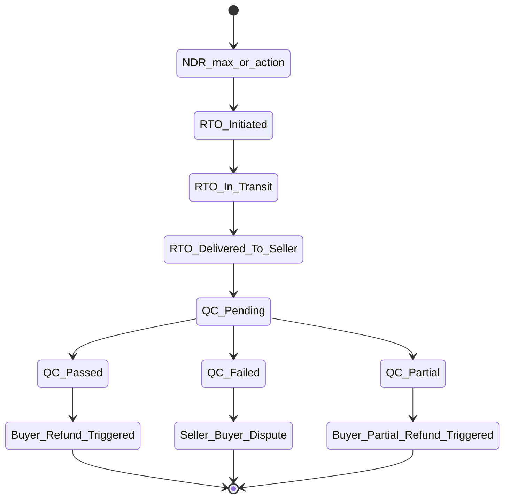
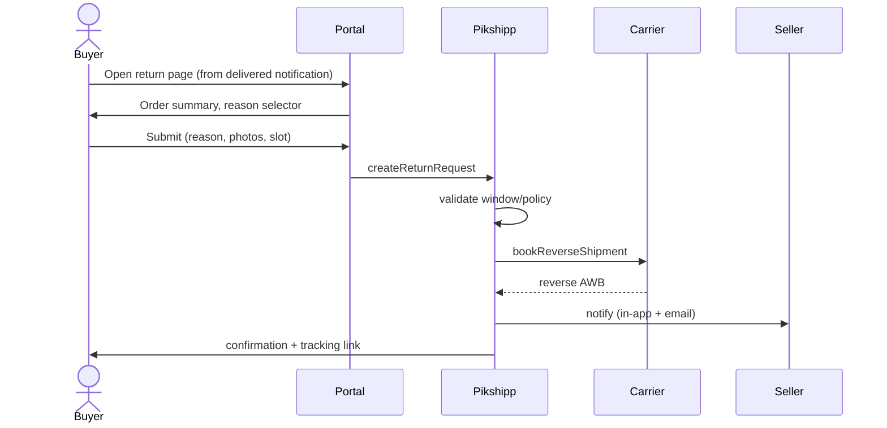
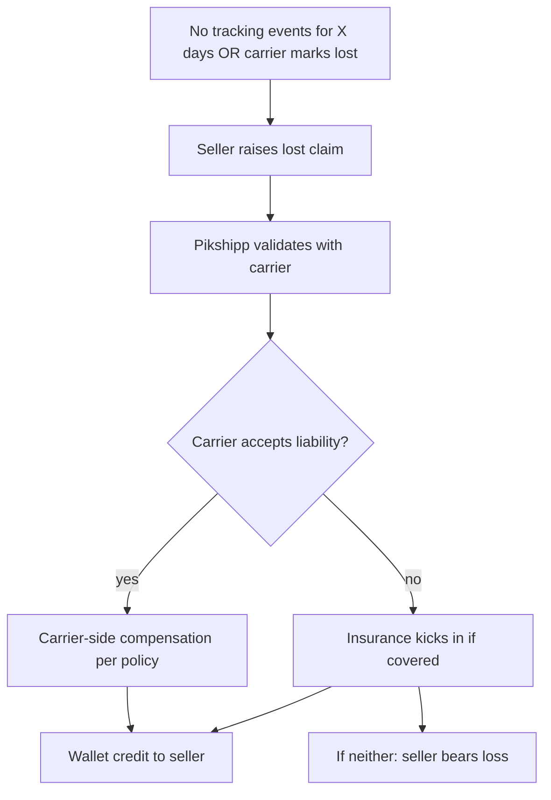

# Feature 11 — Returns & RTO

## Problem

Two related but distinct flows live here:

- **RTO (Return to Origin)** — a forward shipment that did not reach the buyer (NDR exhausted, refused, lost). The parcel comes back.
- **Returns** — the buyer received the parcel, then wants to send it back (size, defect, change of mind). Buyer-initiated reverse logistics.

Both are operationally expensive (the seller pays for the return leg, often loses the sale, and may have to QC the returned item). Doing them well distinguishes a serious seller experience from a poor one.

## Goals

- Track RTO from initiation through return delivery, with QC outcome.
- Provide a **buyer-initiated returns portal** (per-seller branded, seller-policy-driven).
- Manage **reverse pickup** with the same carriers (where supported).
- Ensure **wallet adjustments** flow correctly (refund of forward charge if eligible; debit of return shipping; eventual refund to buyer if seller initiates).

## Non-goals

- Buyer-side refund processing (seller controls; we may signal).
- Inventory restock (channel/seller responsibility).

## Industry patterns

| Approach | Used by | Notes |
|---|---|---|
| **Carrier reverse pickup direct** | All major carriers | Standard; cost = forward + 30–60% |
| **Self-arranged reverse (seller handles)** | Some D2C | Seller-friendly when in-house ops |
| **Returns SaaS (Shipway Returns, Pickrr Returns, AfterShip Returns)** | Many | Differentiator if integrated with shipping |
| **In-store returns** | Omnichannel D2C | Out-of-scope v1 |
| **Try-and-buy (open box on delivery)** | Marketplaces | Carrier-API specific; complex |

**Our pick:** Carrier-arranged reverse + a branded returns portal v1. Shipway-class returns automation as a v2 differentiator.

## Functional requirements

### RTO flow

- Triggered automatically when NDR exhausts attempts or seller chooses `rto` action (Feature 10).
- Status: `rto_initiated` → `rto_in_transit` → `rto_delivered`.
- Wallet treatment: forward charge stays (carrier delivered the leg); return charge debited per carrier RTO policy (typ. 60–100% of forward).
- Notification: seller alerted at each transition; buyer informed once (RTO confirmed).
- On `rto_delivered`: seller does QC on receipt → records outcome → if it was a COD, no refund needed (buyer didn't pay); if prepaid, seller initiates refund to buyer (via channel or manual).

### Returns (buyer-initiated)

- Buyer goes to seller-branded returns page (or comes via post-delivery notification CTA).
- Authenticates via order ID + phone (OTP).
- Selects return reason from configurable list:
  - Wrong item received.
  - Damaged on arrival.
  - Defective product.
  - Doesn't fit / wrong size.
  - Different from description.
  - Changed mind (only if seller policy allows).
- Optionally: photos, comments.
- Picks pickup window.
- Confirms.

System actions:
1. Validate return is within seller's return window (configurable, e.g., 7/14/30 days).
2. Generate return AWB via carrier reverse pickup API.
3. Create reverse Shipment record.
4. Notify seller.
5. Track reverse shipment same as forward, with status semantics adjusted.

### Reverse pickup tracking

- Same canonical state machine + reverse-specific substatuses:
  - `reverse_pickup_scheduled`
  - `reverse_picked_up`
  - `reverse_in_transit`
  - `reverse_delivered_to_seller`
- Notifications mirror forward.

### QC (on receipt by seller)

- Seller marks: passed / failed / partial.
- Photos optional but encouraged.
- Outcome triggers:
  - **Passed** → seller initiates buyer refund (channel-side or our API).
  - **Failed** → escalation to seller-buyer dispute; refund decision is seller's.
  - **Partial** → seller decides partial refund.

### Refunds (buyer-side)

- We provide signaling and ledger adjustments; the actual refund to buyer's payment instrument is the channel's domain (or seller's payment gateway).
- For COD orders: no refund (buyer never paid).
- For prepaid: seller calls their PG via the channel UI; we don't process buyer-side payment refunds in v1.

### Wallet treatment for returns

| Scenario | Wallet action |
|---|---|
| RTO of prepaid order | Forward charge stays; return charge debited; original buyer-paid amount refunded by seller via channel |
| RTO of COD order | Forward charge stays; return charge debited; no buyer refund needed |
| Buyer-initiated return (post-delivery) | Forward charge stays; reverse pickup charge debited |
| Damaged in transit (proven) | Insurance flow (Feature 22); may credit forward charge back |
| Lost in transit | Insurance + carrier liability; may credit forward + value claim |

### Returns portal (per-seller branded)

- Branded by seller; custom domain optional via Feature 17.
- Mobile-first.
- Configurable: which items returnable, return window, allowed reasons, photo required, partial-quantity returns.

## User stories

- *As a buyer*, I want to initiate a return from a link in my delivered email, with one phone OTP, in 60 seconds.
- *As a seller*, I want to mark QC outcomes from my dashboard and have refunds visible in my wallet ledger.
- *As an owner*, I want to set a 7-day return window for jewelry and 30-day for apparel, by category.
- *As Pikshipp Ops*, I want to see seller-by-seller return rates so I can flag suspicious patterns.

## Flows

### Flow: RTO end-to-end



### Flow: Buyer-initiated return



### Flow: Lost shipment claim



## Multi-seller considerations

- Returns policy is seller-controlled within Pikshipp-imposed minimums (e.g., minimum return window).
- Buyer return portal is per-seller branded.
- RTO charges follow seller's carrier rate card (with carrier-specific RTO surcharges); debited from wallet per Feature 13.

## Data model

```yaml
return_request:
  id
  order_id, shipment_id (forward)
  initiated_by: buyer | seller | system
  reason: { canonical, raw_text }
  photos: [...]
  partial_qty
  status: pending | approved | rejected | scheduled | picked_up | in_transit | received | qc_done
  scheduled_pickup
  reverse_shipment_id

reverse_shipment:           # same canonical model as Shipment, with `direction=reverse`
qc_outcome:
  return_request_id
  outcome: passed | failed | partial
  partial_qty
  photos
  notes
  recorded_by
  recorded_at

rto_record:
  shipment_id (original forward)
  initiated_at
  delivered_back_at
  qc_outcome_id
```

## Edge cases

- **RTO arrives at seller but seller never marks QC** — auto-close after X days as `qc_pending_aged`; ops can intervene.
- **Buyer claims lost in transit; carrier disputes** — escalation flow with proof of delivery (POD).
- **RTO of multi-shipment order** — partial RTO; order remains `partially_fulfilled` for the delivered shipments.
- **Return outside policy window** — buyer sees a "contact seller" page; seller can override.
- **Reverse pickup not supported by carrier in that pincode** — buyer ships to seller via different carrier (manual); our system records the parallel return with linked AWB.
- **Buyer initiates return before delivery** (intent) — surface as "early return" intent; seller decides whether to cancel forward or proceed.

## Open questions

- **Q-RTN1** — Should we offer a "no-RTO insurance" product (seller pays a small premium per shipment, we cover RTO charge)? Possibly v2.
- **Q-RTN2** — Should we offer pre-paid return labels for buyer-included return slips? Common in apparel D2C. Possibly v2.
- **Q-RTN3** — How long does the buyer's "open box on delivery" window apply (some couriers support 5–10 minutes inspection)? Carrier-by-carrier; document per adapter.
- **Q-RTN4** — In RTO-delivered orphan inventory (seller closes shop, RTO arrives at empty pickup) — escalation path?

## Dependencies

- Tracking (Feature 09).
- NDR (Feature 10).
- Wallet (Feature 13).
- Insurance (Feature 22).

## Risks

| Risk | Mitigation |
|---|---|
| RTO charge surprises seller | Pre-book RTO charge estimate visible; in-line in NDR dashboard |
| Returns abuse by buyer | Seller-set policy + reason analysis + RTO risk model on repeat returns |
| Reverse pickup serviceability gaps | Multi-carrier; buyer ships in if needed |
| QC outcome disputes between seller and buyer | Photo evidence; seller's policy surfaced upfront |
| Refund timing complaints | Clear status messaging at each step; buyer ledger visibility |
