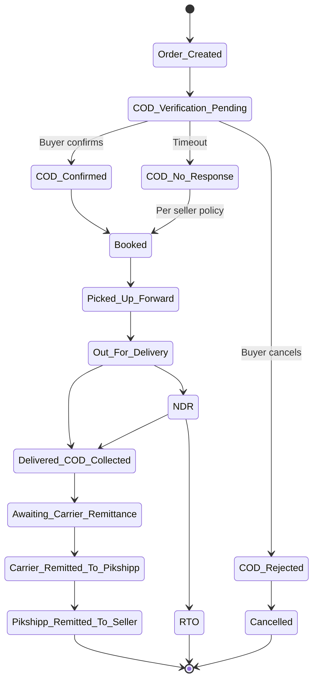
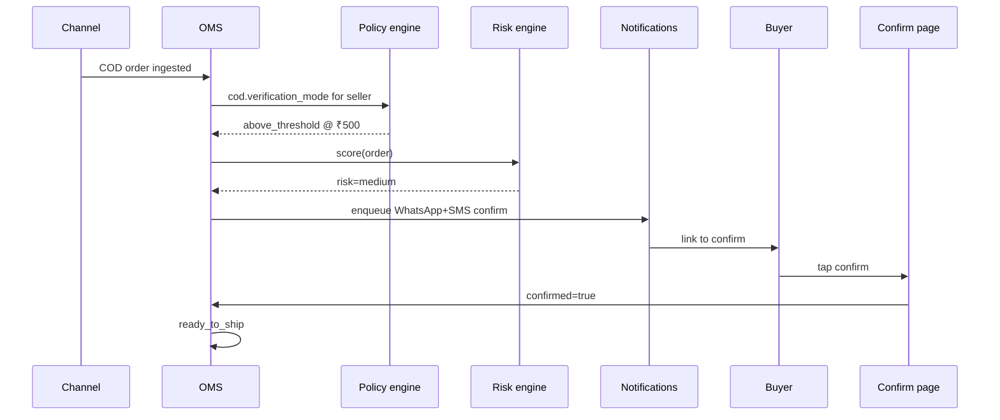
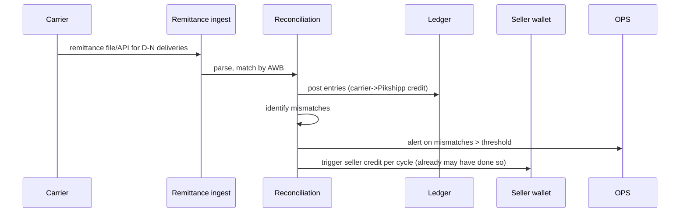
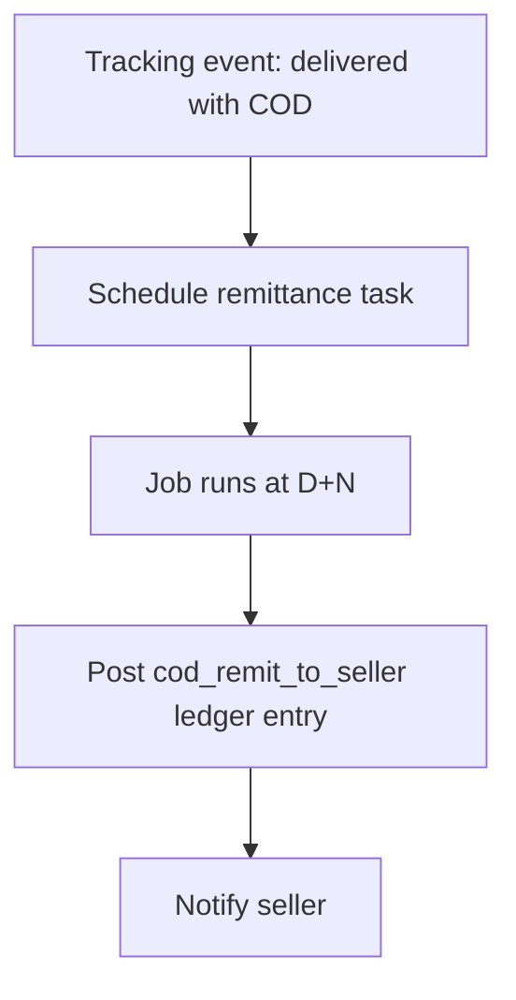

# Feature 12 — COD management & remittance

## Problem

Cash on Delivery is **40–55% of Indian e-commerce shipment volume**. It changes everything:

1. The carrier collects cash from the buyer; we eventually pass that cash to the seller. There's a remittance cycle.
2. COD orders have **2–3× the RTO rate** of prepaid; the buyer can change their mind at the doorstep.
3. **COD fraud is real** — fake orders, repeat-RTO addresses.
4. Working capital matters — sellers wait days for COD money depending on plan; bad cash flow can kill a small seller.

## Goals

- Per-seller-configurable remittance to seller — typically D+2 (premium) or D+5 (default), driven by policy engine.
- Ensure 99.95%+ COD reconciliation accuracy (every rupee accounted).
- Reduce COD RTO % via **risk scoring at order intake** (Feature 26) and **buyer COD verification** before pickup (configurable).
- Provide transparent COD ledger so seller finance closes books cleanly.

## Non-goals

- Lending against COD float (out of scope; potential v3+ adjacent).
- Replacing channel-side payment processing (we don't take buyer payments).

## Industry patterns

| Component | Approach | Used by |
|---|---|---|
| **COD remittance cycle** | D+4 to D+8 typical; D+2 premium | All aggregators (varies by carrier and seller plan) |
| **COD verification** | None / IVR / OTP / WhatsApp confirm / ML risk model | Best players combine multiple |
| **RTO risk scoring** | Internal models based on pincode, repeat behavior | Shiprocket Engage, GoKwik |
| **COD-to-prepaid conversion** (offer prepaid discount) | Razorpay Magic, GoKwik | Adjacent to checkout |
| **COD fee to buyer** | Seller surcharge on COD | Many sellers |

**Our pick:** WhatsApp-based COD confirm pre-pickup (configurable per seller) + RTO risk model (rules at v1, ML at v2) + transparent remittance ledger v1. Aggressive prepay nudging for non-contract sellers; silent for contract sellers.

## What is "COD remittance cycle"?

Two distinct legs:

**Leg 1: Carrier → Pikshipp**
- Carrier collects cash on delivery (D+0).
- Carrier deposits to their treasury, reconciles internally, then remits to us.
- This cycle is **carrier-determined**, typically D+4 to D+7.
- Premium accounts may get D+2 or D+3.

**Leg 2: Pikshipp → Seller**
- Once a delivery is confirmed (tracking event), we schedule a credit to the seller's wallet.
- This cycle is **Pikshipp-determined**, configurable per seller via policy engine.
- Defaults:
  - `small_smb` → D+5 (we float less; matches carrier remittance to us closely)
  - `mid_market` → D+3
  - `enterprise` → D+2 (premium)
- We absorb 2–5 days of float between when we credit the seller and when carrier remits to us.

Float economics:
- 10k shipments/day × 50% COD × ₹1500 average × 5 days = ₹3.75 cr float at all times.
- This is working capital we must fund.

## Functional requirements

### COD lifecycle



### COD verification (pre-pickup)

For COD orders **per seller configuration** (`cod.verification_mode` and `cod.verification_threshold_inr`):
1. On order ingestion, trigger buyer outreach via WhatsApp (or SMS fallback).
2. Message: "Hi <Name>, you placed a COD order for ₹<amount>. Please confirm or cancel: <link>".
3. Buyer page: confirms / cancels with a single tap.
4. Result feeds back into order:
   - **Confirmed** → moves to ready_to_ship.
   - **Cancelled** → order cancelled.
   - **No response** within window → per seller policy (default: still book; some sellers may set "hold for manual review").

### COD handling fee

Per seller config (`cod.handling_fee_visibility`):
- **`bundled`** (default for non-contract sellers) — fee included in seller-facing total cost; no separate line item visible to buyer or seller in the price quote (visible in monthly invoice ledger as a line for transparency).
- **`lineitem`** (some contract sellers prefer) — shown as a distinct line item on quote and ledger.

The fee itself is collected from seller's wallet (not buyer); rate-card driven.

### Prepay nudge

Per seller config (`cod.prepay_nudge`):
- **`aggressive`** (default for non-contract): on COD order intake, nudge seller (and optionally buyer via WhatsApp link) to convert to prepaid for a discount.
- **`silent`** (contract sellers): no nudge.

### RTO risk scoring (Feature 26 integration)

On order intake, compute risk score (rules-based v1; ML v2). High-risk orders:
- Surfaced as advisory in seller's order detail.
- May trigger COD verification regardless of seller's default.
- Auto-rules: "hold high-risk COD orders for manual review" (per seller config).

### COD remittance — multi-leg

Two legs as explained above.

#### Leg 1 reconciliation (Carrier → Pikshipp)

Daily job:
- For every shipment marked `delivered` with COD, expect carrier to remit `cod_amount` within carrier's cycle.
- Carriers send remittance files (CSV / API).
- Match by AWB; flag mismatches to ops.
- Backfill from carrier remittance file → ledger.

If carrier under-remits while we've already paid the seller, we eat the gap until recovered.

#### Leg 2 (Pikshipp → Seller)

When carrier confirms delivery (tracking event):
- Schedule remittance for D+N from delivery (per seller's `cod.remittance_cycle_days`).
- On the scheduled day: post `cod_remit_to_seller` credit to seller's wallet (funded from our float).

### Remittance ledger

Per seller, viewable:
- Per-order: forward charge, COD collected, COD remitted (when), net.
- Per day: aggregate remittance.
- Reconciliation status:
  - `delivered_pending_remit` (we owe seller).
  - `remitted_to_seller` (paid out).
  - `disputed` (carrier-side discrepancy).
  - `mismatched` (carrier remitted ≠ delivered amount).

### Seller-side COD surcharge passthrough

Some sellers add a COD surcharge to buyers (e.g., +₹49 if COD). This surcharge is part of the order total; the courier collects total; we remit back as normal. We do not modify the surcharge logic; we just transport the cash.

### Buyer-side COD prompt (v2)

On buyer's tracking page (when shipment is OFD):
- "Your COD amount today: ₹<amount>. Please keep ready."
- Reduces pickup-day cash issues.

## User stories

- *As an owner*, I want all COD orders >₹2,000 to be auto-confirmed with the buyer before booking.
- *As a buyer*, I want a 1-tap confirm/cancel before the parcel ships.
- *As a finance person*, I want a clean COD ledger that ties forward charges, COD collected, and remittance — with carrier-side mismatches flagged.
- *As Pikshipp Ops*, I want to see carriers' remittance lag P95 trending; if a carrier slows down, we adjust seller-facing remittance proactively.

## Flows

### Flow: COD confirmation pre-pickup



### Flow: COD remittance from carrier



### Flow: Pikshipp → seller credit (D+N from delivery)



## Configuration axes (consumed via policy engine)

```yaml
cod:
  enabled: true
  per_order_max_inr: 50000
  pct_volume_cap: 0.7
  verification_mode: always | above_x | none
  verification_threshold_inr: 500
  remittance_cycle_days: 2 | 3 | 5
  pincode_blocklist_ref: ref or null
  handling_fee_visibility: bundled | lineitem
  prepay_nudge: aggressive | silent
```

## Data model

```yaml
cod_verification:
  id
  order_id
  triggered_at
  channels: [whatsapp, sms]
  responses: [{ channel, sent_at, delivered_at, response_at, response: confirm|cancel }]
  status: pending | confirmed | cancelled | timed_out

cod_remittance:
  id
  shipment_id
  cod_amount
  carrier_remitted_at
  carrier_remitted_amount
  carrier_remittance_ref
  pikshipp_remitted_at
  pikshipp_remitted_amount
  reconciliation_status: pending | matched | mismatched | disputed
  mismatch_reason
```

## Edge cases

- **Carrier reports delivered, but no COD collected** (delivery agent error) — flagged; remediated via carrier escalation; seller doesn't lose.
- **Carrier remits less than expected** — variance flagged; if carrier-side error, recovered; if buyer paid less, case-by-case.
- **Buyer pays via UPI to delivery agent** (rare on COD) — most carriers convert; treated as collected.
- **Multiple shipments to same buyer; only one delivered COD** — independent ledger entries.
- **Seller suspended mid-cycle** — pending COD held until reactivation or wound-down.

## Open questions

- **Q-COD1** — Same-day remittance for premium sellers (D+0)? Material float exposure; needs underwriting policy. Default v3.
- **Q-COD2** — Cross-seller buyer linkage for risk model: hashed phone allowlist for fraud-only, no profile sharing. Default v2.
- **Q-COD3** — When buyer cancels COD via confirm-page after we've already booked (race), do we cancel the shipment or hold? Default: best-effort cancel with carrier; if not possible, ship and let buyer refuse (RTO).
- **Q-COD4** — Should COD verification be opt-in for sellers or default-on? Default: configured per seller-type. `small_smb` → opt-in; `mid_market` → default-on for above-threshold; `enterprise` → per contract.

## Dependencies

- Notifications (Feature 16) for buyer outreach.
- Wallet (Feature 13) for ledger entries.
- Risk model (Feature 26).
- Policy engine for per-seller config.
- Audit (`05-cross-cutting/06`).

## Risks

| Risk | Mitigation |
|---|---|
| Carrier under-remits → we eat the gap if we've already remitted seller | Float exposure cap; carrier dispute SLA; reconciliation alerts |
| Buyer ignores COD confirmation → false negatives | Default policy: ship anyway; seller-configurable hold |
| Risk model false positives (legit orders flagged) | Explainability; seller can override; auditable |
| Cross-seller fraud detection violates privacy | Hashed identifiers; legal review |
| Compliance: PPI / RBI float rules | Legal review pre-launch |
