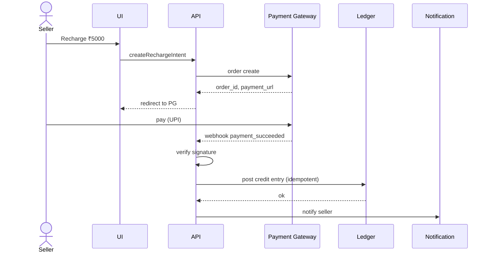
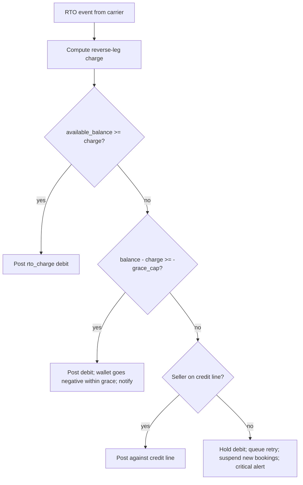
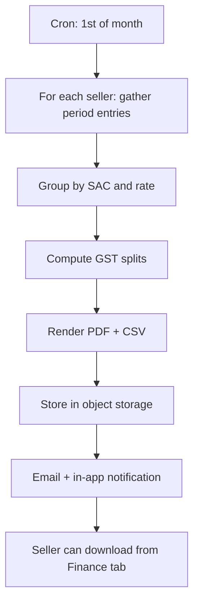

# Feature 13 — Wallet, billing, invoicing

## Problem

Money is sacred. Every rupee that enters or leaves a seller's wallet must be traceable, auditable, and explainable. The wallet is the financial heart of the platform: shipments are debited, COD is credited, weight disputes adjust, recharges flow in, refunds flow out, RTO charges hit. Get this wrong and we lose trust permanently.

Beyond wallet mechanics, this feature also covers GST-compliant invoicing.

## Goals

- **Strict ledger integrity** — double-entry semantics; every entry has a reversible counterpart; balance always derivable from ledger.
- **Two-phase reservations** so booking and charging are atomic with respect to wallet.
- **Reverse-leg charging mechanics** — RTO and reverse-pickup charges debit the wallet cleanly, including a configurable grace cap for negative balance.
- **Multi-payment recharge** (UPI / cards / netbanking / NEFT) with sub-minute reflection.
- **Credit lines** for select sellers with limits, alerts, auto-collection.
- **GST-compliant invoices** auto-generated monthly; downloadable; CA-friendly.
- **Wallet float compliance** — RBI PPI rules where applicable.

## Non-goals

- Buyer-side payment processing (channels handle).
- Lending products (potential v3+ adjacent, partner-led).
- Subscription billing for SaaS plans (handled inside this feature; not a separate sub-domain).

## Industry patterns

| Approach | Pros | Cons |
|---|---|---|
| **Free-form balance** (one balance integer per seller) | Simple to read | Impossible to audit; no trail |
| **Single-entry ledger** (per-event line items) | Auditable | Inconsistencies possible |
| **Double-entry ledger** | Industrial-grade integrity | More machinery to build |
| **Event-sourced wallet** | Replayable; trivially provable | Heavy infra |

**Our pick:** Double-entry ledger with idempotent posting and snapshot balances. Standard fintech-grade.

## Functional requirements

### Wallet account model

```yaml
wallet_account:
  id: wa_xxx
  seller_id (or sub_seller_id)
  currency: INR (only)
  balance_minor: 5000000          # in paise; integer arithmetic
  available_balance_minor          # = balance + credit_limit - holds
  hold_total_minor
  credit_limit_minor: 0
  grace_negative_amount_minor: 50000   # ₹500 default; configurable
  available_credit_minor
  status: active | frozen | wound_down
  policy:
    low_balance_threshold_minor
    auto_recharge_enabled
    auto_recharge_amount_minor
    auto_recharge_method_ref
  created_at
```

Balance is **derived** from the ledger; the cached value is for performance only. Every read can re-compute from ledger.

### Ledger entry rules

- Every entry has: `direction (debit/credit)`, `amount_minor`, `seller_id`, `wallet_account_id`, `ref_type`, `ref_id`, `actor`, `posted_at`, `reverses_id` (nullable).
- **Immutable**. To "correct" an entry, post a reversing entry.
- Sum of all entries = current balance.
- Integer paise arithmetic only — no floats.
- Idempotent posting on `(ref_type, ref_id, direction)` — duplicate posts ignored.

### Reference types

| `ref_type` | What it represents |
|---|---|
| `recharge` | Wallet top-up by seller |
| `shipment_charge` | Forward shipping |
| `cod_handling` | COD fee on a shipment |
| `cod_collected` | COD remitted from carrier (internal account) |
| `cod_remit_to_seller` | COD paid out to seller wallet |
| `weight_dispute_charge` | Carrier raised weight diff |
| `weight_dispute_reversal` | Won dispute; charge reversed |
| `rto_charge` | Return shipping (reverse-leg) |
| `reverse_pickup_charge` | Buyer-initiated return shipping |
| `insurance_premium` | Shipment insurance |
| `insurance_payout` | Claim payout |
| `subscription_fee` | Plan fee |
| `refund` | Wallet refund (e.g., booking failed) |
| `manual_adjustment` | Ops correction with reason |
| `invoice_settlement` | Invoice paid (credit-line customer) |
| `auto_recharge` | Auto top-up |
| `chargeback` | PG chargeback reversal |

### Two-phase wallet operations

- `reserve(amount, ttl_seconds) → hold_id`. Decreases `available_balance` but not `balance`.
- `confirm(hold_id) → ledger_entry`. Materializes the debit; releases hold.
- `release(hold_id)`. Cancels reservation; restores availability.
- TTL expiry → automatic release (background job).

Used by Booking (Feature 08) and any other operation that may fail after pre-charge.

### Reverse-leg charging (RTO and buyer-return)

When the carrier raises an RTO charge or a reverse-pickup charge:

```
1. Charge event arrives (carrier API or carrier remittance file).
2. Compute charge amount per seller's rate card.
3. Attempt direct debit:
   - If available_balance ≥ charge: post `rto_charge` debit. Done.
   - If available_balance < charge:
     a. If (balance - charge) >= -(grace_negative_amount): post debit; wallet goes negative within grace. Notify seller.
     b. Else: hold action; queue retry; suspend new bookings; notify seller (low-balance critical alert).
```

For credit-line / enterprise sellers: charge accumulates against credit line; settled via invoice.

#### Grace cap rationale

A small grace cap (default ₹500, configurable) lets us debit RTO charges even when the seller's wallet sits at zero — a single RTO race condition shouldn't suspend the seller. But unlimited negative would let sellers walk away with debt. The cap is the balance.

#### Suspension

When wallet negative beyond grace cap (and seller is not on credit line):
- Status → suspended.
- New bookings blocked.
- Existing in-flight shipments tracked.
- Notifications sent.
- On recharge that clears debt: auto-reactivate.

### Recharge methods

- **UPI** (instant; near-zero fee) — preferred.
- **Card / debit / credit** (1.5–2.5% PG fee).
- **Netbanking** (instant via PG).
- **NEFT / RTGS / IMPS** (manual reconciliation; supports large recharges).
- **Auto-recharge** — saved card / mandated UPI; triggered when balance crosses threshold.

Each recharge:
1. Initiated via PG.
2. PG webhook on success.
3. Verified server-side (signature).
4. Ledger entry posted (idempotent).
5. Notification to seller.

### Credit line

For select sellers (typically `mid_market` / `enterprise`):
- Pikshipp / Ops sets a credit limit via policy override.
- Wallet can go negative up to that limit.
- Negative balance accrues no interest in v1.
- Monthly invoice settles outstanding negative.
- Triggers (e.g., balance below -80% of limit) raise alerts; suspension at -100% (configurable).

Credit terms (period, settlement) come from the contract → policy engine.

### Subscription / plan billing

- Plan fee charged monthly on a fixed cycle.
- Pro-rated on plan change.
- Billed via wallet (debit) — not via PG separately.
- Failure to pay (insufficient balance + no credit) → grace period → suspension.

### Invoicing

#### Monthly invoice (standard)

Generated on the 1st of each month for the previous month:
- Seller-facing tax invoice from Pikshipp.
- Contains:
  - All shipping charges (forward + RTO + reverse) line-itemed by AWB.
  - COD handling fees (per Feature 12 — bundled or itemized per seller config).
  - Weight dispute charges (if not yet reversed).
  - Insurance premiums.
  - Subscription / plan fee.
  - Credits / adjustments.
  - GST (CGST + SGST or IGST depending on place of supply).
  - GSTIN of supplier (Pikshipp) and recipient (seller).
  - HSN/SAC codes.
- Available in PDF, CSV (line items), and JSON.

#### Per-shipment invoice (on demand)

Some sellers/CAs want per-shipment invoicing. Available on demand.

### GST handling

- Place of supply rules per India GST Act.
- Logistics services: SAC `9965`.
- Insurance: SAC `9971`.
- TCS under GST: not applicable (we are not an e-commerce operator under Sec 52, with legal sign-off).
- TDS: applicable for some seller categories; we provide a TDS-friendly invoice format.

### Wallet statement

- Per period (monthly default; custom range available).
- Opening balance, closing balance, all entries.
- Filterable by ref_type, AWB, date.
- Downloadable CSV / PDF.

### Ledger integrity safeguards

- **Daily invariant check job** — sum of ledger == cached balance for every wallet. Mismatches alert immediately.
- **Cross-context reconciliation** — sum of `shipment_charge` ledger entries for a period == sum of charges on shipments booked in that period. Reconcile daily.
- **No "fix balance" command** — the only way to change balance is to post a ledger entry with a reason and an actor.

### Wallet freeze

Operational lever for ops to freeze a wallet during fraud investigation, contract dispute, etc.

## User stories

- *As a seller*, I want to recharge ₹5,000 via UPI and see it in my balance within 30 seconds.
- *As a seller*, I want to download last month's GST invoice in PDF for my CA.
- *As a finance person*, I want every wallet movement linked to its source so I can reconcile.
- *As Pikshipp Ops*, I want to apply a one-time credit of ₹500 to a seller's wallet with a documented reason.
- *As a seller*, I want clear messaging when RTO charges push my wallet into the grace zone, so I can recharge before suspension.

## Flows

### Flow: Recharge



### Flow: RTO charge debit (with grace handling)



### Flow: Two-phase shipment charge

(See Feature 08 for the full booking sequence.)

### Flow: Monthly invoice generation



### Flow: Ops manual adjustment

1. Pikshipp Ops opens wallet.
2. Click "Adjust" → enter amount, direction, reason, attach evidence.
3. Two-person approval if amount > ₹10k.
4. Ledger entry posted with `actor.kind = ops_user`.
5. Seller audit log entry visible to seller.
6. Notification to seller.

## Configuration axes (consumed via policy engine)

```yaml
wallet:
  posture: prepaid_only | hybrid | credit_only
  credit_limit_inr: 0
  grace_negative_amount_inr: 500
  auto_recharge_enabled: false
  auto_recharge_amount_inr: 5000
  auto_recharge_threshold_inr: 200
  auto_recharge_max_per_day: 3
  auto_recharge_max_amount_per_day: 50000
billing:
  invoice_cycle: monthly | weekly
  credit_period_days: null            # only for credit-line sellers
  invoice_format_default: pdf
```

## Data model

(Canonical wallet/ledger in `03-product-architecture/04-canonical-data-model.md`.)

## Edge cases

- **PG webhook retry after we already posted** — idempotency prevents double credit.
- **Recharge succeeds, webhook never arrives** — periodic PG status reconcile job; credit on confirmation.
- **Seller disputes a charge** — reversing entry posted; original retained for audit.
- **Sub-seller charge but parent wallet** — entry on parent wallet with sub-seller_id in ref for traceability.
- **Plan downgrade mid-cycle** — pro-rate refund credit.
- **Wallet wound-down with positive balance** — refund to seller's bank (penny-drop verified).
- **Negative balance at wind-down** — invoice for outstanding; collection per policy.
- **Currency anomalies** — only INR; reject any non-INR in v1.

## Open questions

- **Q-WB1** — Should we charge GST on COD handling separately or bundle into shipping line? Default: separate line; transparent.
- **Q-WB2** — Auto-recharge cap: ₹10k per trigger; max 3/day. Tune based on data.
- **Q-WB3** — TDS handling: do we issue Form 26AS-aligned reports? Default: yes.
- **Q-WB4** — Float interest: invest the wallet float (RBI PPI rules)? Default: no in v1; legal review for v2.
- **Q-WB5** — Reverse-leg charge timing: at RTO event vs at RTO delivery? Default: at delivery (when we know charge is real).
- **Q-WB6** — Grace cap value: per-seller-type or one global default? Default: per-seller-type via policy engine; ₹500 for `small_smb`, ₹2000 for `mid_market`, custom for enterprise.

## Dependencies

- Payment gateway ([`07-integrations/03-payment-gateways`](../07-integrations/03-payment-gateways.md)).
- Booking (Feature 08) for two-phase calls.
- All charge-emitting features (forward shipping, COD, weight, insurance, RTO).
- GST configuration (place-of-supply table).
- Audit (`05-cross-cutting/06`).
- Policy engine for per-seller wallet config.

## Risks

| Risk | Mitigation |
|---|---|
| Ledger inconsistency causing balance drift | Double-entry; daily invariant check; alert on first mismatch |
| PG webhook spoofing | Signature verification; rotate secrets; replay-protection |
| GST calculation errors (multi-state edge cases) | Unit tests for each state combination; quarterly CA review |
| Float compliance with RBI | Legal review pre-launch; cap float; do not invest in v1 |
| Auto-recharge runaway loop | Per-day cap; alert thresholds; manual confirmation above limit |
| Manual adjustments abused by Ops | Two-person approval above threshold; audit log; periodic review |
| Reverse-leg debt accumulating across many sellers | Suspension semantics enforced; weekly bad-debt report |
