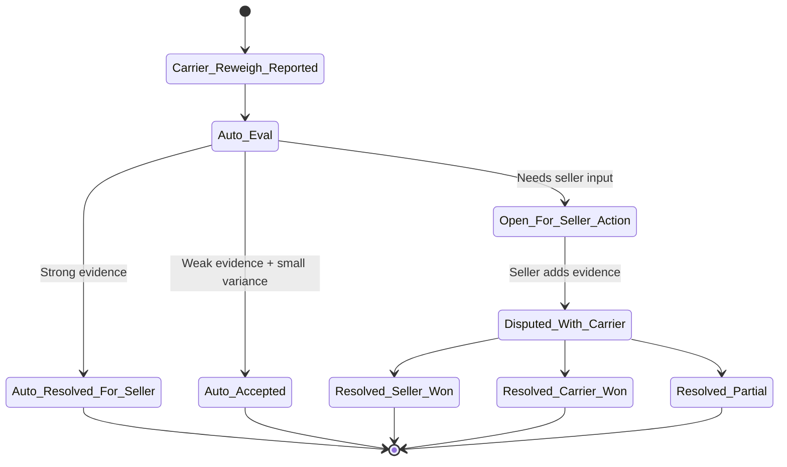
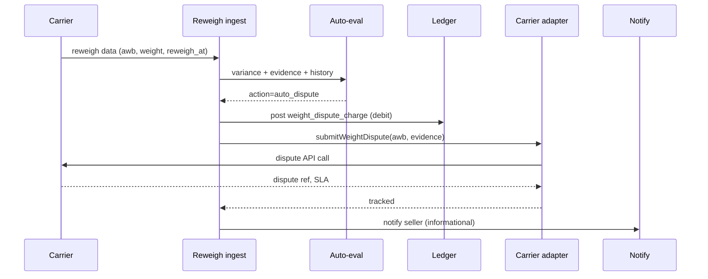
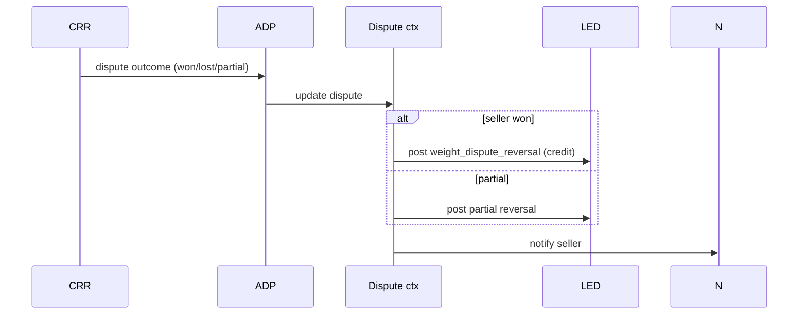

# Feature 14 — Weight reconciliation

## Problem

After a parcel is picked up, the carrier independently re-weighs it at their hub. If the carrier's weight is higher than what the seller declared (and was charged for), the carrier raises a **weight discrepancy** and bills the seller the difference. This is endemic in Indian logistics — sellers routinely lose **3–8% of revenue** to weight charges they cannot easily contest.

Most are legitimate (sellers underestimate). Many are not (carrier's scale calibration, dimensional reweigh disputes, packing material). Without aggregator intervention, the seller has no leverage.

This feature turns reconciliation from "seller eats" to a structured dispute workflow with photo evidence and auto-resolution.

## Goals

- **Auto-resolution rate ≥ 80%** of disputes (no seller manual action).
- **Net seller P&L impact reduced 70%+** vs. baseline (seller eating everything).
- Photo evidence captured **at packing time**, not retroactively.
- Multi-carrier dispute submission via adapter-level API where supported.
- Transparent ledger: every weight charge, dispute, and reversal visible.

## Non-goals

- Carrier-internal reweighing process (we don't see their scales).
- Buyer-facing aspects (this is a seller-carrier dispute).

## Industry patterns

| Approach | Used by | Notes |
|---|---|---|
| **Seller eats it** (no dispute) | Long-tail of small sellers | Default sad-state |
| **Manual dispute (email-based)** | Most aggregators | Slow, low success rate |
| **Photo-based dispute** | Shipway, Shiprocket (some plans) | Better; but seller must upload at pack time |
| **Image-comparison ML** | Emerging | Compares seller's photo with carrier's reweigh photo if available |
| **Carrier-side video evidence** | Some premium carriers | When available, dispute is data-rich |
| **Bulk dispute via carrier API** | Delhivery and a few others | We exploit where present |

**Our pick:** Photo-at-pack + auto-dispute via carrier APIs + ML-assisted decisioning v2.

## Functional requirements

### Photo capture at packing

- Operator (P9) packs an order; before booking, captures one of:
  - Photo of parcel on the scale (recommended).
  - Photo of parcel + a reference dimension marker.
- Photo stored against the shipment.
- Optional but encouraged; sellers without photos have weaker disputes.
- Mobile capture supported (operator at packing table with phone).
- Bulk skip allowed (operator on Pikshipp Free plan).

### Discrepancy ingestion

- Carrier sends weight reconciliation data:
  - Some via API (Delhivery, Bluedart) → real-time.
  - Some via CSV uploads (older carriers) → daily.
  - Some via portal scrape (rare) → weekly.
- Each row: `(awb, carrier_weight_g, carrier_reweigh_at, optional carrier photo)`.
- Match to shipment.
- Create `WeightDispute` record automatically if carrier weight > declared by tolerance (e.g., 50g or 5%).

### Dispute workflow



### Auto-evaluation rules

The auto-eval engine considers:
- **Variance magnitude** — small variance (e.g., <50g or <5%) → auto-accept (cost of disputing > value).
- **Seller's photo** — if photo exists and matches the declared weight on the visible scale → auto-dispute.
- **Carrier's photo** — if provided and shows ambiguous reading → ops review.
- **Shipment value vs charge** — small charge on small parcel may not be worth disputing.
- **Seller history** — if seller has consistent weight accuracy, weight discrepancy more suspicious; if seller chronically under-declares, less so.
- **Carrier history** — if a carrier hub has rising discrepancy rates, ops escalation.

Outputs:
- Accept (post charge to wallet; no dispute).
- Auto-dispute (post charge + open dispute with carrier).
- Open for seller (notify seller; charge held until resolution or auto-charge after deadline).

### Carrier dispute API

Adapter exposes `submitWeightDispute(awb, evidence, requested_resolution)`:
- Submits via carrier API where supported.
- Otherwise queues for manual ops dispute (carrier portal).
- Tracks dispute reference and SLA.

### Resolution outcomes

- **Seller won** — charge reversed via ledger; notification.
- **Carrier won** — charge stands; notification.
- **Partial** — partial reversal; explained.
- **Dispute window expired** — charge stands.

### Ledger treatment

- Original weight charge: posted at carrier reweigh time as `weight_dispute_charge` (debit).
- If reversed (won): `weight_dispute_reversal` (credit).
- If partial: explicit partial reversal.
- All visible in seller's wallet statement.

### Seller dispute UI

- Filterable list of open disputes (pending evidence, awaiting carrier).
- Per-dispute: declared weight, carrier weight, variance, AWB, photos, dispute history.
- Action: upload more evidence, accept, escalate.
- Bulk actions: accept many, dispute many.

### Pikshipp ops view

- Aggregate view: dispute volume per carrier, win rates, average variance.
- Carrier-level escalations when win rate drops or volume spikes.
- Per-tenant dispute analytics for performance reviews.

### Pre-empting future disputes

- Seller-level "your declared weights consistently differ from carrier weights by X%" insight.
- Suggests calibration of seller's scale or rounding.

## User stories

- *As an operator*, I want a 1-tap "snap photo" while packing, so I never forget evidence.
- *As an owner*, I want to see all disputes resolved in last 30 days with money I saved.
- *As a finance person*, I want every weight charge visible in the wallet ledger with clear status.
- *As Pikshipp Ops*, I want to flag carriers whose reweigh discrepancy rate spikes — likely scale calibration issue.

## Flows

### Flow: Discrepancy auto-disputed



### Flow: Dispute resolution



## Multi-seller considerations

- Disputes are seller-scoped.
- Pikshipp Ops can override / escalate.
- Auto-eval thresholds set by Pikshipp; per-seller overrides available within policy floors.

## Data model

```yaml
weight_dispute:
  id
  shipment_id
  declared_weight_g
  carrier_weight_g
  variance_g
  variance_pct
  carrier_charge_amount
  evidence_seller: [{ kind: photo, ref, captured_at }]
  evidence_carrier: [{ kind: photo, ref, captured_at } ]
  auto_eval_decision: auto_resolved | auto_accepted | open_for_seller
  carrier_dispute_ref
  status: pending | open | disputed | resolved_seller_won | resolved_carrier_won | resolved_partial | expired
  resolved_amount       # the amount actually credited back (0 if carrier won)
  raised_at, resolved_at
```

## Edge cases

- **Carrier data missing photo** but seller has one — proceed with seller's evidence.
- **Multiple reweigh events** (carrier reweighs at multiple hubs) — keep latest.
- **Seller adds photo retroactively** — accepted but flagged as late; lower priority.
- **Carrier adjusts reweigh after initial dispute** (rare; some do for VIPs) — reflected in updated charge; net change posted.
- **Dispute past carrier's window** — system marks expired; seller can still see it but no further action.
- **Same AWB has both forward and RTO reweigh** — two separate disputes if applicable.

## Open questions

- **Q-WR1** — Should we charge a percentage of recovered amounts (a "win fee")? Trade-off: aligns incentives vs friction. Default: no in v1; flat plan benefits.
- **Q-WR2** — How aggressive should the auto-dispute be? (Disputing tiny variances irritates carriers; not disputing means we lose obvious wins.) Default: tunable per carrier, starting moderate.
- **Q-WR3** — Image-comparison ML to validate photos: build vs vendor? Default: vendor v2.
- **Q-WR4** — Should we publish carrier-level discrepancy stats (transparency vs vendor relations)? Default: internal only.

## Dependencies

- Booking (Feature 08) for declared weight + photos.
- Wallet (Feature 13) for ledger.
- Carrier adapters (Feature `07-integrations/02`) for dispute APIs.

## Risks

| Risk | Mitigation |
|---|---|
| Auto-dispute pollutes carrier relationships | Tunable thresholds; carrier feedback channel |
| Seller doesn't capture photos | Onboarding nudge; reminder at booking |
| Discrepancy data delayed by carrier | Publish carrier-side SLA; alert sellers if delays grow |
| Photo storage cost | Compress; tier to cold storage after resolution |
