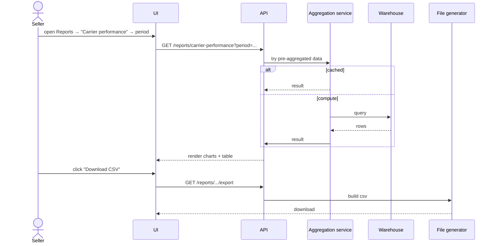

# Feature 15 — Reports & analytics

## Problem

A seller cannot run a business off raw data — they need synthesized views: how am I performing? Which carrier is best for my pincode mix? Why is my RTO going up? Pikshipp ops needs broader views: which sellers are at risk of churn? Which carrier is degrading? Which seller-types are over-utilizing weight disputes?

Reports are the surface that converts the platform's data wealth into seller and operator insight.

## Goals

- 8 default seller reports covering shipping, NDR, RTO, COD, weight disputes, finance, channel performance, carrier performance.
- All reports downloadable (CSV, Excel, PDF).
- API access for sellers consuming reports programmatically.
- Pikshipp-level cross-seller aggregate views (admin-elevation required for any PII).
- Pikshipp ops cross-seller analytics (admin-elevation required for any PII).
- All reports respect tenant scoping rigorously.

## Non-goals

- Custom report builder (drag-drop) in v1; v2.
- BI tool replacement; we aren't Looker / Metabase. Sellers can pull data via API into their tool.

## Industry patterns

| Approach | Pros | Cons |
|---|---|---|
| **Pre-canned reports + filters** | Easy onboarding; fast | Inflexible |
| **Self-serve report builder** | Power-user friendly | Complexity; analytical query load |
| **Embedded BI (Looker / Metabase)** | Powerful | Tenant security tricky |
| **Ad-hoc CSV export** | Universal escape valve | Not "reports" |

**Our pick:** Pre-canned reports + downloadable raw exports v1; lightweight builder v2.

## Functional requirements

### Default seller reports

#### 1. Shipment summary
- Period filter, channel/carrier/pickup/zone filter.
- Counts by status: booked, in transit, delivered, NDR, RTO, lost.
- Conversion rates (booked → delivered).

#### 2. Carrier performance
- Per-carrier: success rate, on-time rate, NDR rate, RTO rate, average cost per shipment.
- Suggestion: "Switching X% of shipments from Carrier A to Carrier B would save ₹Y at the same SLA."

#### 3. NDR & RTO dashboard
- NDR rate trend.
- NDR resolution rate.
- RTO rate by pincode/zone.
- Top NDR reasons.
- Per-buyer repeat NDR / RTO list (privacy-aware).

#### 4. COD report
- COD volume vs prepaid.
- COD remittance status (pending, remitted, mismatched).
- Outstanding COD by age.

#### 5. Weight dispute report
- Open / resolved / won / lost.
- Net P&L impact.
- Per-carrier dispute success rate.

#### 6. Finance report
- Wallet ledger summary.
- Recharge volume.
- Charges by category.
- GST summary.
- Outstanding (negative balance for credit-line sellers).

#### 7. Channel performance
- Orders per channel.
- Conversion: ingested → booked.
- Channel-side errors.

#### 8. Pincode insights
- Top pincodes by volume.
- NDR/RTO heatmap by pincode.
- Pincode-level cost analysis.

### Pikshipp-internal reports

Aggregate over all sellers (privacy-respecting; admin-elevation for any PII):
- Platform health: active sellers, shipments, revenue.
- Carrier performance across all sellers (per `01-vision-and-strategy/04-success-metrics.md`).
- Carrier reliability ranking.
- COD float exposure.
- Top-revenue sellers; sellers needing attention (rising NDR, low recharge).
- Fraud signals (RTO patterns, COD anomalies).
- Margin reports by seller-type.

### Report engine

- Pre-aggregated per day per tenant (efficient).
- Real-time queries layered on top with limited window (last 24h).
- Heavy historical queries → warehouse (separate from transactional DB).

### Export & delivery

- One-click CSV / Excel / PDF.
- Scheduled email delivery (e.g., weekly Monday 9 AM).
- API access for raw data export.

### Custom views (v2)

- Save filters as views.
- Share views within tenant.

## User stories

- *As an owner*, I want a Monday morning email with last week's shipping + NDR summary.
- *As a finance person*, I want monthly GST report exported in a tally-compatible format.
- *As Pikshipp Ops*, I want to know which sellers had a 30%+ RTO rate spike last week.
- *As Pikshipp Ops*, I want cross-seller carrier health rankings updated daily.

## Flows

### Flow: Generate a report on demand



### Flow: Scheduled email report

1. Cron triggers per scheduled report.
2. Engine builds report.
3. Email with attached CSV + summary chart.
4. Failure → in-app alert.

## Multi-seller considerations

- Every report is tenant-scoped.
- Cross-seller aggregates never expose PII without admin elevation + audit.
- Pikshipp internal cross-seller analytics are aggregate-only by default; PII-bearing views require Admin elevation + audit.

## Data model

Reports do not have their own canonical entities; they read from the warehouse. Per-tenant aggregations:

```yaml
agg_daily_seller_shipments:
  seller_id
  date
  count_booked, count_delivered, count_ndr, count_rto, count_lost
  revenue, cost, margin
  ...
```

## Edge cases

- **Reports over very long periods** — paginated/streamed; warehouse-only.
- **Reports on extremely small tenants** — aggregations might be sparse; UI handles emptiness gracefully.
- **Time zones** — reports default to seller-configured TZ (default IST); export marks TZ in metadata.
- **Newly added fields** — historical data may not have them; report shows N/A.

## Open questions

- **Q-RP1** — Do we expose Pikshipp-internal carrier rankings to sellers (for transparency) or keep internal? Default: aggregated only, with per-seller carrier scores in their reports.
- **Q-RP2** — Should reports include AI-generated narrative summaries? (e.g., "Your RTO rose 4% this week, mainly in MH zone.") Default: v2.
- **Q-RP3** — Real-time vs daily-refreshed reports — where do we draw the line? Default: today's KPIs real-time, historical pre-aggregated.

## Dependencies

- Data warehouse infrastructure (cross-cutting).
- All emitting features (every domain context contributes data).

## Risks

| Risk | Mitigation |
|---|---|
| Reports drift from operational data | Reconciliation tests; freshness SLAs surfaced in UI |
| Cross-tenant leak in aggregated reports | Strict scoping at query level; review |
| Slow heavy reports degrade UX | Async generation + email delivery |
| PII in exports (buyer phone, address) | Configurable masking; consent-aware |
