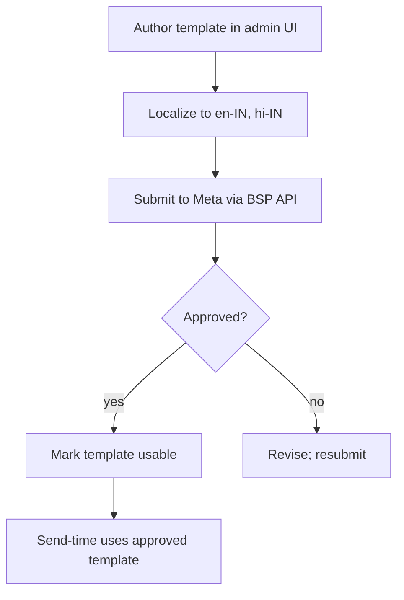

# Feature 16 — Notifications

## Problem

The platform must talk to many people across many channels: sellers (in-app, email, WhatsApp), buyers (WhatsApp, SMS, email), Pikshipp Ops (in-app, email, Slack/PagerDuty for alerts). Each notification has a *trigger*, a *recipient*, a *channel*, a *template*, and a *deliverability cost*.

Done well, notifications cover up the messiness of logistics. Done poorly, they spam and erode trust.

## Goals

- **Multi-channel** routing with fallback: WhatsApp → SMS → email.
- **Per-seller buyer-facing branding** so buyers see the seller's name/logo, not Pikshipp's.
- **Template management** centralized; sellers can override copy where allowed.
- **Deliverability tracking** — per channel, per template, per seller; surface to ops.
- **Compliance** — DLT-registered SMS, WhatsApp template approval, email DKIM/SPF/DMARC, opt-out tracking.
- **Same baseline for all sellers** — no notification tier; every seller gets WhatsApp + SMS + email per shipment as standard.

## Non-goals

- Voice/IVR (passthrough for v3 if needed).
- Push notifications for seller mobile app (v2+ when mobile launches).
- Marketing email automation; this is transactional.

## Industry patterns

| Approach | Pros | Cons |
|---|---|---|
| **Per-channel direct vendor** (one MSG91 for SMS, one Mailgun for email) | Simple | No unified retry/template logic |
| **Notification platform** (Notifly, Engagespot, Customer.io) | Unified | Vendor lock; less control |
| **In-house notification service** | Full control | Build effort |
| **Multi-vendor per channel** | Resilience | Operational overhead |

**Our pick:** In-house notification service with multi-vendor per channel for resilience.

## Functional requirements

### Channels

| Channel | Use cases | Vendors (multi for resilience) |
|---|---|---|
| **WhatsApp** | Buyer NDR / tracking; seller alerts; OTP (v2) | Meta direct (BSP — Gupshup / 360Dialog / Karix) |
| **SMS** | OTP, fallback for WhatsApp, high-priority alerts | MSG91, Karix, Twilio (DLT-registered) |
| **Email (transactional)** | Invoices, weekly reports, system updates | SendGrid, AWS SES, Postmark |
| **In-app** | Real-time UI updates, dashboard banners | Internal pub-sub |
| **Slack / PagerDuty** | Pikshipp internal ops alerts | Direct integration |
| **Push** | Mobile app (v2) | FCM, APNs |

### Sender identity

- **Buyer-facing**: from-name = the seller's brand. SMS sender ID = either Pikshipp's DLT-registered ID or seller's own (configurable; per Feature 27 some sellers register their own DLT). WhatsApp sender = Pikshipp's WhatsApp Business number (with template branded as seller); large sellers may onboard their own WhatsApp business number — feature flag `features.seller_whatsapp_sender`.
- **Seller-facing**: from = Pikshipp; standard branding.
- Identity resolution at send time, never at template authoring time.

### Template management

- Templates stored per `(template_id, locale, scope)`.
- Scope: Pikshipp default → seller override (where allowed).
- Variables interpolated (e.g., `{{buyer_name}}`, `{{tracking_link}}`).
- Pre-launch testing: render with sample data; review; approve.
- WhatsApp templates require Meta approval; we manage submission.
- DLT registration required for India SMS templates; we manage on seller's behalf for buyer comms (regulatory).

Template categories:
- **Transactional buyer comms** — booking, OFD, delivered, NDR, return.
- **Transactional seller comms** — KYC status, low balance, stuck shipment, weekly summary.
- **Marketing** — out of scope v1.
- **System / alerts** — internal ops.

### Send rules

- **Idempotency** — `(event_id, recipient, channel, template)` key prevents duplicate sends on retry.
- **Throttling** — per recipient per template per period (e.g., max 1 NDR notification per shipment per 6h).
- **Quiet hours** — buyer-facing notifications suppressed 10 PM – 8 AM IST unless seller config opts out.
- **Channel fallback** — WhatsApp delivery failure → SMS retry within 5 min; SMS failure → email if available.

### Delivery tracking

- Per-message: sent / delivered / opened / clicked / failed.
- WhatsApp delivery + read receipts.
- SMS delivery receipts (carrier-supplied).
- Email opens / clicks (pixel + link wrapping).
- Stored as notification ledger entries.

### Opt-out & consent

- Buyer-side: opt-out from WhatsApp / SMS via reply STOP; recorded; never re-sent (regulatory).
- Per channel; respected per-seller (a buyer who opts out from one seller doesn't carry to another — privacy default).
- Email unsubscribe link required by law for some categories.
- DPDP-Act-aligned consent records.

### Notification preferences (per seller)

- Per-template enable/disable.
- Per-channel preference per template.
- Quiet hours.
- Aggregation: e.g., "send me a daily summary instead of per-event" for low-priority types.

### Notification center (in-app)

Per seller user:
- Inbox of all notifications relevant to them.
- Read/unread state.
- Filter by category.
- Mark all read.

### Internal alerts (ops)

- Slack/PagerDuty integration for high-severity alerts (carrier outage, ledger inconsistency, KYC backlog).
- Alert categories: P0 / P1 / P2 / informational.
- On-call routing.

## User stories

- *As a buyer*, I want to receive the tracking link on WhatsApp from the seller's brand, not a courier I don't recognize.
- *As a seller*, I want to mute "shipment delivered" notifications during business hours and get a daily digest instead.
- *As Pikshipp Ops*, I want a Slack alert when WhatsApp delivery rate drops below 90%.
- *As a seller*, I want my logo on the WhatsApp template so my buyers recognize me.

## Flows

### Flow: NDR triggers buyer outreach

(See Feature 10 for the NDR → outreach flow.)

### Flow: WhatsApp template lifecycle



### Flow: Vendor failover

1. Send via primary vendor.
2. If error or no delivery receipt within SLA, retry via secondary vendor.
3. If both fail, fall back to next channel (e.g., WhatsApp → SMS).

## Configuration axes (consumed via policy engine)

```yaml
notifications:
  buyer:
    whatsapp_enabled: true
    sms_enabled: true
    email_enabled: true
    quiet_hours: { start: "22:00", end: "08:00" }
    seller_whatsapp_sender_enabled: false   # feature flag
    template_overrides: { ... }
  seller:
    digest_frequency: realtime | daily | weekly
    aggregated_categories: [...]
```

## Data model

```yaml
notification_template:
  id
  category: buyer_transactional | seller_transactional | system
  channel: whatsapp | sms | email | inapp | push
  locale
  scope: pikshipp | seller_id
  body, variables, attachments
  status: draft | submitted | approved | rejected | active | archived
  vendor_template_ref
  approved_at

notification:
  id
  seller_id
  recipient: { kind: buyer|seller_user|..., ref }
  channel
  template_id
  payload
  status: queued | sent | delivered | opened | clicked | failed | suppressed
  vendor: { name, message_id }
  attempts: [...]
  failed_reason
  triggered_by: { kind: event, ref_type, ref_id }
  sent_at, delivered_at, opened_at

opt_out_record:
  recipient_phone | email
  channel
  scope: seller_id (per-seller scope; not global)
  recorded_at, source
```

## Edge cases

- **Same buyer ordered from two sellers** — they receive two separate communications; not deduped.
- **Template variable missing** (e.g., buyer_name absent for Amazon order) — fall back to generic copy or skip.
- **Vendor rate limit hit** — backpressure; queue; tier-2 vendor takes over.
- **Buyer phone number invalid** — surface in seller's order; fallback to email if any.
- **WhatsApp 24-hour session vs template** — template required outside session; we use templates for initial outreach.

## Open questions

- **Q-NT1** — 2-way WhatsApp (buyer replies handled by us)? Default: no v1; v2 for NDR chatbot.
- **Q-NT2** — Per-seller WhatsApp business sender — feature flag rollout? Default: opt-in for `mid_market`+; default off.
- **Q-NT3** — Vendor rotation strategy: weight-based, latency-based, cost-based? Default: latency + delivery rate based.
- **Q-NT4** — DLT registration for hundreds of templates × sellers (when sellers register their own): tooling? Build a sheet-based pipeline; ops manages.

## Dependencies

- Comms providers (`07-integrations/04-communication-providers.md`).
- Per-seller branding via Feature 17 / policy engine.
- Audit (`05-cross-cutting/06`).

## Risks

| Risk | Mitigation |
|---|---|
| WhatsApp template rejection delays buyer comms | SMS fallback; templates reviewed before launch |
| SMS deliverability (DLT compliance) | Maintain DLT registrations; monitor rejection codes |
| Vendor outage | Multi-vendor with failover |
| Buyer over-notification (spam) | Throttling + quiet hours + dedup |
| GDPR-style consent (DPDP) | Consent records; opt-out compliance |
| Cross-seller brand bleed (wrong sender) | Identity resolution at send-time; tested per release |
