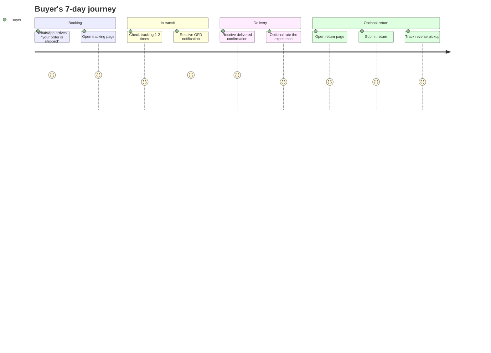
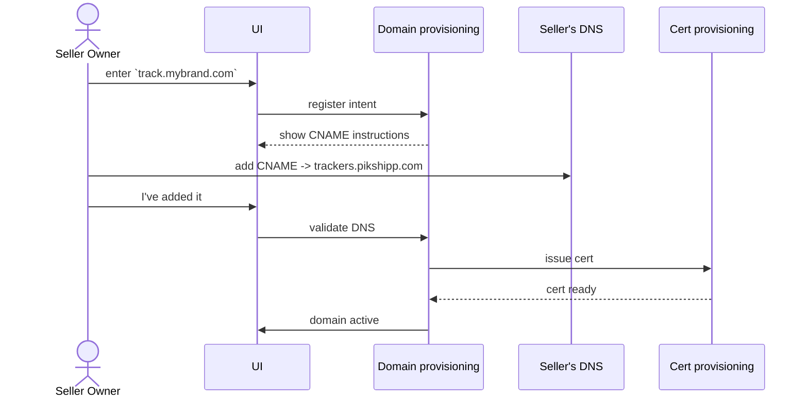

# Feature 17 — Buyer experience (incl. seller branding)

## Problem

The buyer is the only stakeholder who never logs in. They interact with the platform for ~10 days per shipment and form an opinion of the seller's brand based on tracking, delivery, and post-delivery service. **A bad buyer experience does not show up in our metrics directly — it shows up in the seller's repeat-purchase rate, NPS, and chargebacks.**

A great buyer experience also closes the most expensive loop in logistics: it converts NDRs to deliveries and prevents avoidable RTOs.

This feature owns three things:
1. The buyer-facing **surfaces** (tracking page, NDR feedback page, returns portal, COD confirm page).
2. The buyer-facing **comms** triggered (links from notifications — see Feature 16 for delivery).
3. **Per-seller branding** of these surfaces — the seller's logo, colors, and (optionally) a custom tracking domain. Pikshipp's brand never appears to the buyer by default.

## Goals

- **Zero-login buyer pages** — tracking, NDR feedback, returns, COD confirm.
- **Per-seller branded** by default; sellers customize logo, colors, copy.
- **Optional custom domain** (e.g., `track.brand.com`) for sellers who want to fully own the buyer touchpoint.
- **Mobile-first**, < 100 KB load on 3G, accessible.
- **Multilingual** (English, Hindi at v1; Tamil, Telugu, Marathi, Bengali, Gujarati at v2).
- **Engagement loop** — tracking page → NDR feedback → returns → review.

## Non-goals

- Buyer accounts / login.
- Buyer-side payment processing for orders (channel handles).
- Marketing surface to buyer.
- Reseller / white-label tenancy (out of scope; per-seller branding is sufficient — see [`02-multi-tenancy-model.md`](../03-product-architecture/02-multi-tenancy-model.md)).

## Industry patterns

| Approach | Pros | Cons |
|---|---|---|
| **Carrier's own page** | Free | No seller branding; mediocre UX; courier-tied |
| **AfterShip-style overlay** | Polished | Vendor cost; overlays our seller brand |
| **Aggregator-built tracking page** | Brand control | Build effort |
| **Seller's own page** | Maximum control | Most sellers don't build one |

**Our pick:** Aggregator-built page with per-seller branding parameterization.

## Functional requirements

### Per-seller branding (the foundation)

Each seller can configure:
- **Logo** (upload).
- **Brand colors** (primary, secondary, accent).
- **Footer copy** (links to seller's privacy / terms / support).
- **WhatsApp business sender** (optional; from Feature 16).
- **Email sender domain** (optional; with DKIM/SPF/DMARC).
- **Custom tracking domain** (optional; e.g., `track.brand.com` — DNS CNAME to our service; SSL provisioned automatically).

Defaults if seller doesn't configure: a clean Pikshipp-neutral look (not Pikshipp branding — *neutral*, e.g., a generic shipping tracker design with seller's name in plain text).

### Tracking page (the canonical buyer surface)

- URL: `track.<seller-domain or pikshipp-default>/<token>` — token opaque, rate-limited.
- Sections:
  - Header with seller's logo + brand colors.
  - Stepper: Booked → Picked up → In transit → OFD → Delivered (NDR/RTO branches inline).
  - Estimated delivery date.
  - Shipping carrier indicator (small).
  - Latest 5 events.
  - Delivery address (partial mask: city, pincode, last 2 digits of phone).
  - CTA banner: rescheduling (NDR), confirm COD (pre-pickup high-risk), feedback (delivered).
- Refreshes via SSE / poll for fresh events.
- Performance: < 1 sec on 3G; < 100 KB JS payload.

### NDR feedback page

- Linked from NDR notifications.
- Same domain as tracking; one-tap entry from notification.
- See Feature 10 for action set.

### Returns initiation page

- Linked from delivered notification CTA (configurable per seller policy).
- Buyer authenticates with order ID + phone OTP.
- See Feature 11.

### COD confirmation page

- Linked from pre-shipment notification.
- One-tap confirm/cancel.
- See Feature 12.

### Buyer review (post-delivery)

- Optional per seller config.
- Star rating + free-text.
- WhatsApp reply-based ("Reply 5 to rate") or page-based.
- Surfaces to seller as buyer-NPS proxy.

### Localization

- Detect locale from notification context (e.g., Hindi WhatsApp message → Hindi page).
- Fallback to English.
- Translations centrally maintained; seller can override copy per locale.

### Accessibility

- WCAG 2.1 AA compliance.
- Screen-reader compatible stepper.
- High-contrast mode option.
- Keyboard-friendly.

### Buyer privacy

- Display partial address (mask line1 partial; show city/state/pincode).
- Phone shown last 2 digits.
- Tracking token expires (e.g., 60 days post-delivery).
- No buyer login means no buyer profile retained beyond shipment context.

### Performance budget

- HTML+CSS shell < 25 KB.
- JS < 50 KB.
- Images optimized (logo); brand colors via CSS variables.
- Server-side rendered; client-hydrated.
- Edge-cached for unchanged content; live data via API.

### Custom domain provisioning

For sellers opting for `track.brand.com`:
1. Seller provides desired domain.
2. Pikshipp Ops surfaces DNS CNAME records to set.
3. Seller adds CNAME on their DNS.
4. Pikshipp validates DNS, provisions SSL (Let's Encrypt or commercial), maps domain to tenant context.
5. SSL auto-renewed.
6. Domain becomes active; verified periodically.

If seller doesn't have a custom domain: serve under `track.pikshipp.com/<token>` — branded with seller's logo/colors but on Pikshipp's domain.

## User stories

- *As a buyer*, I want to open my tracking link on a tier-3 city 3G connection and see my package status in 2 seconds.
- *As a buyer*, I want to reschedule a missed delivery in under 60 seconds without phoning anyone.
- *As a buyer with low literacy*, I want the page in Hindi with simple icons.
- *As a seller*, I want my logo on the buyer's tracking page, not Pikshipp's.
- *As a mid-market seller*, I want my buyers to see `track.mybrand.com`, not anything that mentions Pikshipp.

## Flows

### Flow: Buyer journey end-to-end



### Flow: NDR → reschedule → delivered

(See Feature 10.)

### Flow: Seller sets up custom domain



## Configuration axes (consumed via policy engine)

```yaml
buyer_experience:
  brand:
    logo_url
    colors: { primary, secondary, accent }
    custom_tracking_domain (optional)
  notification_template_overrides: {...}
  enable_buyer_review: true
  enable_returns_portal: true
  locales_enabled: [en-IN, hi-IN]
  cod_confirm_threshold_inr: 500
```

## Data model

```yaml
buyer_session:                 # ephemeral; not a permanent buyer profile
  token
  shipment_id
  expires_at
  rate_limit_window
  buyer_actions: [...]

buyer_feedback:
  shipment_id
  rating: 1..5
  comment
  channel: page | whatsapp_reply
  recorded_at

custom_domain:
  id
  seller_id
  domain
  cname_target
  dns_validated_at
  ssl_status
  ssl_renewal_at
  active
```

## Edge cases

- **Buyer copies tracking link to friend** — friend can see basic info but actions (NDR, return) require OTP verification.
- **Buyer guesses token** — high-entropy tokens; rate-limited.
- **Buyer's locale uncertain** — default English; offer language selector.
- **Brand assets missing for seller** — Pikshipp neutral default branding (clean shipping tracker design, seller name in plain text).
- **Custom domain DNS misconfigured** — fallback to `track.pikshipp.com/<token>`; alert seller.
- **SSL renewal failure** — fallback to Pikshipp's domain; alert + ops queue.

## Open questions

- **Q-BX1** — Buyer-side delivery photo upload (proof-of-receipt by buyer)? Possibly v2.
- **Q-BX2** — Buyer chatbot (WhatsApp) for queries beyond NDR? Possibly v2.
- **Q-BX3** — Buyer-side review syndication to seller's channel (Shopify reviews, Amazon)? Possibly v3.

## Dependencies

- Notifications (Feature 16), Tracking (Feature 09), NDR (Feature 10), Returns (Feature 11), COD (Feature 12).
- Policy engine (consumes branding + flags).
- Custom domain provisioning (operational, owned by Pikshipp Ops).

## Risks

| Risk | Mitigation |
|---|---|
| Tracking page slow on 3G | Strict performance budget; SSR; CDN |
| Cross-seller brand bleed | Domain-resolved seller context; no cross-seller asset references |
| Token enumeration / scraping | High-entropy + rate limit + WAF |
| Localization quality (regional languages) | Native review; fallback to English |
| Accessibility regressions | Test in CI; periodic audit |
| Custom domain SSL renewal failures | Auto-renewal monitoring; fallback path |
