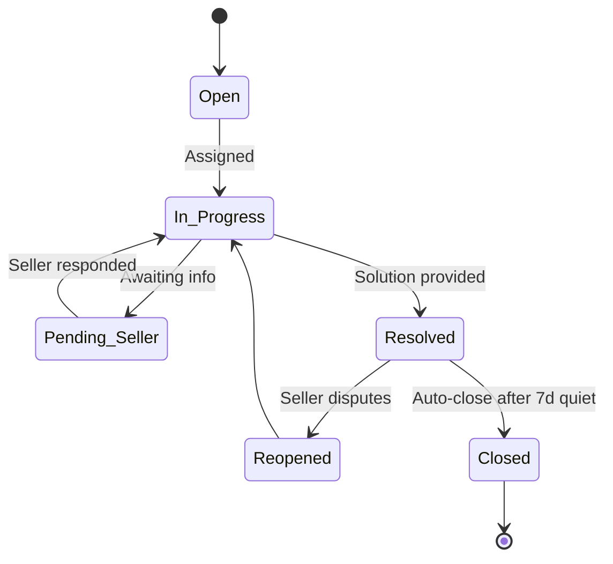
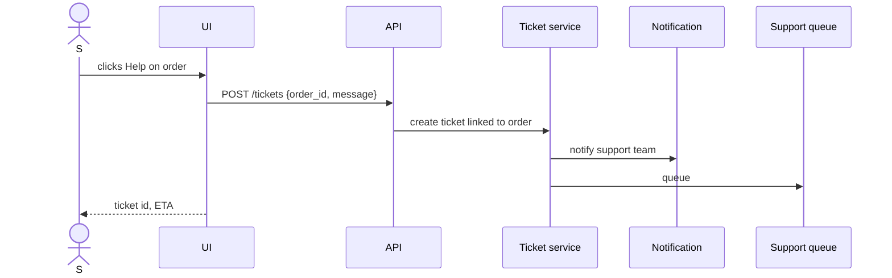
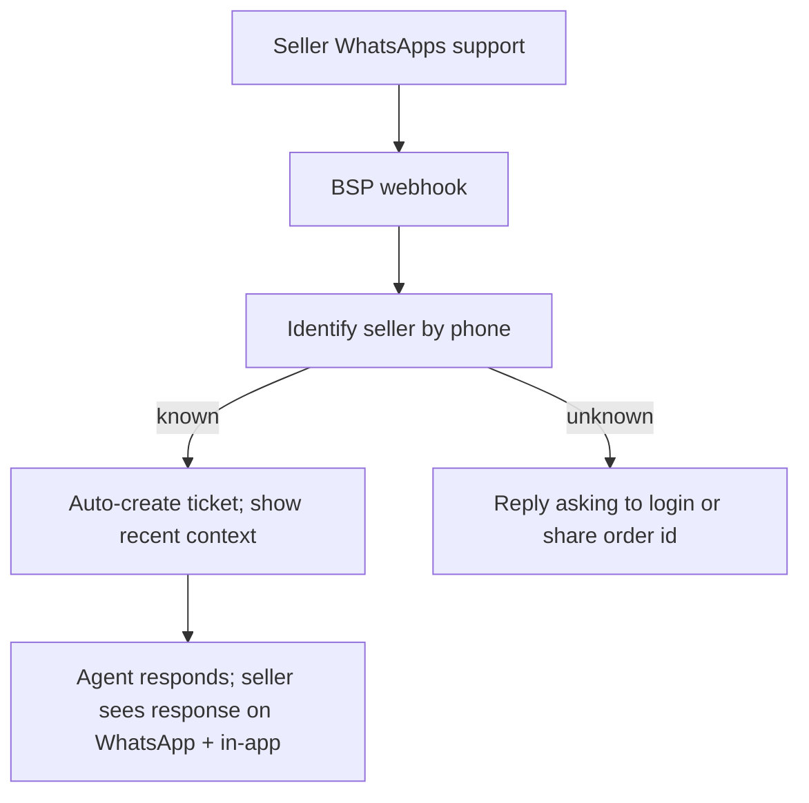

# Feature 18 — Support & ticketing

## Problem

Sellers will hit issues we can't auto-resolve. Some are platform bugs; many are courier-side; some are seller error. Without a structured ticketing layer, support devolves into long WhatsApp threads and lost context. A first-class ticketing experience reduces resolution time, raises seller satisfaction, and gives Pikshipp ops a managed queue.

## Goals

- Multi-channel ticket intake: in-app, email, WhatsApp.
- **First response time < 30 min** business hours.
- **Median resolution < 4h** for SMB issues.
- Ticket linked to shipment/order context (not free-floating).
- Multi-actor: Pikshipp Support team, Pikshipp Ops escalation path, Seller-side users.
- Knowledge base that reduces ticket volume.

## Non-goals

- Ticketing tool replacement (we may use Freshdesk/Zendesk under the hood; this feature spec focuses on the integrated product).
- Voice support center (v3).

## Industry patterns

| Approach | Pros | Cons |
|---|---|---|
| **Email-only** | Trivial | No context; SLA invisible |
| **External ticketing tool (Freshdesk, Zendesk)** | Mature | Less integrated with shipment context |
| **In-app ticketing with linked context** | Best UX | More build |
| **Hybrid: external tool + integration** | Real-world balance | Sync complexity |

**Our pick:** In-app surface for seller; backend connected to Freshdesk/Zendesk for ops staff.

## Functional requirements

### Ticket sources

- **In-app form**: pre-filled with shipment/order/wallet context the seller is on.
- **WhatsApp**: seller messages support number; ticket auto-created.
- **Email**: seller emails support@<tenant>.com; ticket auto-created.
- **Internal escalation**: NDR auto-escalation (Feature 10) creates ops ticket on missed deadlines.
- **System-generated**: alerts (e.g., wallet inconsistency) create ops tickets.

### Ticket fields

- Subject, description, attachments.
- Linked refs: order, shipment, wallet entry, channel, NDR event.
- Category: shipping issue, NDR, weight dispute, COD, channel sync, billing, KYC, account, feature request, other.
- Priority: low / medium / high / urgent.
- Assignee, watchers.
- Status: open / pending_seller / in_progress / resolved / closed / reopened.
- Tags.

### Ticket workflow



### SLA tracking

- Per priority + per plan tier.
- First response time, resolution time.
- Breach alerts to support manager.
- Surfaced in ticket header.

### Support tools (for the agent)

- Seller 360 view: profile, KYC, plan, recent shipments, recent tickets, wallet, NDRs.
- Impersonation under explicit consent (see Feature 02).
- Carrier portal links per shipment.
- Macro responses (canned replies).
- Internal notes (not visible to seller).
- Escalation: assign to ops, eng, finance.

### Knowledge base

- Public articles: how to use Pikshipp, GST, COD, NDR best practices, channel setup.
- Per-seller-type curated KB articles (a seller of jewelry sees jewelry-specific guides).
- Article search; ticket-form auto-suggest articles based on subject.
- Multi-language.

### CSAT

- Post-resolution survey: 1–5 + free-text.
- Surfaced to support team and rolled to leadership.

### Escalation matrix

| Level | Owner | Trigger |
|---|---|---|
| L1 | Support agent | Default |
| L2 | Senior support | L1 unresolved 4h or specific category |
| L3 | Ops / eng | Platform-side issue |
| L4 | Carrier escalation | Carrier-side issue |
| Exec | Pikshipp Admin | High-value seller, severity |

### Cross-seller in support

- Pikshipp Support sees all sellers, with audit on access.
- Pikshipp Admin can route tickets across sellers (e.g., a platform bug affecting many sellers).

## User stories

- *As a seller*, I want to start a ticket from my order page with the order auto-attached.
- *As a support agent*, I want a one-click "view as seller" so I can see what they see.
- *As a support manager*, I want to see SLA breaches in real time.
- *As a seller*, I want clear escalation paths if my issue isn't resolved by L1 support.

## Flows

### Flow: Seller creates ticket from order page



### Flow: WhatsApp inbound



### Flow: System-generated ticket (alert)

E.g., wallet inconsistency:
1. Invariant check fails.
2. System creates internal ticket with diagnostic dump.
3. Routed to platform eng on-call.
4. Optional: ticket visible to affected tenant if user-impacting.

## Multi-seller considerations

- Seller users see their own tickets.
- Pikshipp staff see all tickets (with role-based access; PII access audited).
- Routing rules by seller-type, category, priority.

## Data model

```yaml
ticket:
  id
  seller_id
  created_by: { kind, ref }
  subject, description
  category, priority
  status
  assignee_user_id
  watchers
  linked_refs: { order_id, shipment_id, wallet_entry_id, ... }
  tags
  source: in_app | email | whatsapp | system
  created_at, updated_at, resolved_at, closed_at
  sla:
    first_response_due_at
    resolution_due_at
    first_response_at
    breached: bool

ticket_message:
  ticket_id
  author: { kind, ref }
  body
  attachments
  internal: bool
  created_at

knowledge_article:
  id
  scope: pikshipp | seller_type:{name}
  title, body, locale
  category
  views
  helpful_yes, helpful_no
```

## Edge cases

- **Seller submits same issue multiple times** — auto-link related tickets.
- **Platform-side incident impacts multiple sellers** — single internal ticket; per-seller comms templated.
- **Ticket linked to deleted shipment** — reference preserved; UI handles gracefully.
- **PII in ticket body** — masked when surfaced in any cross-seller view.
- **Ticket reopened after closure** — reopen window 30d.

## Open questions

- **Q-SP1** — Build full ticketing in-house or integrate Freshdesk/Zendesk? Default: integrate v1; in-app overlay; revisit.
- **Q-SP2** — Self-serve KB with AI answer summarization? Possibly v2.
- **Q-SP3** — Agent assist with AI-suggested replies? Possibly v2.

## Dependencies

- Identity (Feature 01), Tenant (02), Notifications (16).

## Risks

| Risk | Mitigation |
|---|---|
| SLA breaches go invisible | Real-time dashboard; alerts |
| Cross-tenant ticket leaks | Strict scoping |
| Agent burnout from volume | Macros, KB, cross-team rotation |
| Vendor outage (if external) | Email fallback |
