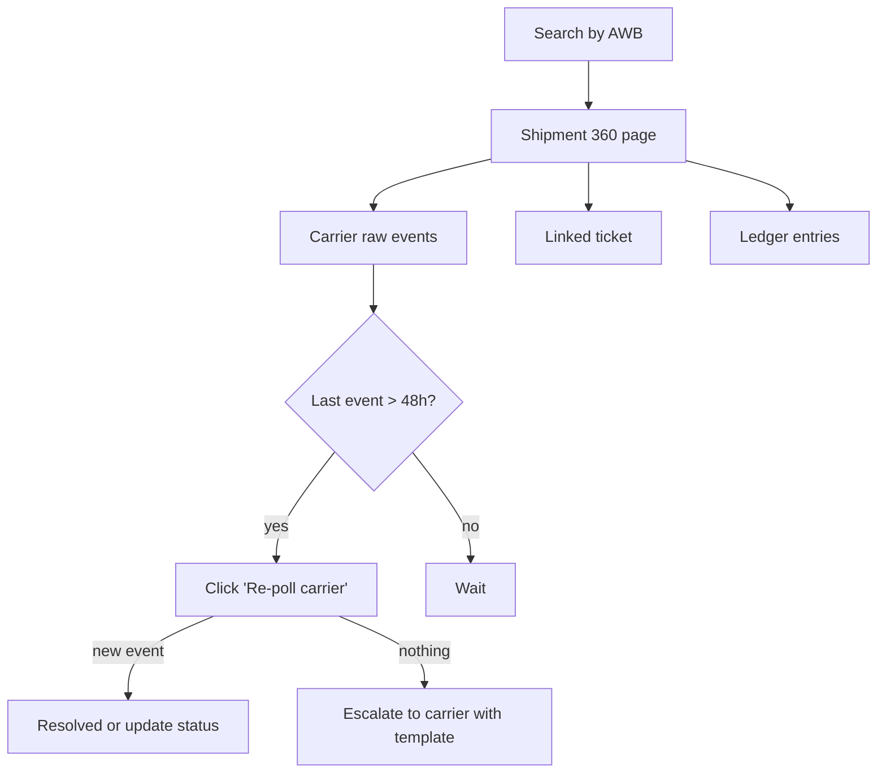

# Feature 19 — Admin & ops console

## Problem

Pikshipp is partly a platform and partly an ops machine. Internal staff (Admin, Ops, Support, Finance, Eng) need a productive surface to operate the platform — onboard tenants, manage carriers, handle KYC, intervene in stuck shipments, reconcile invoices, audit activity. Without an excellent internal console, ops-cost-per-seller scales linearly and that becomes the binding constraint on the business.

## Goals

- One console for all internal roles (with role-scoped views).
- Sub-5-minute resolution for "stuck shipment" with full context on one screen.
- Cross-tenant, audited operations: KYC review, manual ledger adjustment, courier escalation.
- High-leverage tooling: carrier health, fraud signals, ticket queues.
- Per-role views: Pikshipp Admin (full), Ops, Support, Finance, Eng — same console, role-scoped.

## Non-goals

- Buyer-facing surfaces (Feature 17).
- Seller dashboard (covered across features).
- Reporting (Feature 15) — the console links into reports but doesn't duplicate.

## Industry patterns

Internal admin tools at SaaS platforms range from "raw SQL access" to "Retool dashboards" to "first-class internal product". For platforms whose ops cost is a margin lever (logistics, fraud-heavy fintech), the internal console is treated as a real product. We follow that model.

## Functional requirements

### Console homepage

- Health bar: platform uptime, carrier status, queue depths, SLA breach counts.
- Quick links by role.
- Search box: globally search tenants, users, shipments, AWBs, tickets.

### Tenant management

- List, filter, sort all sellers.
- Tenant detail: profile, KYC, plan, billing, sub-tenants, recent activity, audit log.
- Actions: suspend, reactivate, wind-down (with approvals), impersonate.
- Tenant migration tool (rare).

### KYC review

- Queue sorted by SLA proximity.
- Per-application: documents, auto-eval results, OCR comparisons, history.
- Actions: approve, reject (with reason), request more info.
- Bulk approve where auto-eval high-confidence.

### Carrier ops

- Carrier list with health (Feature 06).
- Per-carrier: config, credentials, status code mapping, recent incidents.
- Actions: enable/disable, rotate credentials, escalate to carrier.
- Manifest reconciliation: see manifests with pickup count vs declared.

### Shipment ops

- Search by AWB / order ID / shipment ID / phone (last 4).
- Per-shipment: full canonical view + carrier raw events + linked tickets + ledger entries.
- Actions: re-poll tracking, re-issue label, manual status correction (audited), escalate to carrier.

### Wallet & finance ops

- Per-tenant wallet view: balance, ledger, recent activity, holds.
- Manual adjustment with reason + approval-tier.
- Recharge investigation: pull PG-side details; mark settlement.
- COD remittance reconciliation (Feature 12).

### Disputes ops (weight)

- Queue of weight disputes needing manual decision.
- Carrier-level performance.
- Escalation tools.

### Tickets ops

- (See Feature 18.) Console-mounted view.

### Audit & search

- Audit log search: who did what, when, on whom.
- Filters: actor, action, target tenant, date.
- Exportable.
- Tamper-evident (append-only).

### Cross-tenant analytics (with elevation)

- Aggregate views (Pikshipp leadership).
- Per-seller-type dashboards (e.g., enterprise health overview).
- Drill-downs require explicit elevation; logged.

### Permissions

| Role | Capabilities |
|---|---|
| Pikshipp Admin | All |
| Pikshipp Ops | Most operational; not financial adjustments above threshold |
| Pikshipp Support | Read-mostly + impersonation under consent + reply to tickets |
| Pikshipp Finance | Wallet, invoices, reconciliation, manual adjustments |
| Pikshipp Eng | Read-only on-call view; trigger reruns |

### Approval workflows

- Manual ledger adjustment > ₹10k → two-person approval.
- Suspending a tenant → senior approval.
- Wind-down of large sellers → Pikshipp Admin only with two-person approval.

### Operational runbooks

- Embedded runbooks for common ops scenarios:
  - Stuck shipment.
  - COD missing.
  - Weight dispute escalation.
  - Carrier outage.
  - KYC escalation.
- Each runbook is interactive: shows context, suggests actions, takes the action with approval.

## User stories

- *As Pikshipp Ops*, I want to find a stuck shipment in 30 seconds and act on it in <5 min.
- *As Pikshipp Support*, I want to find a seller's recent shipments and tickets in one search.
- *As Pikshipp Finance*, I want to apply a manual adjustment with approval and audit.
- *As Pikshipp Admin*, I want to see who accessed which tenant in the last week.

## Flows

### Flow: Stuck-shipment runbook



### Flow: Tenant impersonation

```mermaid
sequenceDiagram
    actor SUP as Support
    participant CON as Console
    participant TEN as Tenancy
    participant AUD as Audit
    participant TARG as Target tenant UI

    SUP->>CON: open tenant; click Impersonate
    CON->>SUP: prompt reason
    SUP->>CON: reason
    CON->>TEN: issue impersonation token (1h)
    CON->>AUD: log
    CON->>TARG: redirect with banner "you are impersonating"
    SUP->>TARG: navigate, perform actions (audited as actor=sup, on_behalf_of=tenant_user)
    SUP->>CON: end session
```

## Multi-seller considerations

- Pikshipp staff see all with audit.
- Pikshipp staff see all sellers; access is audit-logged.
- Cross-tenant operations sanctioned per `03-product-architecture/02-multi-tenancy-model.md`.

## Data model

The admin console is a thin layer over existing models; it persists:
- `audit_log` (append-only).
- `approval_request` (when two-person required).
- `runbook_invocation` (record of which runbook ran).

## Edge cases

- **Concurrent ops on same tenant** — locking; second user sees a banner.
- **Pikshipp staff actions on a seller's data** — always audited; visible in seller's audit log.
- **Bulk operations on many tenants** — tracked as jobs; audited per tenant.

## Open questions

- **Q-AO1** — One console for all Pikshipp roles (Admin / Ops / Support / Finance / Eng) with role-scoped views — vs separate apps per role? Default: one codebase, role-driven views; deep-links into role-specific landing pages.
- **Q-AO2** — Permissions granularity: roles vs fine-grained ABAC? Default: roles v1; ABAC v2.
- **Q-AO3** — Self-serve runbook authoring (ops can write runbooks) or eng-curated? Default: eng-curated v1.

## Dependencies

- All features (the console is the cross-cutter).
- Audit (cross-cutting), notifications, tenancy.

## Risks

| Risk | Mitigation |
|---|---|
| Powerful console enables abuse | Role-based; audit; approval thresholds |
| Console becomes the dumping ground for "we'll fix in admin" | Charter: console for ops, not a replacement for product fixes |
| Performance under scale | Aggregations, search index, caching |
| Cross-tenant leakage | Strict scoping enforced at data layer |
