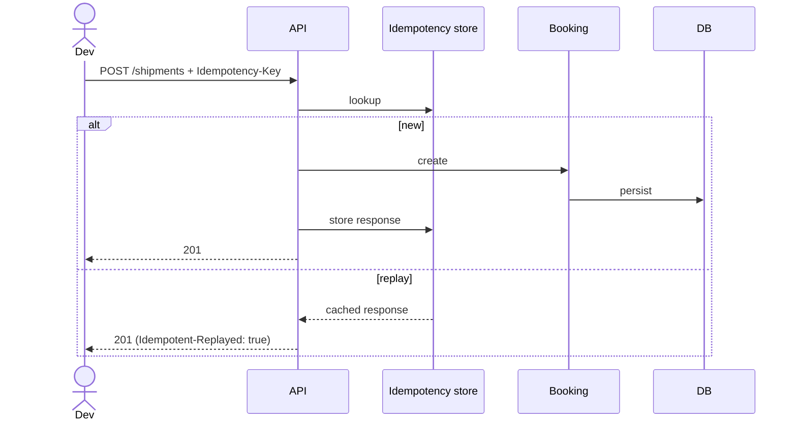
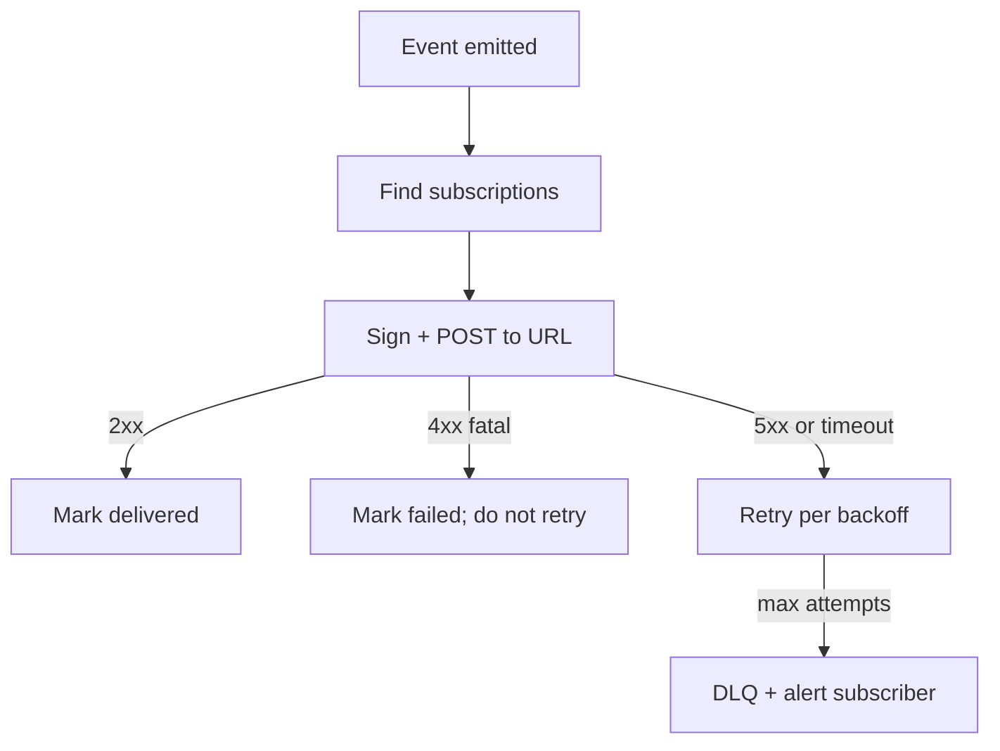

# Feature 21 — Public API & webhooks

> **Status: Deferred to v2.** v1 sellers operate via the Pikshipp dashboard only; no public API. The API contract documented here is the v2 target — internal APIs of all features are designed *as if* they will be exposed publicly, so v2 is a productization, not a re-architecture.

## Problem

Many sellers will eventually want to integrate Pikshipp into their own systems (storefronts, ERPs, OMS, custom dashboards) instead of using our UI. The API and webhooks are themselves a product, and our developer experience (DX) is a real differentiator versus Shiprocket-class incumbents whose APIs are uneven.

## Goals (for v2 launch)

- A clean, RESTful, OpenAPI-spec'd public API covering 100% of canonical model operations.
- Webhooks for every meaningful event with HMAC signing, retries, and DLQ visibility.
- Self-serve API key + scoped tokens.
- Predictable rate limits with informative headers.
- Sandbox environment for integration testing.
- Excellent developer portal: docs, code samples, interactive console.

## v1 status

- **No public API** in v1. Sellers operate via dashboard.
- **Webhooks not exposed** to sellers in v1.
- The internal APIs of every feature are clean and RESTful so v2 productization is small (mostly: developer portal, SDKs, rate-limit hardening, public docs).

## Non-goals

- GraphQL (v2 RESTful only; revisit v3).
- gRPC public API (internal only).
- Public API versioning beyond major (v2, v3 only).

## Industry patterns

| Element | Best in class | Pattern |
|---|---|---|
| API style | Stripe, Razorpay | RESTful + OpenAPI spec |
| Auth | Stripe (key+secret), Razorpay | API key with scoped permissions |
| Errors | Stripe | Stable error codes; human + machine readable |
| Webhooks | Stripe, Shopify | HMAC signed; idempotent; retried with DLQ |
| Idempotency | Stripe | Idempotency-Key header; cached for 24h |
| Pagination | Stripe (cursor) | Cursor-based for stability |
| Rate limit | Stripe headers | `X-RateLimit-*` |
| Versioning | Stripe | Per-key API version pin |
| SDK | Stripe / Razorpay | Official SDKs in 5+ languages |
| Docs | Stripe | Interactive, runnable, with realistic examples |

**Our pick:** Stripe-like patterns; it's the gold standard.

## Functional requirements

### Authentication

- API keys: pair of `key_id` + `key_secret`.
- Two key types per tenant:
  - **Live keys** — production.
  - **Test keys** — sandbox; sandbox carrier adapter.
- Scopes: `orders:read`, `orders:write`, `shipments:read`, `shipments:write`, `wallet:read`, `tracking:read`, `webhooks:manage`, `*` (all).
- Keys can be created, rotated, revoked, listed.
- Per-key audit log of usage.

### REST shape

- Base URL: `https://api.pikshipp.com/v2` (when v2 launches).
- Resources: `/orders`, `/shipments`, `/rates`, `/tracking`, `/wallet`, `/webhooks`, `/channels`, `/pickup-locations`, `/products`, `/carriers`, `/serviceability`.
- Verbs: GET, POST, PATCH, DELETE; standard semantics.
- IDs and prefixes per `03-product-architecture/04-canonical-data-model.md`.

### Common headers

- `Authorization: Bearer <key_id>:<key_secret>` or `X-Api-Key`.
- `Idempotency-Key`: caller-supplied UUIDv4; required on POST.
- `X-Pikshipp-Version`: client-pinned API version.
- Response: `X-RateLimit-Limit`, `X-RateLimit-Remaining`, `X-RateLimit-Reset`, `X-Request-Id`.

### Errors

```json
{
  "error": {
    "type": "invalid_request_error",
    "code": "pincode_unserviceable",
    "message": "Pincode 999999 is not serviceable by any enabled carrier",
    "param": "ship_to.pincode",
    "request_id": "req_xxx",
    "doc_url": "https://docs.pikshipp.com/errors/pincode_unserviceable"
  }
}
```

Stable codes; documented; never silently changed.

### Idempotency

- Server stores `(key_id, idempotency_key) → response` for 24h.
- Replay returns same response (with `Idempotent-Replayed: true` header).
- Conflicting payload with same key → 409 with explanation.

### Rate limits

- Per key, per endpoint family, per minute.
- 429 with `Retry-After` when exceeded.
- Headers always present.
- Tier-based: Free → 60/min; Grow → 300/min; Scale → 1500/min; Enterprise → custom.

### Pagination

- Cursor-based: `?starting_after=<id>` or `?ending_before=<id>`.
- `limit` capped at 100.
- Response includes `has_more` boolean.

### Versioning

- URL major version (`/v1`).
- Minor evolution backwards-compatible; additive only.
- Breaking changes → /v2 (rare).
- Version pin per key for stability across upgrades.

### Webhooks (outbound)

Events:
- `order.created`, `order.updated`, `order.cancelled`.
- `shipment.created`, `shipment.booked`, `shipment.picked_up`, `shipment.in_transit`, `shipment.out_for_delivery`, `shipment.delivered`, `shipment.ndr`, `shipment.rto_initiated`, `shipment.rto_delivered`, `shipment.lost`, `shipment.damaged`.
- `wallet.recharged`, `wallet.charged`, `wallet.refunded`, `wallet.adjusted`.
- `kyc.approved`, `kyc.rejected`.
- `weight_dispute.raised`, `weight_dispute.resolved`.
- `cod.remitted`.

Delivery:
- HMAC-SHA256 signed; secret per subscription.
- Retries with exponential backoff up to 24h.
- Dead-letter queue + dashboard.
- Signed payload includes `event_id` (idempotency) + `created_at`.

Subscription management:
- Self-serve creation via UI or API.
- Per-event subscription.
- Multiple endpoints per tenant.
- Failed-deliveries dashboard.

### Sandbox / test mode

- Test keys interact with `sandbox_carrier` adapter that emits scripted tracking events.
- Test bookings don't charge real wallet (test wallet auto-tops).
- Sandbox endpoints are functionally identical to live.

### Public API for buyer-side data

Limited subset (no PII beyond what buyer themselves provided):
- `GET /tracking/{token}` — public tracking endpoint (no auth) for buyer pages.
- Rate-limited per IP.

### SDKs

- Official SDKs at v1 launch:
  - Node.js (TypeScript).
  - Python.
  - PHP.
- Community SDKs encouraged: Go, Ruby, Java, .NET.
- SDKs auto-generated from OpenAPI spec.

### Developer portal

- Live OpenAPI explorer (try-it-now).
- Code samples in 5+ languages per endpoint.
- Webhook test tool.
- Migration guides (e.g., from Shiprocket).
- Status page integration.
- Changelog.

## User stories

- *As a developer integrating Pikshipp into a custom storefront*, I want to book a shipment with one POST and a recognizable error if anything is wrong.
- *As a Shiprocket migrant developer*, I want a migration guide that maps Shiprocket endpoints to Pikshipp's.
- *As a tech-savvy seller*, I want webhooks for delivery events so I can update my channel directly.

## Flows

### Flow: Idempotent booking via API



### Flow: Webhook with retry



## Multi-seller considerations

- API keys are tenant-scoped.
- Sellers create their own keys.
- Per-seller rate limits via policy engine; dashboard surfaces remaining headroom.

## Data model

```yaml
api_key:
  id, key_id, key_secret_hash
  seller_id
  name
  scopes: [...]
  created_by
  created_at, last_used_at, revoked_at

webhook_subscription:
  id
  seller_id
  url
  secret_hash
  event_types: [...]
  active
  metadata

webhook_delivery:
  id
  subscription_id, event_id
  attempt_no
  result: success | failed | pending
  http_status
  next_attempt_at
  request_payload_ref
  response_body_ref
```

## Edge cases

- **Idempotency key reused with different payload** — 409.
- **Webhook URL bouncing** — retry per policy; DLQ if all fail.
- **Webhook subscriber under attack from us (we DDoS them)** — circuit breaker; subscriber-side health check optional.
- **Public tracking endpoint scraped** — rate limit + token entropy.
- **Major version migration** — pinned keys keep working until explicit upgrade; deprecation cycle (≥12 months).

## Open questions

- **Q-API1** — GraphQL public API ever? Default: no v1; revisit if developer demand.
- **Q-API2** — Webhook payload — full canonical resource or compact event? Default: compact event with resource URL + recent fields; full lookup via API.
- **Q-API3** — Test mode COD remittance behavior (do we simulate)? Default: yes — mocked timeline.
- **Q-API4** — Should we run a public bug bounty? Yes, by v2.

## Dependencies

- Identity (Feature 01).
- All canonical resources.
- Webhook infrastructure.

## Risks

| Risk | Mitigation |
|---|---|
| API stability promises broken | Versioning; deprecation policy; tests on canonical contracts |
| Webhook DDoS to subscriber | Circuit breaker; rate limit per subscriber URL |
| API key leakage | Show secret once; rotation; per-key usage anomaly detection |
| Sandbox drift (sandbox != live) | Same code paths; sandbox-specific only at the carrier adapter |
| Documentation rot | Generated from OpenAPI; portal on CI |
