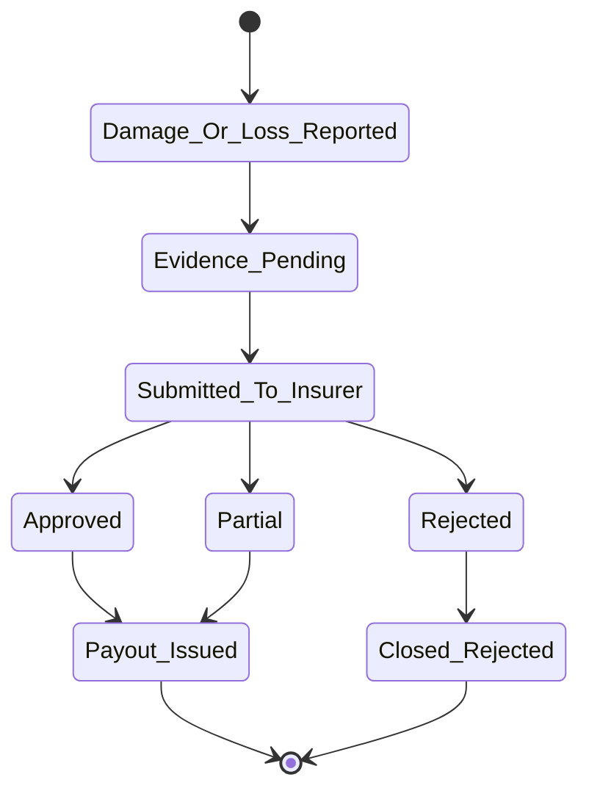
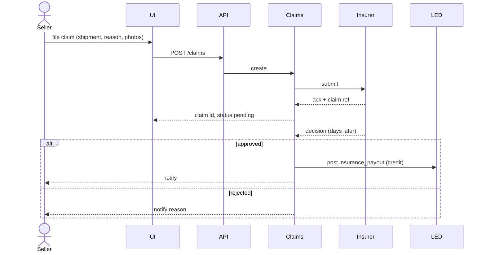

# Feature 22 — Shipment insurance

## Problem

Shipments get lost, damaged, or stolen. Carriers offer minimal liability (typically declared value capped at ~₹100/kg or 0.5% of value, whichever lower). For higher-value parcels (jewelry, electronics, premium D2C), seller exposure is significant. Insurance covers the gap.

For Pikshipp, insurance is also a margin product (we earn commission) and a buyer-trust signal.

## Goals

- Per-shipment insurance attach (manual or auto-rule) with transparent premium.
- Claims workflow with photo evidence and SLA.
- Multi-insurer backend (commodity supply; we route by best price/coverage).
- Default opt-in for high-value (configurable).

## Non-goals

- Self-insurance / underwriting (regulatory; partner-led only).
- Buyer-paid insurance (out of scope; seller-paid model).

## Industry patterns

| Approach | Notes |
|---|---|
| **Carrier-included declared-value protection** | Minimal; seller-borne |
| **Aggregator-bundled insurance via partner** | Standard pattern; Shiprocket, NimbusPost partner with insurers |
| **Seller-side insurance (separate purchase)** | Friction; rare |
| **Pikshipp-self-insured** | Regulatory; not v1 |

**Our pick:** Aggregator-bundled via partner (Digit, ICICI Lombard, Acko, etc.).

## Functional requirements

### Premium calculation

- Inputs: declared value, category (jewelry, electronics, etc.), zone (some zones higher risk).
- Output: premium INR.
- Typical rate: 0.3% of declared value with a floor (₹15) and a cap.
- Per-insurer rate cards; we pick best.

### Attach options

- Manual at booking.
- Auto-rule: "auto-attach if declared value > ₹2,000".
- Per-channel default.
- Per-product default (catalog field).

### Coverage scope

- Damage in transit.
- Lost in transit.
- Theft.
- Excludes: fragile-not-packed-properly (depends on insurer), buyer refusal.

### Claims workflow



### Evidence

- Damage: photos at unboxing (buyer or seller).
- Lost: declaration + carrier confirmation + tracking gap proof.
- Theft: police FIR may be required.

### Payout

- Insurance partner pays Pikshipp.
- Pikshipp credits seller wallet (`insurance_payout` ledger entry).

### Claim SLA

- Acknowledgement: 24h.
- Decision: 7–14 days (insurer-driven).
- Payout: 3–7 days post-approval.

### Insurer routing

- For each shipment, we pick insurer at attach time based on rate, capacity, claim experience.
- All commercials passthrough; commission visible internally.

### Reporting

- Insurance attach rate.
- Claim rate.
- Approval rate per insurer.
- SLA compliance.

## User stories

- *As a seller of high-value items*, I want auto-insurance on every shipment over ₹2,000.
- *As a seller*, I want to file a claim with photos uploaded inline; status tracked in my dashboard.
- *As a buyer of damaged goods*, I want my photos to feed into the seller's claim without separate flow.

## Flows

### Flow: Attach insurance at booking

(Feature 08 booking flow, with insurance step inserted post rate-quote.)

### Flow: Claim filing



## Multi-seller considerations

- Insurance is per shipment, attached at booking.
- Pikshipp pre-selects insurer partners and default attach rules per seller-type.
- Seller may opt out where Pikshipp default permits.

## Data model

```yaml
insurance_policy:
  id
  shipment_id
  insurer
  insured_value
  premium
  coverage_terms_ref
  policy_doc_ref
  created_at

insurance_claim:
  id
  shipment_id, policy_id
  reason: damage | lost | theft
  evidence_refs
  insurer_claim_ref
  status: pending | submitted | approved | rejected | partial | paid
  decision_amount
  decided_at, paid_at
```

## Edge cases

- **Buyer claims damage but seller has no photo evidence at packing** — claim weak; insurer may reject.
- **Multi-package shipment, only one damaged** — partial claim.
- **Carrier liability also applicable** — pick best path; sometimes both pay (rare).
- **Insurance attached but premium not charged due to wallet shortfall** — booking blocks; resolved before book.

## Open questions

- **Q-INS1** — Do we self-insure for low-value high-volume (e.g., <₹500) shipments? Default: no v1.
- **Q-INS2** — Buyer-side claim portal? Default: no — seller files.
- **Q-INS3** — Insurance for RTO leg? Default: covered as part of forward; reverse has its own policy if attached.

## Dependencies

- Booking (Feature 08), Wallet (Feature 13), Notifications (Feature 16).
- Insurer partners (commercial).

## Risks

| Risk | Mitigation |
|---|---|
| Low attach rate due to friction | Auto-rules; UI clarity; default-on for high-value |
| Insurer slow on claims | SLA tracking; seller-visible; carrier-of-last-resort if SLA breached |
| Disputed claim outcomes | Clear coverage terms surfaced pre-booking |
| Compliance / regulatory | IRDAI scope review for our role as intermediary |
