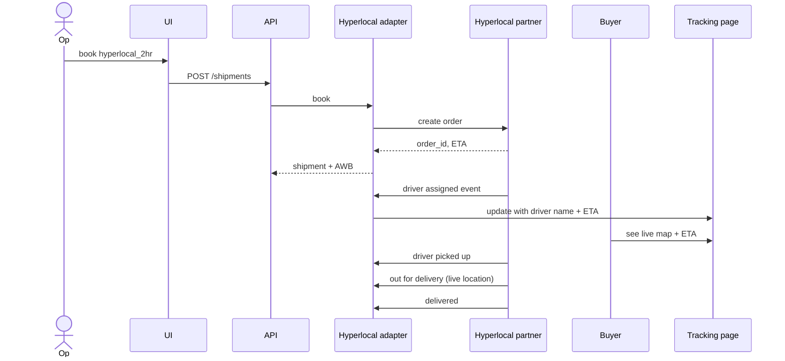

# Feature 23 — Hyperlocal & same-day shipping

## Problem

A growing share of D2C orders need hyperlocal (within-city) or same-day delivery. The cadence is different: pickup in 1 hour, delivery in 4 hours, live tracking, fixed-price-per-km models. Standard surface couriers don't serve this; specialized hyperlocal players (Borzo/Wefast, Dunzo, Porter, Shadowfax Hyperlocal, Loadshare) do.

Adding hyperlocal expands our addressable market into cake/flower/grocery/quick-electronics D2C and emerging category D2C.

## Goals

- Onboard hyperlocal partners under the same Carrier Adapter framework.
- Surface hyperlocal as a *service type* on the rate engine.
- Support live driver tracking and ETA dynamics.
- Same buyer experience (per-seller branded).

## Non-goals

- Building our own hyperlocal fleet (potential v3+).
- Quick commerce (Q-Commerce) inventory model.

## Industry patterns

| Approach | Notes |
|---|---|
| **Per-partner direct integration** | Each hyperlocal player has its own API |
| **Aggregator over hyperlocal** (e.g., Shiprocket Quick) | Same pattern as our courier aggregation |
| **City-level marketplaces** (e.g., Dunzo's seller portal) | Single-city; not generalizable |

**Our pick:** Per-partner adapters within our existing Carrier Adapter framework.

## Functional requirements

### Hyperlocal partners (target v2)

- Borzo (formerly WeFast).
- Porter.
- Dunzo for Business.
- Shadowfax Hyperlocal.
- Loadshare.
- Locus / Pidge (where applicable).

### Service-type taxonomy

- `hyperlocal_60min` — within 1 hour.
- `hyperlocal_2hr` — within 2 hours.
- `hyperlocal_same_day` — by EOD.
- `hyperlocal_scheduled` — scheduled pickup window.

### Pricing

- Distance-based (km) plus time-band surcharge.
- Surge during peak hours/weather.
- COD supported (limited).

### Live tracking

- Driver location update via partner API or webhook.
- Buyer page shows live map (when partner allows).
- ETA recomputed from driver location.

### Booking specifics

- Pickup typically immediate (partner schedules in minutes).
- Driver assignment events surfaced.
- Cancellation window tighter (often pre-driver-pickup only).

### Constraints

- Weight/size limits per partner (typically <30 kg, <60×60×60 cm).
- Goods restrictions (perishables OK, dangerous goods not).
- Payment: prepaid preferred; COD limited.

## User stories

- *As a flower D2C seller*, I want to ship a same-day order in Mumbai by 6 PM with live tracking for the buyer.
- *As an operator*, I want hyperlocal to appear in the rate engine alongside surface, so I can pick based on cost/SLA.
- *As a buyer of a same-day order*, I want a live map showing the driver, not a static stepper.

## Flows

### Flow: Hyperlocal booking & live tracking



## Multi-seller considerations

- Hyperlocal partners enabled per tenant subset.
- Buyer-facing live map respects branding.

## Data model

Hyperlocal extends Shipment:
```yaml
shipment.hyperlocal:
  partner: borzo | porter | dunzo | ...
  vehicle_type: bike | mini_truck | ...
  distance_km
  driver:
    name
    phone (masked, proxy)
    vehicle_no
    current_location: { lat, lng, ts }
    eta_at
```

## Edge cases

- **No driver available** — partner returns failure; suggest later booking or alternative.
- **Partner pricing surge** — surface to seller pre-booking; confirm.
- **Partner cancels mid-pickup** — re-book or refund.
- **Buyer requests address change mid-trip** — partner-dependent; usually no.

## Open questions

- **Q-HL1** — Should hyperlocal share the same rate engine UI or be a separate "Quick" tab? Default: integrated.
- **Q-HL2** — Live driver phone — proxy via carrier or expose? Default: proxy.
- **Q-HL3** — Multi-stop / multi-drop in one booking? Default: not v2.

## Dependencies

- Carrier adapter framework.
- Buyer experience (Feature 17) for live map.

## Risks

| Risk | Mitigation |
|---|---|
| Live tracking failure | Fallback to static stepper |
| Pricing volatility (surge) | Show pre-confirm; lock for X minutes |
| Limited geographic coverage | Surface coverage clearly per pincode/city |
