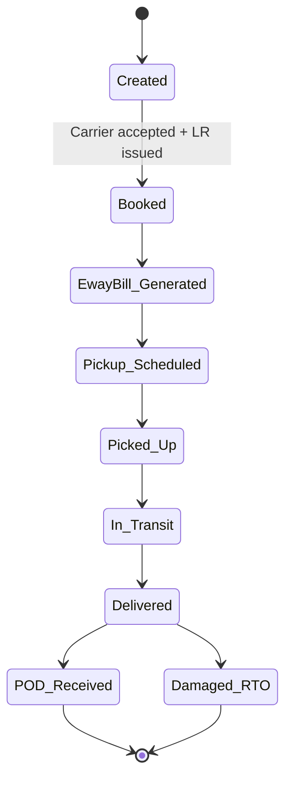

# Feature 24 — B2B / heavy / freight

## Problem

Some sellers ship B2B parcels (factory → wholesaler), bulky items (furniture, appliances), or full-truck loads. B2C aggregator economics don't apply: parcel-per-AWB gives way to consignment-per-LR (Lorry Receipt), per-pallet rates, palletized handling, GST e-way bill mandates, and fewer pickup events but bigger ones.

Adding B2B grows the addressable wallet of existing sellers (an apparel D2C brand has B2C orders *and* B2B distribution to retailers).

## Goals

- Onboard B2B carriers under the same adapter framework, with B2B-specific extensions.
- Service types: LTL (less-than-truckload), FTL (full-truckload), heavy parcel.
- Support consignment-level booking (multiple pieces per consignment), LR documents, e-way bill generation.
- Seller-side rate quoting per consignment, not per AWB.

## Non-goals

- Trucking marketplace (broker model).
- Cold-chain or temperature-controlled logistics (specialized; v3+).

## Industry patterns

| Approach | Notes |
|---|---|
| **Specialized B2B aggregators** (Vahak, BlackBuck) | Different motion |
| **Hybrid B2C+B2B aggregators** | Shiprocket B2B, Delhivery 2-wheeler+truck | Our pattern |
| **Direct freight booking** | Largest sellers do this | Out of our segment |

**Our pick:** B2B as a service-type extension of our aggregator. Partner with Safexpress, V-Trans, Spoton, Gati Surface, plus Delhivery's freight arm.

## Functional requirements

### Consignment object

A B2B unit of work; superset of Shipment:
```yaml
consignment:
  id
  order_id (or standalone)
  carrier_id (B2B)
  service_type: ltl | ftl | heavy_parcel
  pieces: [{ sku?, qty, weight, dims, contents }]
  total_weight, total_volume
  declared_value
  origin: pickup_location
  destination: address
  freight_type: door_to_door | door_to_dock | dock_to_dock
  lr_number (carrier-issued LR)
  eway_bill_no
  manifest: [...]
  status: created | booked | picked_up | in_transit | delivered | rto
  pod_proof
```

### E-way bill generation

- Mandated for inter-state consignments ≥ ₹50,000 (and intra-state per state rules).
- Generated via GST e-way bill API or carrier's portal.
- Stored against consignment.

### Pricing

- Per kg or per ft³ (volumetric).
- Door pickup vs dock vs full-truck.
- Loading/unloading charges.
- Fuel + GST.

### POD (Proof of Delivery)

- Mandatory for B2B; signed copy required for invoicing.
- Carrier sends digital POD; we store + surface.

### Insurance

- B2B insurance is mandatory above value thresholds (per RBI / freight norms).
- Premium calculations differ.

### Tracking

- Less granular than B2C — typically: booked, picked, in-transit, delivered.
- Per-leg events for transshipments.

### Pickup scheduling

- Larger, scheduled (typically 24–72 h ahead).
- Vehicle requirements (tail-lift, etc.) communicated.

## User stories

- *As an apparel D2C seller*, I want to ship 50 boxes to a Bengaluru distributor with one consignment + e-way bill auto-generated.
- *As a furniture seller*, I want a heavy-parcel rate quote with door-to-door service.
- *As a finance person*, I want POD-attached invoices for B2B consignments.

## Flows

### Flow: B2B consignment lifecycle



## Multi-seller considerations

- B2B is feature-flag gated per seller (`features.b2b_enabled`); not all sellers are eligible.
- B2B carriers configured platform-wide; access controlled per-seller via policy engine.

## Data model

(See Consignment above; Shipment is reused with `direction=forward` and B2B-specific fields under `b2b: { ... }`.)

## Edge cases

- **Multi-leg transshipment** — events per leg.
- **Partial delivery** — consignment marked `partial_delivered` with detail.
- **POD lost** — carrier escalation; SLA.
- **E-way bill expires en route** — carrier responsibility; seller alerted if delays expected.

## Open questions

- **Q-B2B1** — In-house B2B rate engine or pure passthrough? Default: passthrough v2; cards in v3.
- **Q-B2B2** — Door-to-door insurance bundling? Default: per-carrier.
- **Q-B2B3** — Truck-loading photo capture for damage disputes? Default: optional v3.

## Dependencies

- Carrier network (B2B-specific carriers).
- E-way bill provider.
- Insurance (Feature 22).

## Risks

| Risk | Mitigation |
|---|---|
| E-way bill failure blocks shipment | Pre-validate; fallback to carrier-side generation |
| POD reconciliation delays | SLA + escalation |
| Damage in transit | Insurance + photo evidence |
| Heavier ops cost vs B2C | Tier-priced; not for SMB plans |
