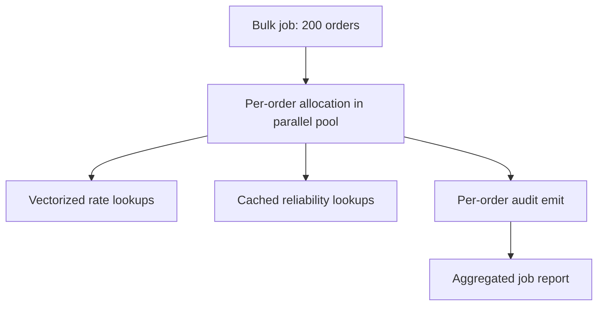
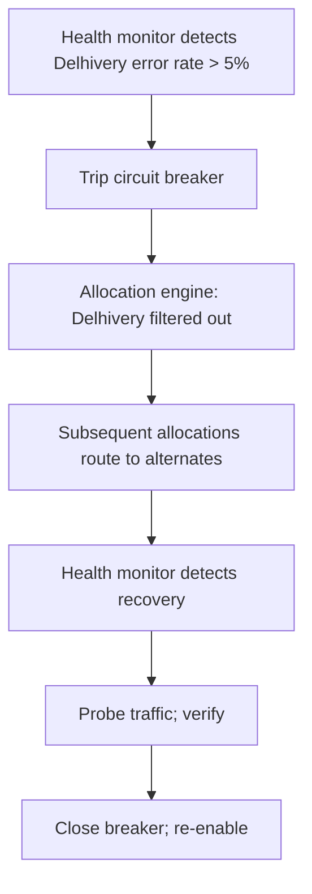

# Feature 25 — Allocation engine

> *Promotion of "carrier recommendation" to a first-class engine. Picks the carrier and service for every shipment, given filter constraints and weighted objectives, with audit-grade explainability.*

## Problem

Given an order, **which carrier should ship it?** The wrong answer costs money (more expensive than necessary), erodes seller trust (slow when fast was available, or unreliable when reliable was available), or opens fraud surface (favoring a degraded carrier when alternatives existed).

The allocation question is not "what's the cheapest rate?" It's a constrained, weighted, multi-objective optimization with auditable reasoning.

## Goals

- Produce an explainable, ranked list of (carrier × service) options for every order.
- Filter by hard constraints (serviceability, weight, payment, seller's allowed set).
- Score by weighted objectives (cost, speed, reliability, seller preference).
- Audit every decision: what was considered, what was filtered, what was chosen, why.
- Run sub-500ms P95.
- Support automatic mode (auto-book per rule) and interactive mode (UI shows ranked options).

## Non-goals

- Setting rates (Pricing engine, Feature 07).
- Booking (Feature 08).
- Real-time vehicle dispatch (carriers do this internally).
- Deciding *whether* to ship (that's an OMS-level rule).

## Industry patterns

| Approach | Pros | Cons |
|---|---|---|
| **Cheapest by default, no scoring** (legacy aggregators) | Simple | Pushes traffic to unreliable carriers; sellers override constantly |
| **Per-tenant configured weights** (Shiprocket, Shipway) | Flexible | Sellers don't know how to set weights |
| **Single-objective optimizer (e.g. cheapest within ETA)** | Predictable | Doesn't capture reliability nuance |
| **Multi-objective with auditable explainer** (our pick) | Transparent and tunable | More machinery to build |
| **ML-trained carrier-pick model** | Possibly optimal | Black-box; hard to debug |

**Our pick:** Multi-objective scoring with auditable explanations. Weights start as platform defaults (per seller-type) and can be overridden per seller. ML-assisted scoring is a v2/v3 enhancement on top.

## Functional requirements

### Inputs

```yaml
allocation_input:
  order:
    pickup_pincode
    ship_to_pincode
    declared_weight_g
    dims_mm
    payment_mode: prepaid | cod
    cod_amount
    declared_value
    special_handling: [fragile, dangerous, perishable, ...]
    desired_delivery_window: { earliest, latest } | null

  seller_context:
    seller_id
    allowed_carriers      (from policy engine)
    preferred_carriers    (from policy engine)
    excluded_carriers     (from policy engine)
    cost_ceiling          (optional, per seller config)
    objective_weights:    (from policy engine)
      cost
      speed
      reliability
      seller_pref
    sla_tier
```

### Filtering (hard constraints)

Reject candidates that fail any:
- Carrier doesn't service this (pickup, ship_to) pair.
- Carrier doesn't support this weight or volumetric weight.
- Carrier doesn't support COD when payment is COD.
- Carrier doesn't support the declared special handling.
- Carrier is currently in "circuit-broken" state (health monitor detected outage).
- Carrier is not in the seller's allowed set.
- Carrier is in the seller's excluded set.
- Per-seller cost ceiling exceeded.

Each filter rejection is recorded with reason in the audit.

### Scoring (weighted objectives)

For each surviving candidate, compute:

```
score = w_cost × normalized_cost_score
      + w_speed × normalized_speed_score
      + w_reliability × normalized_reliability_score
      + w_pref × seller_preference_boost
```

Where:
- **cost_score**: 1.0 for cheapest in candidate set; 0.0 for most expensive.
- **speed_score**: 1.0 for fastest ETA; 0.0 for slowest.
- **reliability_score**: based on (carrier × pincode-zone) stats over last 30 days — on-time rate, NDR rate, RTO rate.
- **seller_preference_boost**: 1.0 if carrier is in seller's preferred priority list (with rank decay); 0.0 otherwise.

Default weights (`small_smb` seller type): cost=1.0, speed=0.5, reliability=0.7, pref=0.3. Tunable per seller-type and per seller.

### Output

```yaml
allocation_decision:
  id: alc_xxx
  order_id
  decided_at
  candidates:
    - { carrier_id, service_type, total_cost, eta_days, 
        scores: { cost, speed, reliability, pref, total },
        rank }
    - ...
  filtered_out:
    - { carrier_id, reason: "pincode_unserviceable" | "weight_over_max" | ... }
    - ...
  weights_used: { cost, speed, reliability, pref }
  recommended: index-of-rank-1
  strategy_version: "v1.3"
  decided_by: { kind: auto | rule | user, ref }
```

This object is **persisted with the Shipment** so the question "why this carrier?" always has an answer.

### Modes

#### Automatic mode
- Used by auto-book rules.
- Picks the rank-1 recommendation.
- Seller can configure: "auto-book only if rank-1 score is X% better than rank-2" (avoid flip-flopping near ties).

#### Interactive mode
- UI shows the top N (default 5) options with scores and reasons.
- Seller can pick non-recommended; that pick is logged with reason.
- Seller-pick patterns inform future weight tuning.

#### Bulk mode
- For bulk-book operations.
- Vectorized; one allocation per order in parallel.
- Batched audit emit.

### Explainability

Every allocation decision can be inspected via the dashboard:

```
Why DTDC was chosen for AWB DLV1234:
- 4 carriers serviced this pincode (filtered out 2: weight-over-max for India Post; circuit-broken for Bluedart).
- Of the remaining: Delhivery (₹78, 3d, 89% on-time), DTDC (₹65, 4d, 86% on-time), Ekart (₹70, 5d, 81% on-time).
- Score weights (your settings): cost=1.0, speed=0.5, reliability=0.7, pref=0.3.
- DTDC scored 0.81; Delhivery 0.78; Ekart 0.69.
- Pikshipp recommended DTDC. You accepted.
```

This is a UI surface, not a debug log. It builds seller trust.

### Configuration knobs (via policy engine)

| Key | Effect |
|---|---|
| `allocation.objective_weights.cost` | weight on cost |
| `allocation.objective_weights.speed` | weight on speed |
| `allocation.objective_weights.reliability` | weight on reliability |
| `allocation.objective_weights.seller_pref` | weight on preferred carriers |
| `allocation.tie_break_strategy` | `prefer_recommended` / `prefer_cheaper` / `prefer_faster` |
| `allocation.auto_book_min_score_gap` | minimum gap between rank-1 and rank-2 to auto-book |
| `allocation.cost_ceiling_inr` | hard ceiling on cost per shipment |
| `allocation.eta_ceiling_days` | hard ceiling on ETA |
| `allocation.reliability_window_days` | how far back to look at carrier stats |

Any of these are seller-overridable from defaults.

### Reliability score computation

Per (carrier, pincode-zone), every 24h:

```
reliability = 0.4 × on_time_rate
            + 0.3 × (1 - ndr_rate)
            + 0.2 × (1 - rto_rate)
            + 0.1 × api_success_rate
```

Stats from last 30 days of shipments. Below a minimum sample size (e.g., <50 shipments per carrier-zone), use carrier-wide stats; below carrier-wide threshold, use a Bayesian prior.

### Carrier health integration

When a carrier's circuit-breaker trips (sustained API errors), they are temporarily filtered out. Allocation re-runs continue routing to alternates. Decisions during outage are tagged so we can audit later if the outage was misclassified.

### Audit & change-log

Every allocation decision emits an event:
- Decision ID, order, seller.
- Inputs snapshot.
- Filter results.
- Score table.
- Chosen carrier.
- Strategy version.

Stored permanently. Queryable via ops console.

### Performance

- Target: <500 ms P95 single allocation; <30 s for 1000-order bulk.
- Primary cost: looking up rates per candidate. Vectorize against rate cards.
- Secondary cost: reliability lookup. Pre-aggregated daily; cached in memory.

## User stories

- *As an operator*, I want to bulk-book 200 orders and see the allocation results before booking, so I can spot-check before committing.
- *As an owner*, I want to set my preferred carrier weighting once and have it apply everywhere.
- *As Pikshipp Ops*, I want to know when allocation is consistently choosing a degraded carrier, so we can adjust the strategy.
- *As a seller asking "why DTDC?"*, I want a one-screen explanation, not a support ticket.

## Flows

### Flow: Allocate a single order

```mermaid
sequenceDiagram
    actor S as Operator
    participant UI
    participant API
    participant POL as Policy engine
    participant ALC as Allocation engine
    participant CAR as Carrier serviceability
    participant PRC as Pricing engine
    participant REL as Reliability service
    participant AUD as Audit

    S->>UI: open order
    UI->>API: GET /allocate?order_id
    API->>POL: resolve allocation config for seller
    POL-->>API: weights + allowed_set
    API->>ALC: allocate(order, config)
    ALC->>CAR: serviceable_for(pickup, ship_to, weight, payment)
    CAR-->>ALC: candidates
    ALC->>PRC: rates(candidates, order)
    PRC-->>ALC: rates
    ALC->>REL: scores(candidates, ship_to_zone)
    REL-->>ALC: reliability scores
    ALC->>ALC: compute scores; rank
    ALC->>AUD: emit decision
    ALC-->>API: ranked candidates + recommended
    API-->>UI: render
```

### Flow: Bulk allocation



### Flow: Carrier health degrades mid-flight



## Configuration axes (consumed from policy engine)

```yaml
allocation:
  enabled: true
  objective_weights:
    cost: 1.0
    speed: 0.5
    reliability: 0.7
    seller_pref: 0.3
  tie_break_strategy: prefer_recommended
  auto_book_min_score_gap: 0.05
  cost_ceiling_inr: null
  eta_ceiling_days: null
  reliability_window_days: 30
  reliability_min_sample_size: 50
```

## Data model

(See `03-product-architecture/04-canonical-data-model.md` for `allocation_decision`.)

## Edge cases

- **All carriers filter out** (no candidates) — return empty with reasons; UI shows "no carrier serves this combination — try changing X".
- **Tie at top** — apply tie-break strategy; record tie in audit.
- **Reliability data sparse for a new carrier** — use Bayesian prior; mark in decision audit.
- **Seller picks non-recommended** — log; if pattern emerges, surface to seller as "your picks differ from our recommendations — adjust weights?".
- **Carrier added mid-allocation** (race) — next allocation includes it; current decision unchanged.

## Open questions

- **Q-AL1** — Should we let carriers bid in real-time on shipments (dynamic pricing), or always use static rate cards? Default: static cards v1; dynamic v3+ if commercially relevant.
- **Q-AL2** — Should reliability scores be exposed to sellers ("DTDC is at 81% in your pincode")? Default: aggregated only at v1; per-seller-zone in v2.
- **Q-AL3** — Multi-shipment optimization (split a multi-pkg order across carriers)? Default: no in v1; v2 explores.
- **Q-AL4** — ML-driven scoring as v2 enhancement: which signal first (predicted on-time? predicted RTO?)? Owner: Allocation PM.

## Dependencies

- Carrier network (Feature 06) for serviceability + capabilities.
- Pricing engine (Feature 07) for rates.
- Policy engine (`03-product-architecture/05`) for seller config.
- Audit (`05-cross-cutting/06`) for decision log.
- Carrier health monitor (Feature 06).

## Risks

| Risk | Mitigation |
|---|---|
| Reliability data lags reality (carrier just had a bad week, gets de-ranked unfairly) | Window length + minimum samples; emergency override |
| Seller expects auto-pick but doesn't trust it | Explainability UI; opt-in for fully-automatic |
| Allocation logic drifts from documentation | Strategy versioning; doc generated from code |
| Performance regression at scale | Per-pincode caching; rate-card vectorization |
| Carrier disputes ranking ("you favored X over us") | Audit + transparent weights; dispute SOP |
