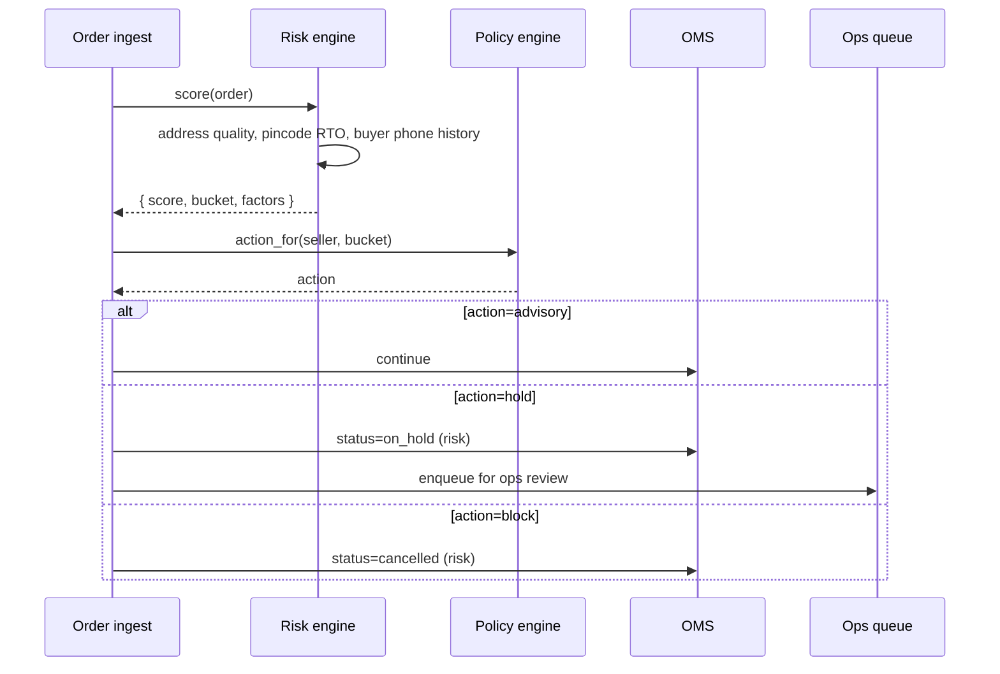

# Feature 26 — Risk & fraud

> *Phased build. v1 ships rules-based intake screening + behavioral monitoring; v2 adds ML; v3 adds cross-seller signals. The architecture is in place from v1 even if the depth grows over time.*

## Problem

Fraud is the silent killer of aggregator margins. Most failures of small aggregators are fraud-related, not feature-related:

- Sellers signing up with stolen identity.
- Sellers under-declaring weight to pay less.
- Sellers using us to ship restricted goods.
- Buyers serially refusing COD.
- Buyer addresses farmed for harassment campaigns.
- Carrier-side losses (delivery agent pockets cash).
- Internal staff abuse (manual ledger overrides).

Without an explicit risk feature, every other feature accumulates ad-hoc protections, and important signals never connect.

## Goals

- **v1**: detect basic seller and buyer fraud at order intake using rules; provide ops queue for review; minimize false positives.
- **v2**: ML-based scoring; cross-seller hashed signals; pattern detection.
- **v3**: mature; SOC 2-grade; periodic external audits.

## Non-goals

- Replacing KYC (Feature 01); this complements it.
- Replacing carrier-side audits (carriers' problem).
- Building a generic fraud platform; this is shipping-specific.

## Industry patterns

| Approach | Notes |
|---|---|
| **No explicit risk feature** | Most small aggregators; relies on KYC + reactive support |
| **Rules-based intake** | Shiprocket Engage; basic |
| **ML scoring on order intake** | GoKwik for COD-RTO; growing standard |
| **Cross-merchant signals** | Razorpay, Cashfree have these for payments; rare in shipping |
| **Behavioral pattern detection** | Banking-grade; not in shipping yet |
| **Vendor solutions** (Bureau, Karza Risk) | Available but expensive |

**Our pick:** v1 in-house rules; v2 in-house ML; v3 evaluate vendor augmentation.

## Functional requirements (v1 minimum)

### Risk surfaces (v1)

#### 1. Seller intake risk
At signup and KYC, score the seller:
- Multiple accounts at same address / device fingerprint / phone.
- Industry on restricted-goods watch list.
- GSTIN status and age.
- PAN-name vs document name match strength.
- Bank account match strength.
- Sanctions / PEP list screening (basic).

Output: `seller.risk_tier = low | medium | high`. Feeds into KYC depth and operational defaults via policy engine.

#### 2. Order intake risk
On every order ingestion:
- Pincode RTO history (carrier-zone level).
- Buyer phone reputation (per-seller history; v2 cross-seller hashed).
- Address quality (pincode-state match, length, repetitive characters).
- Order value vs typical for this seller.
- Time-of-day, channel.
- Newness of buyer (first-order vs repeat).

Output: `order.rto_risk = score 0–100; bucket low | medium | high`. Surfaced in:
- Order detail page (advisory).
- Allocation engine (no effect on routing in v1; signal-only).
- Auto-rules ("hold high-risk COD orders").
- Reports.

#### 3. Behavioral monitoring (sellers)
Per-seller, periodic:
- Cancel-rate threshold.
- First-attempt-fail rate.
- Address pattern (repeat addresses, address-stacking).
- Weight discrepancy rate (chronic under-declaration signal).
- Insurance claim rate.
- RTO rate.

Anomalies → ops queue.

#### 4. Internal action audit
Already covered by [`05-cross-cutting/06-audit-and-change-log.md`](../05-cross-cutting/06-audit-and-change-log.md). The risk feature consumes audit for pattern detection on internal actions (e.g., one ops person making lots of high-value adjustments).

### Risk action set

When risk signals fire:
- **Advisory** — surface to seller/ops; no enforcement (default for many signals).
- **Hold** — order/booking enters review queue; ops decides.
- **Block** — booking refused (rare; high-confidence cases only).
- **Suspend** — seller account suspended pending investigation.

Action mapping is configurable via policy engine; conservative at v1.

### Fraud signal taxonomy

| Signal | Surfaces in | v1 / v2 |
|---|---|---|
| Multi-account same device | Onboarding | v1 |
| Sanctions/PEP match | Onboarding | v1 |
| Restricted-goods industry | Onboarding | v1 |
| GSTIN-PAN name mismatch | Onboarding | v1 |
| Bank-PAN name mismatch | Onboarding | v1 |
| Pincode RTO history high | Order intake | v1 |
| Buyer phone repeat-RTO (per-seller) | Order intake | v1 |
| Buyer phone repeat-RTO (cross-seller, hashed) | Order intake | v2 |
| Address quality low | Order intake | v1 |
| Order value anomaly | Order intake | v2 (needs ML) |
| Weight under-declaration pattern | Behavioral | v1 (rule-based) |
| Cancel-rate spike | Behavioral | v1 |
| Insurance claim-rate spike | Behavioral | v2 |
| Internal ops action anomaly | Internal | v1 (audit-driven) |

### Risk score storage

```yaml
risk_score:
  id: rsk_xxx
  scope: order | seller | buyer_phone_hash
  scope_ref
  score: 0..100
  bucket: low | medium | high
  factors:
    - { name, value, contribution }
  computed_at
  rule_version
```

History retained for analytics + trend tracking.

### Cross-seller signals (v2; architecturally available v1)

Privacy-preserving design:
- Phone numbers hashed with platform secret + per-seller salt.
- Hashed phones are matched across sellers for known-RTO patterns.
- Raw PII never crosses seller boundary.
- Sellers opt-in to receive cross-seller signals (default off in v1; default on in v2 with disclosure).

### Ops review queue

For "hold" actions:
- Ops sees: signal that fired, seller context, order/buyer details, action taken.
- Actions: approve / reject / escalate / annotate.
- SLA tracking.
- Auto-time-out (e.g., 4h hold expires; default action applied).

### Reports & analytics

- Per-seller risk dashboard.
- Per-pincode RTO heatmap.
- False-positive / false-negative tracking (when a "low risk" order RTOs; when a "high risk" order delivers).
- Internal-staff anomaly reports.

## User stories

- *As Pikshipp Ops*, I want a queue of high-risk orders to review before they ship.
- *As an owner*, I want to see why my order was flagged high-risk and what to do about it.
- *As Pikshipp Admin*, I want to know if any internal staff member has unusual approval patterns.
- *As a buyer-protection advocate*, I want assurance that my phone number isn't shared in the clear across sellers.

## Flows

### Flow: Order intake risk scoring



### Flow: Behavioral seller monitoring

Daily job:
1. Compute per-seller behavioral metrics.
2. Compare to seller's baseline + cohort baseline.
3. Anomalies → ops queue.
4. Trends emailed to risk team weekly.

## Configuration axes (consumed from policy engine)

```yaml
risk:
  intake_scoring_enabled: true
  intake_thresholds:
    high: 70
    medium: 40
  intake_actions:
    high: hold
    medium: advisory
    low: advisory
  behavioral_monitoring_enabled: true
  cross_seller_signals_enabled: false  # v2 default true
  rule_version: "v1.2"
```

## Data model

```yaml
risk_score: ... (above)

risk_action:
  id
  triggered_by: { signal_name }
  scope: order | seller
  scope_ref
  action: advisory | hold | block | suspend
  status: pending | resolved
  resolved_by
  resolved_at
  decision: approved | rejected | escalated | timeout

fraud_pattern:
  id
  pattern_name           # e.g., "address_stacking"
  detected_at
  scope: seller | buyer | pincode | internal_actor
  scope_ref
  evidence: jsonb
  status: open | dismissed | escalated
```

## Edge cases

- **Legitimate seller flagged high-risk** (false positive) — ops can override; signal logged as FP for tuning.
- **Repeat buyer phone with legitimate change** (e.g., moved house) — buyer outreach to confirm.
- **Internal anomaly: an ops member legitimately handles many high-value cases** — annotation; not all anomalies are bad.
- **Bypass attempt** (e.g., seller signs up with friend's PAN) — multi-signal correlation catches.

## Open questions

- **Q-RF1** — How conservative should v1 thresholds be? Too aggressive = false positives; too loose = lost margin. *Suggested:* very conservative v1 with weekly tuning.
- **Q-RF2** — Cross-seller hashing key custody (rotation, leak handling). Owner: Security.
- **Q-RF3** — When risk vs allocation interact: does a high-risk order go to a more reliable carrier even if more expensive? *Suggested:* yes, weighted via allocation engine in v2.
- **Q-RF4** — Customer notification when their order is flagged: legally required? Defaults to silent advisory.
- **Q-RF5** — Vendor augmentation timing for sanctions/PEP screening (e.g., Karza, Bureau). Default: in-house v1; vendor v2.

## Dependencies

- Identity (Feature 01) for KYC signals.
- Order management (Feature 04) for intake hook.
- Allocation engine (Feature 25) for downstream signal consumption.
- Policy engine for action mapping.
- Audit (`05-cross-cutting/06`) for internal monitoring.

## Risks

| Risk | Mitigation |
|---|---|
| False positives kill seller experience | Conservative thresholds; rapid tuning; ops review |
| False negatives — fraud goes through | Multi-layer signals; carrier-side audit; insurance |
| Cross-seller signal leakage / privacy issues | Hashed-only; key rotation; legal review |
| ML drift in v2 (if/when introduced) | Holdout testing; periodic re-training; explainability |
| Internal abuse of ops queue (approving everything) | Approval-rate monitoring; rotation; two-person review on high-value |

## Phasing

| Capability | v1 | v2 | v3 |
|---|---|---|---|
| Rules-based intake | ✅ | ✅ | ✅ |
| Per-seller behavioral monitoring | ✅ | ✅ | ✅ |
| Audit-derived internal monitoring | ✅ | ✅ | ✅ |
| ML scoring on order intake | — | ✅ | ✅ |
| Cross-seller hashed signals | — | ✅ | ✅ |
| Vendor augmentation (sanctions/PEP) | — | ✅ | ✅ |
| Image-based weight evidence ML | — | — | ✅ |
| Sophisticated pattern detection | — | partial | ✅ |
| Periodic external risk audit | — | — | ✅ |
