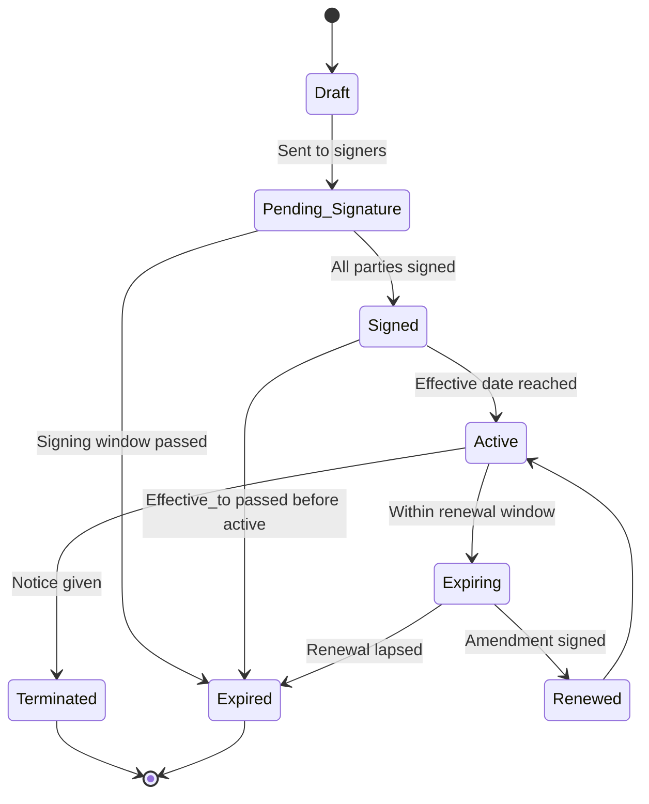
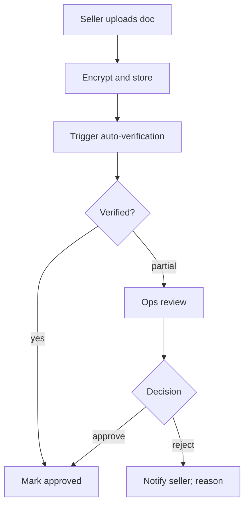
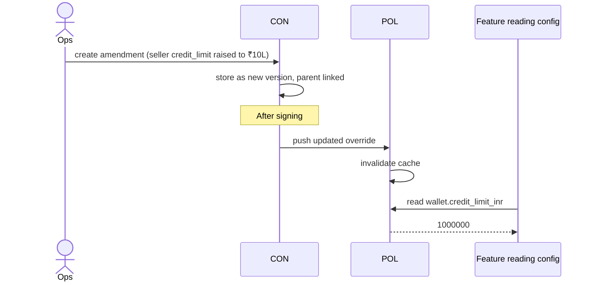

# Feature 27 — Contracts & documents

> *The home of every paper artifact: signed agreements, KYC documents, machine-readable contract terms, and the lifecycle around them. Phased build: v1 stores docs and seeds policy from terms; v2 productizes the contract authoring & e-sign workflow.*

## Problem

A seller's relationship with Pikshipp is mediated by documents:

- Master Service Agreement, Schedule of Services, DPA, NDA.
- KYC documents (PAN, GSTIN, bank, partnership deed, etc.).
- Insurance policies, addenda.
- Pickup-location proofs.

These are not just files — they are **the source of contractual terms** that drive runtime behavior. A seller's negotiated rates, credit limit, COD cycle, and SLA all originate in a contract. Without a contracts feature, those terms get pasted by hand into wallet/policy/CRM, drift over time, and become un-auditable.

## Goals

- **v1**: store all signed docs immutably; e-sign integration; surface terms to seller; feed machine-readable contract terms into policy engine.
- **v2**: contract authoring workflow; templates; renewal tracking; bulk operations.
- **v3**: full contract lifecycle management (CLM) with versioning, redlining, etc.

## Non-goals

- Generic document management (Google Drive). This is contractual artifacts only.
- Replacing legal counsel; we provide infra for them, not advice.
- Selling contracts to other companies.

## Industry patterns

| Approach | Notes |
|---|---|
| **Email + shared drive** | What most early-stage SaaS uses; doesn't scale |
| **DocuSign / Leegality / Digio + shared drive** | Better; common Indian pattern |
| **CLM platforms** (Ironclad, SpotDraft, Juro) | Productized but heavy |
| **In-house CLM** | Rare; only when contracts are core to the business |

**Our pick:** E-sign vendor (Leegality / Digio at v1) + structured metadata in our DB + machine-readable terms feed to policy engine. CLM-grade in v2/v3.

## Functional requirements (v1)

### Document types

| Type | Owner | Required for |
|---|---|---|
| **Master Service Agreement (MSA)** | Pikshipp ↔ Seller | All paid sellers |
| **Plan T&C / click-wrap** | Pikshipp ↔ Seller | Free / Grow tier sellers |
| **Schedule of Services (SoS)** | Pikshipp ↔ Seller | Custom-rate / enterprise |
| **DPA (Data Processing Agreement)** | Pikshipp ↔ Seller | Enterprise / regulated industries |
| **NDA** | Pikshipp ↔ Seller (pre-contract) | Enterprise sales |
| **PAN** | Seller | KYC |
| **GSTIN certificate** | Seller | KYC |
| **Cancelled cheque / bank statement** | Seller | KYC |
| **Partnership deed / MOA / LLP agreement** | Seller (entity) | KYC |
| **Address proof (pickup location)** | Seller | When pickup ≠ business address |
| **Carrier Service Agreement** | Pikshipp ↔ Carrier | Each carrier |
| **Vendor agreement** | Pikshipp ↔ vendor | KYC, PG, comms |
| **Insurance partnership** | Pikshipp ↔ insurer | Insurance product |
| **Amendments / addenda** | Various | When contracts change |

### Storage

- Encrypted at rest with KMS-managed keys.
- Object storage with strict ACLs.
- Access audit log (who viewed which doc when).
- Per-doc-type retention rules (DPDP / financial 7y baseline; longer for some).
- Versioning (re-uploaded docs replace prior with audit trail).
- Tamper-evident (hash on each upload).
- Export-on-request (DPDP rights).

### E-sign integration

- Vendor: Leegality / Digio (Indian e-sign with Aadhaar OTP, OTP, draw-signature support).
- Workflow:
  1. Pikshipp Ops creates contract from template + variables.
  2. Sends e-sign envelope to seller's authorized signatory.
  3. Seller signs.
  4. Both parties' signatures captured with timestamp + IP + signing flow.
  5. Signed PDF stored; metadata extracted.

### Machine-readable contract terms

For contracts that affect runtime behavior (MSA, SoS), encode the terms as structured data:

```yaml
contract:
  id: con_xxx
  seller_id
  type: msa | plan_tnc | sos | dpa | ...
  doc_ref                    # signed PDF
  effective_from
  effective_to               # null = open-ended
  status: draft | pending_signature | signed | active | expiring | expired | terminated
  signatures:
    - { party: pikshipp | seller, signed_by, signed_at, signature_ref }
  parent_contract_id         # for amendments
  
  machine_readable_terms:    # structured; mapped to policy engine
    - key: "wallet.credit_limit_inr"
      value: 500000
    - key: "billing.credit_period_days"
      value: 30
    - key: "cod.remittance_cycle_days"
      value: 2
    - key: "pricing.rate_card_ref"
      value: "rc_lotus_v3"
    - key: "carriers.allowed_set"
      value: ["delhivery", "bluedart", "ekart", "xpressbees"]
    - key: "support.tier"
      value: "1h"
    - key: "sla.uptime_pct"
      value: 99.95
    - key: "delivery.max_attempts"
      value: 3
  
  custom_clauses:            # free text for legal reference; not enforced by system
    - "Termination for convenience: 60 days notice"
    - "Liability cap: 12 months of fees paid"
```

### Term-to-policy push

When a contract is **signed and active**:
1. Each `machine_readable_term` is pushed to the policy engine as a **seller-level override** with `source = contract_id`.
2. The override carries an effective range matching the contract.
3. On contract amendment / termination / expiry, overrides are updated/removed.

This is the mechanism by which **negotiated terms become runtime behavior**.

### Lifecycle states



### Renewal & alerts

- Renewal alerts at 90, 60, 30 days before expiry.
- Auto-extend (where contract permits).
- Surface to Pikshipp Ops + seller's contact.

### Termination

- Initiated by either party per contract.
- Notice period honored.
- On effective termination:
  - Seller status moves toward wind-down.
  - Contract-derived overrides removed; defaults reapply.
  - Data export per terms.

### Search & access

- Per-seller contract list.
- Search by type, status, effective date, party.
- Access controls: seller users see their own contracts; Pikshipp legal/admin see all.

## Functional requirements (v2 productization)

- Template authoring with variable substitution.
- Approval workflow (legal sign-off internally).
- Redlining / negotiation tracking.
- Bulk renewals (e.g., all expiring annual MSAs).
- Programmatic contract creation via internal API.

## Functional requirements (v3 CLM-grade)

- Full negotiation workflow (multi-party comments).
- AI-assisted clause extraction.
- Compliance reporting (e.g., "all DPAs current?").
- Integration with vendor CLMs if/when bigger customers demand.

## User stories

- *As Pikshipp Ops*, I want to send an MSA to a seller and track its signing status without leaving the console.
- *As Pikshipp Legal*, I want to know every active contract with credit-line provisions.
- *As a seller's CA*, I want to download our signed agreements anytime.
- *As Pikshipp Admin*, I want contract terms to drive runtime behavior automatically — no manual reentry.

## Flows

### Flow: New contract signing (v1)

```mermaid
sequenceDiagram
    actor Ops as Pikshipp Ops
    participant CON as Contracts service
    participant ESN as E-sign vendor
    participant Seller as Seller signatory
    participant POL as Policy engine
    participant AUD as Audit

    Ops->>CON: create contract (type, seller, terms)
    CON->>CON: persist as draft
    CON->>ESN: send envelope (terms)
    ESN-->>Seller: email signing link
    Seller->>ESN: sign (Aadhaar OTP / draw)
    ESN-->>CON: webhook signed
    CON->>CON: store signed PDF; extract metadata
    CON->>POL: push machine-readable terms as overrides
    POL->>AUD: log overrides
    CON-->>Ops: contract active
```

### Flow: KYC document upload



### Flow: Contract amendment changes runtime



## Configuration axes (consumed via policy engine)

The contracts feature *produces* policy overrides, not consumes them. But it has its own config:

```yaml
contracts:
  esign_vendor: leegality | digio
  default_signing_window_days: 14
  renewal_alert_days: [90, 60, 30]
  auto_extend_default: false
```

## Data model

(See `contract` schema above. Plus:)

```yaml
document:
  id: doc_xxx
  seller_id (or pikshipp_internal)
  type: kyc_pan | kyc_gstin | msa | sos | ...
  ref                       # storage location
  uploaded_at, uploaded_by
  hash                      # tamper-evidence
  retention_until
  access_log_ref

contract_amendment:
  id
  parent_contract_id
  effective_from
  changes: [...]            # diff of machine_readable_terms
  signed_at
```

## Edge cases

- **Two contracts with conflicting terms** (rare; should be impossible by process) — last-effective wins; alert.
- **Signing party leaves seller's company** — reissue to new authorized signatory.
- **E-sign vendor outage** — manual sign + scan path; ops captures.
- **Aadhaar-OTP fails** (bank-side issue) — fallback to OTP / draw signature.
- **Contract terminated mid-cycle** — overrides removed; seller defaults restored; audit captures impact.
- **Lost contract document** — fall back to signed copy in vendor's system; double-storage by design.

## Open questions

- **Q-CT1** — Single e-sign vendor or multi for resilience? Default: single v1; multi v2.
- **Q-CT2** — Should sellers self-serve plan T&C as click-wrap (no e-sign)? Default: yes — click-wrap for Free/Grow; e-sign for Custom.
- **Q-CT3** — Contract template versioning when terms change platform-wide. Default: new template version + grandfather existing.
- **Q-CT4** — Storage of carrier-side contracts: same system as seller-side or separate? Default: same; access-controlled by counterparty type.
- **Q-CT5** — Time-bounded vs perpetual machine-readable-term mapping (some terms expire even within an active contract): how to model? Default: per-term effective range supported.

## Dependencies

- Policy engine (consumes overrides).
- Identity (Feature 01) for KYC docs.
- E-sign vendor.
- Audit (`05-cross-cutting/06`) for tamper-evidence.

## Risks

| Risk | Mitigation |
|---|---|
| Term mis-encoding (machine-readable doesn't match PDF) | Two-person review on term encoding; periodic audit |
| E-sign vendor lock-in | Escape hatch: manual sign + upload |
| Lost legal version-of-record | Vendor + our storage = redundancy |
| Renewal lapse (we forgot) | Multi-trigger alerts; auto-extend where allowed |
| Compliance gap (DPA missing for required seller) | Pre-launch checklist per seller class |

## Phasing

| Capability | v1 | v2 | v3 |
|---|---|---|---|
| Encrypted doc storage | ✅ | ✅ | ✅ |
| E-sign integration | ✅ | ✅ | ✅ |
| Machine-readable terms feed → policy | ✅ | ✅ | ✅ |
| Versioning & amendments | ✅ basic | ✅ | ✅ |
| Renewal alerts | ✅ basic | ✅ | ✅ |
| Template authoring | — | ✅ | ✅ |
| Approval workflow internal | — | ✅ | ✅ |
| Redlining / negotiation tracking | — | partial | ✅ |
| AI-assisted clause extraction | — | — | ✅ |
| Vendor CLM integration | — | — | ✅ |
