# Flow — Seller onboarding (signup → first shipment)

> Cuts across Features 01 (identity), 02 (tenant), 03 (channels), 05 (catalog/warehouse), 06 (carriers), 07 (rates), 08 (booking), 13 (wallet), 16 (notifications).

## End-to-end timeline

Median target: **first shipment in <30 minutes from signup**. P95: <24h.

```mermaid
gantt
    title Seller onboarding journey
    dateFormat HH:mm
    axisFormat %H:%M
    section Signup
    OTP + business profile     :a1, 00:00, 5m
    section KYC
    Doc upload                 :a2, after a1, 5m
    Auto-KYC (GSTIN+PAN+bank)  :a3, after a2, 3m
    section Setup
    Pickup address             :a4, after a3, 4m
    Connect first channel      :a5, after a4, 5m
    Wallet recharge            :a6, after a4, 3m
    section First shipment
    Quote + book               :a7, after a6, 2m
```



## Detailed sequence

```mermaid
sequenceDiagram
    actor S as Seller
    participant LP as Landing
    participant AUTH as Auth
    participant KYC as KYC service
    participant TEN as Tenant service
    participant CH as Channels
    participant WH as Pickup loc
    participant WAL as Wallet
    participant PG as Payment GW
    participant RAT as Rate engine
    participant BK as Booking
    participant ADP as Carrier adapter
    participant N as Notify

    S->>LP: open
    S->>AUTH: phone OTP
    AUTH-->>S: token
    S->>TEN: business profile (GSTIN, name, address)
    TEN->>KYC: auto-verify GSTIN
    KYC-->>TEN: ok / mismatch
    TEN-->>S: dashboard (sandbox mode)

    S->>WH: add pickup address
    S->>CH: connect Shopify (OAuth)
    CH-->>S: channel connected; orders backfilled
    S->>WAL: open recharge
    WAL->>PG: create intent
    PG-->>S: pay UPI
    S->>PG: pays
    PG-->>WAL: webhook success
    WAL-->>S: balance updated

    KYC->>KYC: bank penny-drop, PAN OCR
    KYC-->>TEN: kyc_passed
    TEN-->>S: live mode unlocked
    S->>BK: book first order
    BK->>RAT: quote
    BK->>ADP: book
    ADP-->>BK: AWB
    BK-->>S: shipment booked
    BK->>N: notify buyer + seller
```

## Decision points

| Step | If passes | If fails |
|---|---|---|
| OTP | continue | retry; fall back voice OTP |
| GSTIN auto-verify | continue | manual review queue |
| Bank penny-drop | continue | re-enter / ops review |
| KYC overall | live mode | sandbox-only; ops queue |
| Channel OAuth | continue | troubleshoot (token refresh, scopes) |
| Wallet recharge | continue | retry / alternate method |
| Booking | continue | error surfaced; auto-fallback if enabled |

## SLAs along the journey

(See `04-features/01-identity-and-onboarding.md` for step-level targets.)

## Where the flow can fall apart

1. **GSTIN inactive / cancelled** — manual escalation. We tighten.
2. **Bank account mismatch with PAN name** — re-enter with proof.
3. **Shopify scope rejection** — re-walk OAuth.
4. **PG payment in pending state >5 min** — show "we're checking"; reconcile.
5. **Booking failure on first try** — UX bias toward auto-fallback / clear retry.

## Multi-tenant note

Reseller-mediated onboarding follows the same flow but:
- Branding throughout is reseller's.
- KYC ruleset can override Pikshipp default.
- Approval queue routes to reseller ops.
- Wallet provisioned under reseller.
