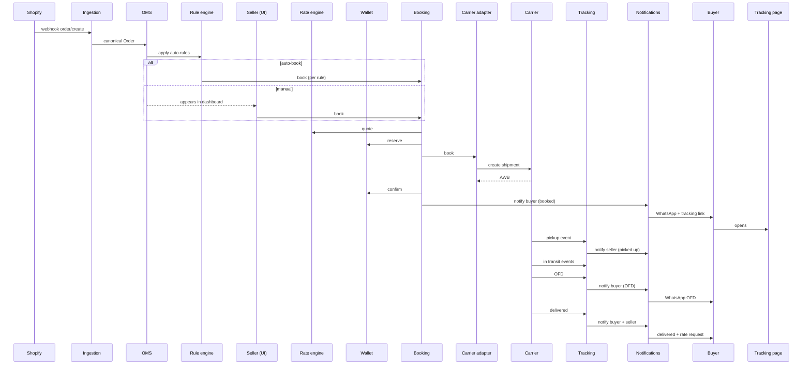

# Flow — Order to delivery (the canonical happy path)

> Cuts across Features 03–17.

## Stages

```mermaid
flowchart LR
    A[Channel order] --> B[Ingestion]
    B --> C[Canonical Order created]
    C --> D[Validation + auto-rules]
    D --> E[Ready_to_ship]
    E --> F[Rate quote + carrier select]
    F --> G[Two-phase wallet reserve]
    G --> H[Carrier book]
    H --> I[AWB + label]
    I --> J[Manifest + pickup]
    J --> K[Picked_Up]
    K --> L[In_Transit]
    L --> M[Out_For_Delivery]
    M --> N[Delivered]
    N --> O[Buyer notified + COD remittance flow]
```

## Detailed sequence

## Multi-shipment orders

If the order is split into multiple shipments:
- Each shipment runs independently.
- Order status is `partially_fulfilled` until all are delivered.

## Cancellation paths

| Cancelled at | Effect |
|---|---|
| Channel side, before our ingest | We don't ingest |
| Channel side, after ingest, before book | Mark cancelled; remove from queue |
| After book, before pickup | Try carrier cancel; refund wallet on success |
| After pickup | Cannot cancel; process as RTO if needed |

## Edge variant: COD

(See `04-cod-remittance-flow.md` for the cash-side flow.)

## Edge variant: NDR before delivered

(See `03-ndr-flow.md`.)
