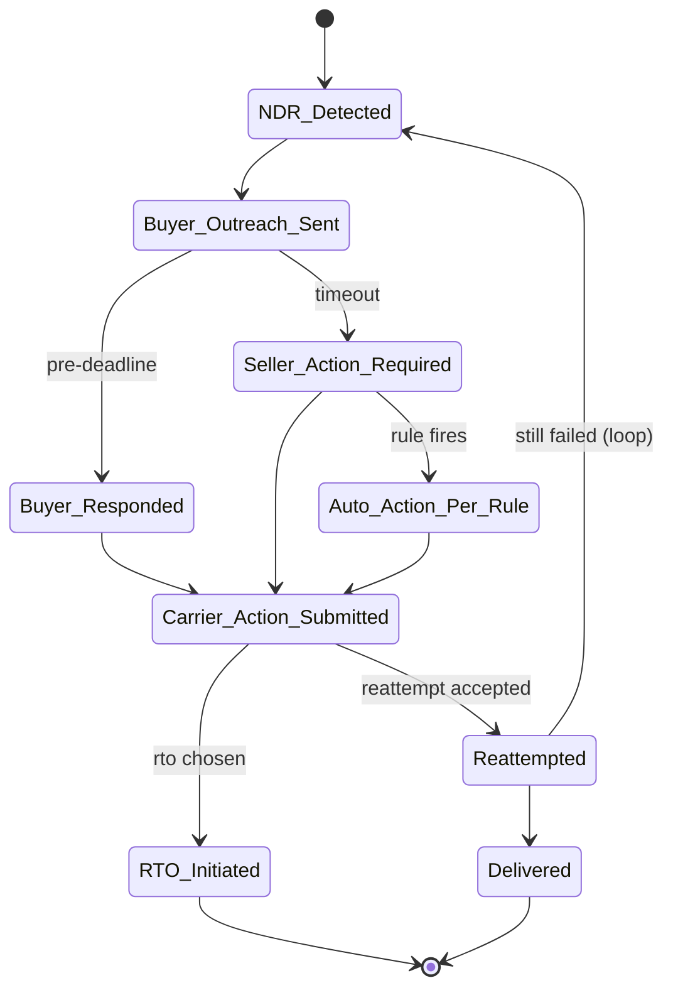
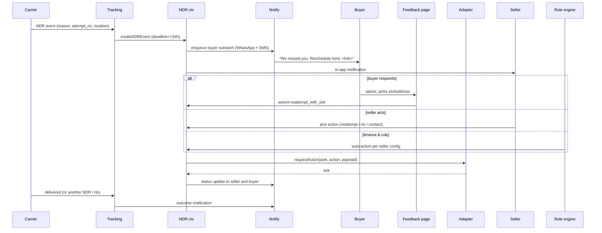

# Flow — NDR action loop

> Cuts across Features 09 (tracking), 10 (NDR), 16 (notifications), 17 (buyer experience).

## Lifecycle



## Detailed sequence



## Action-to-outcome matrix

| Action | Likely outcome |
|---|---|
| reattempt | ~50–70% deliver next attempt |
| reattempt_with_slot | +5–10% lift over generic reattempt |
| reattempt_with_address | High lift if original address was wrong |
| contact_buyer | Indirect; surfaces info |
| hold_at_hub | Buyer collects; ~30% conversion |
| rto | Terminal; cost to seller |

## Auto-rule examples

```yaml
# Conservative rule set
- if reason == buyer_unavailable and attempt_no <= 2: action=reattempt
- if reason == refused: action=rto
- if attempt_no >= max(carrier): action=rto

# Aggressive rule set (more saves; more friction)
- always send buyer outreach immediately
- if no response in 12h and reason==buyer_unavailable: action=reattempt_with_slot=morning
- if attempt_no >= 3: action=hold_at_hub if supported else rto
```

## Buyer page UX

(See `04-features/17-buyer-experience.md`.)

## Notes

- Carrier-specific limitations affect what actions are even available.
- WhatsApp template approval is the long pole; without it, outreach degrades to SMS.
- Buyer multi-language matters in tier-2/3 cities.
