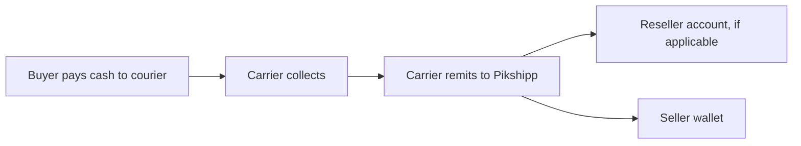

# Flow — COD remittance (cash from buyer to seller wallet)

> Cuts across Features 12 (COD), 13 (wallet), 19 (admin/ops).

## Two-leg flow



## Timing model

| Event | Day |
|---|---|
| Delivered | D+0 |
| Carrier remits to Pikshipp (varies) | D+4 to D+7 |
| Pikshipp remits to seller wallet (default plan) | D+2 |

We absorb a 2–5 day float exposure.

## Sequence (happy path)

```mermaid
sequenceDiagram
    participant Buyer
    participant Carrier
    participant Pikshipp
    participant LED as Ledger
    participant Seller as Seller wallet
    participant FIN as Finance recon

    Buyer->>Carrier: pays cash on delivery
    Note over Carrier: D+0 delivered event
    Carrier->>Pikshipp: tracking event delivered (cod_amount captured)
    Pikshipp->>LED: schedule remittance entry to seller
    Note over Pikshipp: D+2 (per plan)
    Pikshipp->>Seller: credit cod_remit_to_seller (from float)
    Note over Carrier: D+4..D+7 actual remittance
    Carrier->>Pikshipp: remittance file/API
    Pikshipp->>FIN: match by AWB; reconcile
    FIN->>LED: post carrier->Pikshipp credit
    FIN->>Pikshipp: alert on mismatches
```

## Reconciliation states

```mermaid
stateDiagram-v2
    [*] --> Awaiting_Carrier_Remittance
    Awaiting_Carrier_Remittance --> Matched: file + delivered amount agree
    Awaiting_Carrier_Remittance --> Mismatched: amount or count differ
    Awaiting_Carrier_Remittance --> Disputed: carrier denies delivery
    Matched --> [*]
    Mismatched --> Investigated --> Resolved
    Resolved --> [*]
    Disputed --> Investigated
```

## Pikshipp → Reseller settlement

Resellers are settled aggregated:
- Monthly invoice from Pikshipp covers their seller-mediated COD net of our fees.
- Direct credit/NEFT.

## Seller-side ledger view

(Reference: `04-features/13-wallet-and-billing.md`.) Each shipment's COD generates a `cod_remit_to_seller` ledger entry.

## Failure modes

| Failure | Effect | Mitigation |
|---|---|---|
| Carrier under-remits | We float more; reconcile and recover | Float caps; carrier dispute |
| Carrier remits late | Our exposure widens | Remittance lag SLA tracking |
| Carrier-side fraud (delivery confirmed but no cash collected) | Loss | Random sampling; carrier audit |
| Mismatched AWB references in remittance file | Manual matching | Per-carrier file format normalization |
| Seller wallet wound-down | Pending remit held; refund to bank | Wind-down flow |

## Accounting

- Pikshipp internal accounts: `cod_float`, `accounts_receivable_carriers`, `accounts_payable_sellers`, `revenue_handling_fees`.
- Each leg fully ledgered.

## Open questions

(Captured in Features 12/13.) Notable:
- Same-day remittance for premium plans?
- COD float regulatory compliance?
