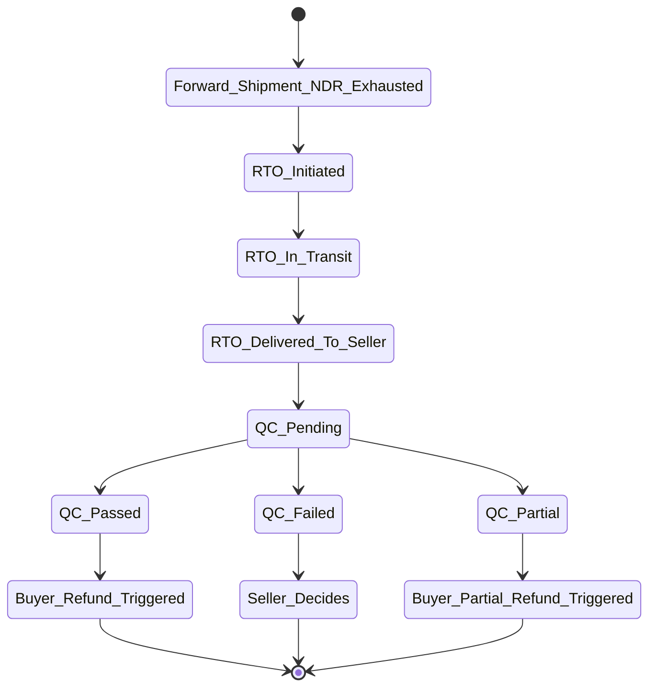

# Flow — RTO (Return to Origin)

> Cuts across Features 09 (tracking), 10 (NDR), 11 (returns/RTO), 13 (wallet).

## Lifecycle



## Sequence

```mermaid
sequenceDiagram
    participant CRR as Carrier
    participant NDRC as NDR
    participant TR as Tracking
    participant ADP as Adapter
    participant WAL as Wallet
    participant SLR as Seller
    participant N as Notify
    participant Buyer

    NDRC->>ADP: request rto (or carrier auto-rto on max attempts)
    ADP->>CRR: rto API
    CRR-->>ADP: ack; rto_initiated
    ADP->>TR: status rto_initiated
    TR->>WAL: post rto_charge (debit to seller)
    TR->>N: notify seller + buyer
    CRR->>TR: rto_in_transit events
    CRR->>TR: rto_delivered_to_seller event
    SLR->>SLR: receive parcel; perform QC
    SLR->>SLR: mark QC outcome (pass/fail/partial)
    alt prepaid order
        SLR->>SLR: trigger buyer refund (channel-side)
        N->>Buyer: refund initiated
    else COD order
        Note over Buyer: no refund needed (buyer never paid)
    end
```

## Wallet treatment

| Event | Ledger entry |
|---|---|
| RTO initiated | `rto_charge` (debit to seller) |
| QC pass on prepaid | Seller initiates buyer refund externally; no Pikshipp wallet effect on buyer side |
| Insurance covers (lost / damaged in RTO leg) | `insurance_payout` (credit) |

## Open questions

- **Q-RTO1** — Auto-trigger buyer refund on prepaid RTO + QC pass? Possibly v2; integration with channels.
- **Q-RTO2** — RTO insurance bundle ("no-RTO insurance") — see Feature 22.
