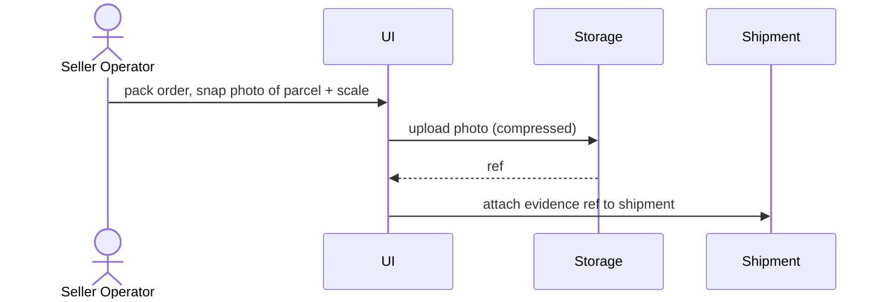
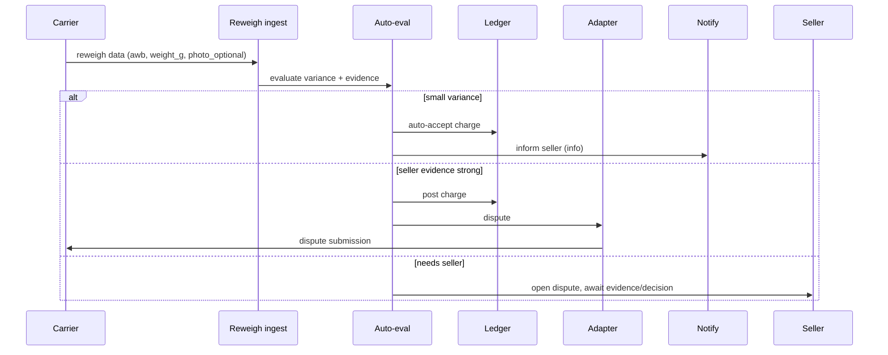
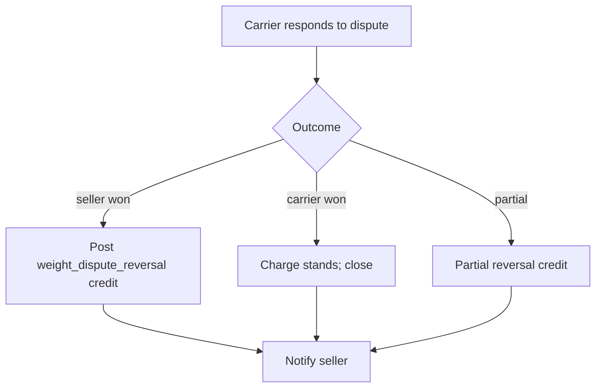

# Flow — Weight dispute

> Cuts across Features 08 (booking), 14 (weight reconciliation), 13 (wallet).

## Capture phase (at packing)

## Dispute phase (post-pickup)

## Resolution phase

## SLA & policy

- Carrier dispute window varies (typ. 7–15 days from charge raised).
- Pikshipp SLA: auto-disputes filed within 24h of carrier reweigh data.
- Seller must add evidence within window if open-for-seller status.

## Open questions

(See Feature 14.)
