# Phasing strategy

> The feature catalogue (`04-features/`) is a completeness document — every feature, regardless of whether we build it in month 1 or year 3. **This** document decides what to build first, and why.
>
> Read this with a Product Owner mindset: which 20% of features deliver 80% of the value for our first cohort of sellers? What sequence of releases compounds rather than fragments?

## Versioning convention

- **v0** — Internal alpha. Not for paying customers. Internal team + 5–10 friendly sellers. Goal: prove the architecture and the core happy path.
- **v1** — Public launch. Paying customers. Goal: a usable Shiprocket-class aggregator for Indian SMB-to-mid-market sellers.
- **v2** — Scale + channel breadth + public API. Goal: 250k+ shipments/month; 5+ channels integrated; mobile app shipped; API productized.
- **v3** — Adjacencies, hyperlocal, B2B, ONDC, optional first-party pilot.

The version names map to product posture, not arbitrary calendar quarters. Time targets in each doc; the *what* is more important than the *when*.

## Operating principles for phasing

### 1. Build the architecture before the features

Multi-customer scoping, the canonical data model, the carrier adapter framework, the channel adapter framework, the **policy engine** — these are v0 *foundations*, even when the surface they support is minimal. Retrofitting any of them later is the most expensive bug we could ship.

### 2. Wide carrier coverage > wide channel coverage at launch

A seller will tolerate "I can only connect Shopify and manual" if the courier set is comprehensive. The reverse is not true. **v1 ships with 8 carriers, 4 channels.**

### 3. Money-handling features are non-negotiable from v1

Wallet (with grace cap and reverse-leg charging), ledger, COD remittance, weight reconciliation — even in their simplest forms, these must work correctly the day a paying seller signs up. We do not ship v1 with "weight disputes manual via support email" — that's a v0 hack only.

### 4. Configurability is foundational, not a v2 productization

The policy engine ships with v0 because every feature consumes it. We never have hard-coded "if plan == X" logic. Plans are bundles of config. New axes are config additions, not code changes.

### 5. NDR and COD outcomes are a v1 marketing wedge

We don't compete on price. We do compete on NDR resolution and COD conversion. v1 ships with the buyer-facing NDR feedback page, the auto-rules engine, and (basic) COD verification. This is what differentiates the demo.

### 6. Mobile app deferred, but mobile-web is v1-grade

We don't build native apps in v1. We do build the seller dashboard mobile-responsive enough for an operator to handle exceptions on the go. Buyer-facing pages are mobile-first.

### 7. **No public API at v1.** Sellers operate via dashboard only.

The public API is deferred to v2. v1 internal APIs are designed cleanly so v2 productization is small (developer portal, SDKs, docs, rate-limit hardening), not a re-architecture.

### 8. **No white-label / reseller layer.** Ever (or until proven otherwise).

We are a single-aggregator product. Per-seller buyer-experience branding is supported (logo, colors, optional custom domain) — this is sufficient for sellers wanting to "show their brand to buyers". A multi-tenant platform-licensing business is explicitly out of scope.

### 9. Insurance, hyperlocal, B2B are deferred or optional

- Insurance: optional partner-led offering at v1; not a forced attach.
- Hyperlocal, B2B: v3.

### 10. First-party (Pikshipp Express) is v3+, if at all

The architecture supports it abstractly from v0 (it would plug in as a carrier adapter). The decision to *operate* a first-party network is gated on (a) v1+v2 success and (b) a specific seller demand the aggregator can't serve.

### 11. Each version ships with its own ops + SLA capacity

We don't add v2 features without v2 ops headcount and SLA targets. Underbuilt ops kills more startups than underbuilt product.

### 12. Audit-everything from day 0

The audit cross-cutter is in place v0; every feature emits events. This is foundational and cheap if done early; expensive if retrofitted.

## Cuts overview

```mermaid
flowchart TB
    subgraph V0["v0 - Internal alpha"]
        V0A[Identity + onboarding minimal]
        V0B[Seller config + policy engine]
        V0C[Canonical model + 1 channel + 2 carriers]
        V0D[Manual book + label + track]
        V0E[Wallet basics + recharge]
        V0F[Audit infrastructure]
    end
    subgraph V1["v1 - Public launch"]
        V1A[5 channels: manual, CSV, Shopify, WC, Amazon]
        V1B[8 carriers]
        V1C[Allocation engine multi-objective]
        V1D[Pricing engine versioned]
        V1E[NDR + RTO + reverse-leg charging]
        V1F[COD verification + remittance]
        V1G[Weight disputes auto-eval]
        V1H[GST invoicing + reports]
        V1I[Buyer pages: tracking, NDR, returns]
        V1J[Seller branding: logo, colors, optional custom domain]
        V1K[Notifications full surface]
        V1L[Risk and fraud minimum]
        V1M[Contracts and KYC documents storage]
    end
    subgraph V2["v2 - Scale and breadth"]
        V2A[+Flipkart, Meesho, Magento, BigCommerce]
        V2B[+5-7 carriers]
        V2C[Mobile app]
        V2D[Insurance integrated]
        V2E[Public API + SDKs + dev portal]
        V2F[Custom reports + AI assist]
        V2G[2-way WhatsApp NDR chatbot]
        V2H[Risk ML scoring]
    end
    subgraph V3["v3 - Adjacencies"]
        V3A[Hyperlocal]
        V3B[B2B / freight]
        V3C[ONDC channel]
        V3D[Pikshipp Express pilot if ever]
        V3E[International outbound]
        V3F[SOC 2 / enterprise readiness]
        V3G[Working capital / advance against COD]
    end
    V0 --> V1
    V1 --> V2
    V2 --> V3
```

## Versions in detail

- v0: [02-v0-internal-alpha.md](./02-v0-internal-alpha.md)
- v1: [03-v1-public-launch.md](./03-v1-public-launch.md)
- v2: [04-v2-scale.md](./04-v2-scale.md)
- v3: [05-v3-platform.md](./05-v3-platform.md)

## Anti-patterns we will avoid

- **Shipping a feature without its operational counterpart.** No "weight disputes UI" without auto-eval and ops queue.
- **Hard-coded behavior per seller.** All variation goes through the policy engine.
- **Selling enterprise before SMB is solid.** Enterprise contracts are tempting but distort focus; we lock in SMB-grade first.
- **Adding channels we can't support.** Each channel needs adapter + ops + support. Don't list 25 if 5 work well.
- **Premature optimization.** v1 may use simpler infra than v3 wants; that's fine.
- **Refactor-as-feature.** "We need to refactor" is not a release; it's part of the cost of every release.
- **White-label / reseller distractions.** We are not a platform-maker. Period.

## How this doc gets updated

- Quarterly review with PM + Eng leadership.
- Re-cut if user feedback or competitive moves shift the priority.
- Tag each release with the actual scope shipped vs the doc; carry forward unshipped to next version.
