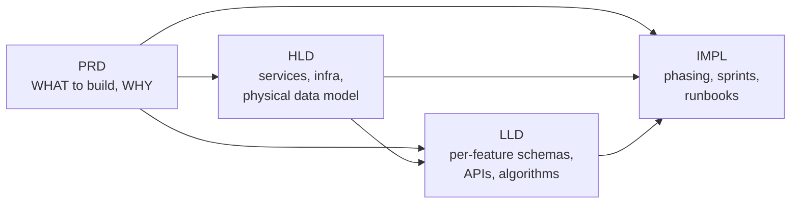

# Pikshipp documentation

> The complete documentation set for Pikshipp — a multi-courier shipping aggregator for India. Three layers, each with its own ownership and cadence:

```
docs/
├── PRD/   ← Product Requirements (WHAT we're building, WHY, for WHOM)
├── TRD/   ← Technical Requirements (HOW we're building it)
│   ├── HLD/   High-Level Design — services, infra, data flow
│   └── LLD/   Low-Level Design — per-component schemas, APIs, algorithms
└── IMPL/  ← Implementation plan + tracking
```

## Where to start

| Reader | Start here |
|---|---|
| New PM / designer / founder | [`PRD/README.md`](./PRD/README.md) |
| Engineer architecting the system | [`PRD/00-executive-summary.md`](./PRD/00-executive-summary.md) → [`PRD/03-product-architecture/`](./PRD/03-product-architecture/) → [`TRD/HLD/README.md`](./TRD/HLD/README.md) |
| Engineer implementing a feature | [`PRD/04-features/<n>-…`](./PRD/04-features/) → [`TRD/LLD/features/<n>-…`](./TRD/LLD/) |
| Ops / Support | [`PRD/02-users-and-personas/01-personas.md`](./PRD/02-users-and-personas/01-personas.md) → [`PRD/04-features/19-admin-and-ops.md`](./PRD/04-features/19-admin-and-ops.md) |
| Investor / exec | [`PRD/00-executive-summary.md`](./PRD/00-executive-summary.md) only |

## What lives where

### `PRD/` — Product requirements
What we're building, who it serves, what it must do. **The source of truth for product decisions.**
- ✅ Status: complete (v1.0)
- 67 markdown files, 18 diagrams
- Index: [`PRD/README.md`](./PRD/README.md)

### `TRD/HLD/` — High-Level Design
Service decomposition, data model (physical), infra choices, cross-cutting tech (auth, observability, deployment). **The bridge from PRD to code.**
- ⏳ Status: not yet authored
- Will derive from PRD; updated when architecture changes
- Stub: [`TRD/HLD/README.md`](./TRD/HLD/README.md)

### `TRD/LLD/` — Low-Level Design
Per-feature implementation specs: API endpoints, request/response schemas, database schemas, algorithms, error handling. **What an engineer reads before writing code for a feature.**
- ⏳ Status: not yet authored
- Authored per-feature when an eng team picks one up
- Mirrors the PRD's `04-features/` structure
- Stub: [`TRD/LLD/README.md`](./TRD/LLD/README.md)

### `IMPL/` — Implementation plan
Phased build plan, sprint tracking, runbooks. **What's actively being built and operated.**
- ⏳ Status: not yet authored
- High churn; living document
- Stub: [`IMPL/README.md`](./IMPL/README.md)

## How the layers relate



- **PRD changes** when product strategy or scope changes.
- **HLD changes** when system architecture changes (rare after v1).
- **LLD changes** per feature, on the eng cycle that picks up that feature.
- **IMPL changes** every sprint.

## Conventions

- Layers are **derivative**: HLD references PRD; LLD references HLD + PRD. Never the reverse — a PRD must not depend on engineering choices.
- **Cross-references are relative paths.** Use `../` to walk up. No absolute paths.
- **Open questions** are tagged with stable IDs (`Q-O1`, `Q-T5`, etc.) and cumulated in [`PRD/09-appendix/02-open-questions.md`](./PRD/09-appendix/02-open-questions.md). HLD/LLD will add their own (`Q-HLD-1`, `Q-LLD-13.4`, etc.).
- **Diagrams** are kept per-layer (`PRD/diagrams/`, future `TRD/HLD/diagrams/`, `TRD/LLD/diagrams/`). Mermaid `.mmd` source + rendered `.png` (scale 4 via `mmdc`).
- **Glossary** ([`PRD/09-appendix/01-glossary.md`](./PRD/09-appendix/01-glossary.md)) is authoritative for terms used across all layers.

## Versioning

| Layer | Current version | Cadence |
|---|---|---|
| PRD | 1.0 | Quarterly review |
| HLD | — (not authored) | When architecture changes |
| LLD | — (not authored) | Per feature, per release |
| IMPL | — (not authored) | Per sprint |

Last updated: 2026-04-30.
